# 🏗️ Padrões Arquiteturais - App ReceitaAgro

## 📐 Visão Geral da Arquitetura

### Arquitetura Atual vs. Target

```mermaid
graph TD
    subgraph "ATUAL - Problemas"
        A1[Presentation] --> B1[Business Logic]
        B1 --> C1[Data Layer]
        B1 -.->|Acoplamento Direto| D1[External Services]
        B1 -.->|Dependências Concretas| E1[Storage]
    end
    
    subgraph "TARGET - Clean Architecture"
        A2[Presentation] --> B2[Domain]
        B2 --> C2[Data]
        B2 --> D2[Interfaces]
        C2 -.->|Implements| D2
        E2[External] -.->|Implements| D2
    end
```



## 🎯 Princípios Fundamentais

### 1. Dependency Rule
```
Presentation → Domain ← Data
```
- **Inner layers** não conhecem **outer layers**
- **Dependencies** apontam sempre para dentro
- **Interfaces** definem contratos

### 2. Separation of Concerns
- **Presentation**: UI/UX logic
- **Domain**: Business rules
- **Data**: Storage & external APIs

### 3. Inversion of Control
- **Abstrações** em vez de implementações
- **Injection** de dependencies
- **Factory patterns** para criação

---

## 📱 Camada de Apresentação (Presentation)

### Provider Pattern - Estado Global
```dart
// ✅ CORRETO - Com abstrações
class PremiumProvider extends ChangeNotifier {
  final IPremiumService _premiumService;
  final IAnalyticsService _analytics;
  
  PremiumProvider({
    required IPremiumService premiumService,
    required IAnalyticsService analytics,
  }) : _premiumService = premiumService,
       _analytics = analytics;
       
  Future<void> upgradeToPremium() async {
    try {
      await _premiumService.purchaseLicense();
      _analytics.track('premium_upgrade_success');
      notifyListeners();
    } catch (e) {
      _analytics.track('premium_upgrade_error', {'error': e.toString()});
      rethrow;
    }
  }
}

// ❌ INCORRETO - Dependencies diretas
class PremiumProvider extends ChangeNotifier {
  final PremiumService _service = PremiumService(); // Hard dependency
  final FirebaseAnalytics _analytics = FirebaseAnalytics(); // Hard dependency
}
```

### Widget Composition Pattern
```dart
// ✅ CORRETO - Single Responsibility
class PremiumStatusWidget extends StatelessWidget {
  final PremiumStatus status;
  final VoidCallback? onUpgrade;
  
  const PremiumStatusWidget({
    required this.status,
    this.onUpgrade,
  });
  
  @override
  Widget build(BuildContext context) {
    return Card(
      child: _buildStatusContent(),
    );
  }
}

// ❌ INCORRETO - Múltiplas responsabilidades
class PremiumWidget extends StatefulWidget {
  // Responsabilidade 1: UI
  // Responsabilidade 2: Business logic
  // Responsabilidade 3: Data fetching
  // Responsabilidade 4: Error handling
}
```

---

## 🎯 Camada de Domínio (Domain)

### Use Cases Pattern
```dart
// ✅ CORRETO - Use case com interface
abstract class IValidatePremiumLicenseUseCase {
  Future<Result<PremiumStatus>> execute(String licenseKey);
}

class ValidatePremiumLicenseUseCase implements IValidatePremiumLicenseUseCase {
  final IPremiumRepository _repository;
  final ILicenseValidator _validator;
  
  ValidatePremiumLicenseUseCase({
    required IPremiumRepository repository,
    required ILicenseValidator validator,
  }) : _repository = repository,
       _validator = validator;
       
  @override
  Future<Result<PremiumStatus>> execute(String licenseKey) async {
    try {
      // 1. Validate format
      if (!_validator.isValidFormat(licenseKey)) {
        return Result.failure('Invalid license format');
      }
      
      // 2. Check with remote
      final status = await _repository.validateLicense(licenseKey);
      
      // 3. Cache result
      await _repository.cacheLicenseStatus(status);
      
      return Result.success(status);
    } catch (e) {
      return Result.failure(e.toString());
    }
  }
}
```

### Entity Pattern
```dart
// ✅ CORRETO - Entity com validation
class PremiumLicense {
  final String key;
  final DateTime expiryDate;
  final LicenseType type;
  final bool isActive;
  
  const PremiumLicense({
    required this.key,
    required this.expiryDate,
    required this.type,
    required this.isActive,
  });
  
  // Business rules no domain
  bool get isExpired => DateTime.now().isAfter(expiryDate);
  bool get isValid => isActive && !isExpired;
  
  // Factory methods
  factory PremiumLicense.fromJson(Map<String, dynamic> json) {
    return PremiumLicense(
      key: json['key'],
      expiryDate: DateTime.parse(json['expiry_date']),
      type: LicenseType.values.byName(json['type']),
      isActive: json['is_active'],
    );
  }
}
```

### Repository Interfaces
```dart
// ✅ CORRETO - Interface no domain
abstract class IPremiumRepository {
  Future<PremiumStatus> validateLicense(String key);
  Future<void> cacheLicenseStatus(PremiumStatus status);
  Future<PremiumStatus?> getCachedStatus();
  Future<List<PremiumFeature>> getAvailableFeatures();
}

// ✅ CORRETO - Interface para external services
abstract class ILicenseValidator {
  bool isValidFormat(String key);
  Future<bool> checkWithProvider(String key);
}
```

---

## 💾 Camada de Dados (Data)

### Repository Implementation Pattern
```dart
// ✅ CORRETO - Implementação na data layer
class PremiumRepositoryImpl implements IPremiumRepository {
  final IRemoteDataSource _remoteDataSource;
  final ILocalDataSource _localDataSource;
  final INetworkInfo _networkInfo;
  
  PremiumRepositoryImpl({
    required IRemoteDataSource remoteDataSource,
    required ILocalDataSource localDataSource,
    required INetworkInfo networkInfo,
  }) : _remoteDataSource = remoteDataSource,
       _localDataSource = localDataSource,
       _networkInfo = networkInfo;
       
  @override
  Future<PremiumStatus> validateLicense(String key) async {
    if (await _networkInfo.isConnected) {
      try {
        final remoteStatus = await _remoteDataSource.validateLicense(key);
        // Cache for offline use
        await _localDataSource.cacheLicenseStatus(remoteStatus);
        return remoteStatus.toDomain();
      } catch (e) {
        // Fallback to cache
        final cached = await _localDataSource.getCachedStatus();
        if (cached != null) return cached.toDomain();
        rethrow;
      }
    } else {
      final cached = await _localDataSource.getCachedStatus();
      if (cached != null) return cached.toDomain();
      throw NetworkException('No internet connection');
    }
  }
}
```

### Data Source Pattern
```dart
// ✅ CORRETO - Remote data source
abstract class IRemoteDataSource {
  Future<PremiumStatusModel> validateLicense(String key);
  Future<List<PremiumFeatureModel>> getFeatures();
}

class RemoteDataSourceImpl implements IRemoteDataSource {
  final IHttpClient _httpClient;
  
  RemoteDataSourceImpl(this._httpClient);
  
  @override
  Future<PremiumStatusModel> validateLicense(String key) async {
    final response = await _httpClient.post(
      '/premium/validate',
      body: {'license_key': key},
    );
    
    if (response.statusCode == 200) {
      return PremiumStatusModel.fromJson(response.data);
    } else {
      throw ServerException(response.statusMessage);
    }
  }
}

// ✅ CORRETO - Local data source
abstract class ILocalDataSource {
  Future<PremiumStatusModel?> getCachedStatus();
  Future<void> cacheLicenseStatus(PremiumStatusModel status);
}

class LocalDataSourceImpl implements ILocalDataSource {
  final IHiveManager _hive;
  
  LocalDataSourceImpl(this._hive);
  
  @override
  Future<PremiumStatusModel?> getCachedStatus() async {
    final box = await _hive.openBox<PremiumStatusModel>('premium');
    return box.get('current_status');
  }
  
  @override
  Future<void> cacheLicenseStatus(PremiumStatusModel status) async {
    final box = await _hive.openBox<PremiumStatusModel>('premium');
    await box.put('current_status', status);
  }
}
```

---

## 🔧 Dependency Injection Patterns

### Module Pattern
```dart
// ✅ CORRETO - Módulo específico
class PremiumModule extends DIModule {
  @override
  void configure(GetIt container) {
    // Use cases
    container.registerLazySingleton<IValidatePremiumLicenseUseCase>(
      () => ValidatePremiumLicenseUseCase(
        repository: container<IPremiumRepository>(),
        validator: container<ILicenseValidator>(),
      ),
    );
    
    // Repository
    container.registerLazySingleton<IPremiumRepository>(
      () => PremiumRepositoryImpl(
        remoteDataSource: container<IRemoteDataSource>(),
        localDataSource: container<ILocalDataSource>(),
        networkInfo: container<INetworkInfo>(),
      ),
    );
    
    // Data sources
    container.registerLazySingleton<IRemoteDataSource>(
      () => RemoteDataSourceImpl(container<IHttpClient>()),
    );
    
    container.registerLazySingleton<ILocalDataSource>(
      () => LocalDataSourceImpl(container<IHiveManager>()),
    );
  }
}
```

### Factory Pattern
```dart
// ✅ CORRETO - Factory para criação complexa
abstract class IValidatorFactory {
  IValidator<T> create<T>(ValidatorType type);
}

class ValidatorFactory implements IValidatorFactory {
  final Map<ValidatorType, IValidator Function()> _creators = {
    ValidatorType.email: () => EmailValidator(),
    ValidatorType.phone: () => PhoneValidator(),
    ValidatorType.cpf: () => CpfValidator(),
  };
  
  @override
  IValidator<T> create<T>(ValidatorType type) {
    final creator = _creators[type];
    if (creator == null) {
      throw UnsupportedError('Validator type $type not supported');
    }
    return creator() as IValidator<T>;
  }
}
```

---

## 🧪 Testability Patterns

### Mock Implementation
```dart
// ✅ CORRETO - Mock que respeita LSP
class MockPremiumRepository implements IPremiumRepository {
  final List<PremiumStatus> _mockStatuses = [];
  
  @override
  Future<PremiumStatus> validateLicense(String key) async {
    await Future.delayed(Duration(milliseconds: 100)); // Simula latência
    
    if (key == 'VALID_KEY') {
      return PremiumStatus.active();
    } else if (key == 'EXPIRED_KEY') {
      return PremiumStatus.expired();
    } else {
      throw InvalidLicenseException('Invalid license key');
    }
  }
  
  @override
  Future<void> cacheLicenseStatus(PremiumStatus status) async {
    _mockStatuses.add(status);
  }
  
  @override
  Future<PremiumStatus?> getCachedStatus() async {
    return _mockStatuses.isNotEmpty ? _mockStatuses.last : null;
  }
}
```

### Test Double Pattern
```dart
// ✅ CORRETO - Stub para casos específicos
class StubNetworkInfo implements INetworkInfo {
  final bool _isConnected;
  
  StubNetworkInfo({required bool isConnected}) : _isConnected = isConnected;
  
  @override
  Future<bool> get isConnected async => _isConnected;
}

// ✅ CORRETO - Spy para verificar comportamento
class SpyAnalyticsService implements IAnalyticsService {
  final List<AnalyticsEvent> _trackedEvents = [];
  
  List<AnalyticsEvent> get trackedEvents => List.unmodifiable(_trackedEvents);
  
  @override
  void track(String event, [Map<String, dynamic>? parameters]) {
    _trackedEvents.add(AnalyticsEvent(event, parameters));
  }
}
```

---

## 🔄 Error Handling Patterns

### Result Pattern
```dart
// ✅ CORRETO - Result para error handling
sealed class Result<T> {
  const Result();
  
  factory Result.success(T data) = Success<T>;
  factory Result.failure(String error, [Exception? exception]) = Failure<T>;
  
  bool get isSuccess => this is Success<T>;
  bool get isFailure => this is Failure<T>;
  
  T get data => switch (this) {
    Success(data: final data) => data,
    Failure() => throw StateError('Tried to get data from failure result'),
  };
  
  String get error => switch (this) {
    Success() => throw StateError('Tried to get error from success result'),
    Failure(error: final error) => error,
  };
}

class Success<T> extends Result<T> {
  final T data;
  const Success(this.data);
}

class Failure<T> extends Result<T> {
  final String error;
  final Exception? exception;
  const Failure(this.error, [this.exception]);
}
```

### Exception Hierarchy
```dart
// ✅ CORRETO - Hierarquia de exceptions
abstract class AppException implements Exception {
  final String message;
  const AppException(this.message);
}

class NetworkException extends AppException {
  const NetworkException(super.message);
}

class ServerException extends AppException {
  final int statusCode;
  const ServerException(super.message, this.statusCode);
}

class CacheException extends AppException {
  const CacheException(super.message);
}

class ValidationException extends AppException {
  final Map<String, String> errors;
  const ValidationException(super.message, this.errors);
}
```

---

## 📊 Performance Patterns

### Lazy Loading
```dart
// ✅ CORRETO - Lazy initialization
class LazyRepositoryManager {
  IPremiumRepository? _premiumRepository;
  IDiagnosticoRepository? _diagnosticoRepository;
  
  IPremiumRepository get premiumRepository {
    _premiumRepository ??= getIt<IPremiumRepository>();
    return _premiumRepository!;
  }
  
  IDiagnosticoRepository get diagnosticoRepository {
    _diagnosticoRepository ??= getIt<IDiagnosticoRepository>();
    return _diagnosticoRepository!;
  }
}
```

### Caching Strategy
```dart
// ✅ CORRETO - Cache com TTL
class CachedDataSource implements IRemoteDataSource {
  final IRemoteDataSource _remoteDataSource;
  final ICache _cache;
  final Duration _ttl;
  
  CachedDataSource({
    required IRemoteDataSource remoteDataSource,
    required ICache cache,
    Duration ttl = const Duration(minutes: 5),
  }) : _remoteDataSource = remoteDataSource,
       _cache = cache,
       _ttl = ttl;
       
  @override
  Future<PremiumStatusModel> validateLicense(String key) async {
    final cacheKey = 'license_$key';
    final cached = _cache.get<PremiumStatusModel>(cacheKey);
    
    if (cached != null && !cached.isExpired(_ttl)) {
      return cached.data;
    }
    
    final fresh = await _remoteDataSource.validateLicense(key);
    await _cache.put(cacheKey, fresh, _ttl);
    return fresh;
  }
}
```

---

## 📝 Best Practices Summary

### ✅ DO's
- **Use abstractions** instead of concrete classes
- **Inject dependencies** through constructors
- **Implement Result pattern** for error handling
- **Create focused interfaces** (ISP)
- **Apply factory patterns** for complex creation
- **Write tests** for business logic
- **Document public APIs**

### ❌ DON'Ts
- **Hard-code dependencies** in classes
- **Mix presentation logic** with business logic
- **Create god classes** with multiple responsibilities
- **Use static singletons** for stateful services
- **Ignore error cases** in happy path coding
- **Skip interface segregation**
- **Couple layers directly**

---

## 🔗 Referências

- [Clean Architecture (Uncle Bob)](https://blog.cleancoder.com/uncle-bob/2012/08/13/the-clean-architecture.html)
- [SOLID Principles](https://en.wikipedia.org/wiki/SOLID)
- [Flutter Architecture Samples](https://github.com/brianegan/flutter_architecture_samples)
- [Monorepo Best Practices](./MONOREPO_GUIDELINES.md)