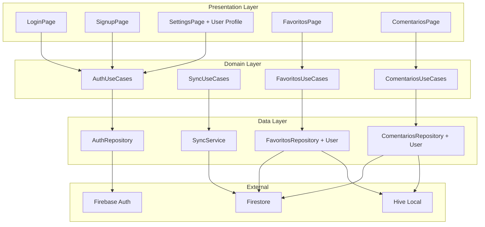
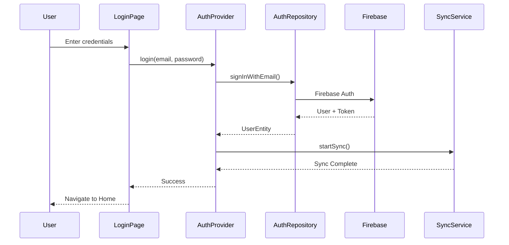
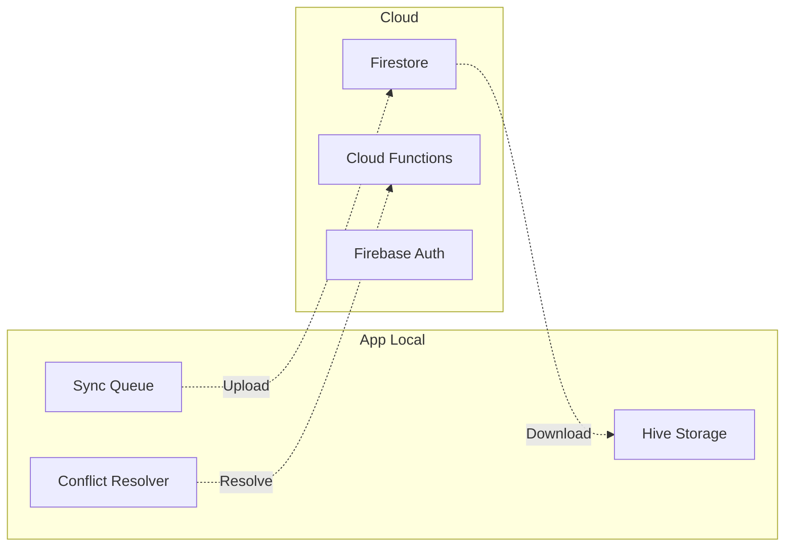

# 🔐 Plano de Implementação - Login e Criação de Contas
## ReceitauAgro - Sistema de Autenticação e Sincronização

*Documento Técnico | Versão 1.0 | Data: Janeiro 2025*

---

## 📋 **Índice**

1. [Visão Geral](#visão-geral)
2. [Análise da Estrutura Atual](#análise-da-estrutura-atual)
3. [Arquitetura Proposta](#arquitetura-proposta)
4. [Especificações Técnicas](#especificações-técnicas)
5. [Fases de Implementação](#fases-de-implementação)
6. [Migração de Dados](#migração-de-dados)
7. [Sincronização](#sincronização)
8. [Controle de Dispositivos](#controle-de-dispositivos)
9. [Segurança](#segurança)
10. [Interface do Usuário](#interface-do-usuário)
11. [Cronograma](#cronograma)

---

## 🎯 **Visão Geral**

### **Objetivo**
Implementar sistema completo de autenticação no app-receituagro, permitindo criação de contas, login/logout e sincronização de favoritos e comentários entre devices.

### **Escopo de Sincronização**
- ✅ **Favoritos**: Defensivos, Pragas e Diagnósticos
- ✅ **Comentários**: Sistema completo de comentários dos usuários
- ❌ **Outros dados**: Permanecem locais (sem sincronização)

### **Padrões de Referência**
Baseado na implementação bem-sucedida do **app-gasometer**, que possui sistema robusto de autenticação com Firebase, Clean Architecture e sincronização inteligente.

---

## 🔍 **Análise da Estrutura Atual**

### **✅ Pontos Fortes Existentes**

#### **1. Core Package Disponível**
```bash
/packages/core/lib/src/auth/
├── data/
│   ├── datasources/
│   │   ├── auth_local_datasource.dart      # ✅ Pronto
│   │   └── auth_remote_datasource.dart     # ✅ Pronto
│   ├── models/
│   │   └── user_model.dart                 # ✅ Pronto
│   └── repositories/
│       └── auth_repository_impl.dart       # ✅ Pronto
├── domain/
│   ├── entities/
│   │   └── user_entity.dart               # ✅ Pronto
│   ├── repositories/
│   │   └── auth_repository.dart           # ✅ Pronto
│   └── usecases/
│       ├── get_current_user.dart          # ✅ Pronto
│       ├── login_user.dart                # ✅ Pronto
│       ├── logout_user.dart               # ✅ Pronto
│       └── register_user.dart             # ✅ Pronto
└── presentation/
    └── auth_provider.dart                 # ✅ Pronto
```

#### **2. Firebase Configuração**
- ✅ Firebase já configurado (modo anônimo)
- ✅ Firestore disponível mas não utilizado
- ✅ Firebase Auth configurado
- ✅ Estrutura de Dependency Injection pronta

#### **3. Arquitetura Compatível**
- ✅ Provider Pattern implementado
- ✅ Clean Architecture seguida
- ✅ GetIt/Injectable configurado
- ✅ Navigation Provider existente

### **❌ Pontos que Precisam de Implementação**

#### **1. Modelos de Dados Sem Associação de Usuário**
```dart
// ATUAL - Favoritos sem userId
@HiveType(typeId: 7)
class FavoritoDefensivoModel extends HiveObject {
  @HiveField(0)
  final String id;
  // Sem userId - associado apenas ao device
}

// NECESSÁRIO - Favoritos com associação de usuário
@HiveType(typeId: 7)  
class FavoritoDefensivoModel extends HiveObject {
  @HiveField(0)
  final String id;
  @HiveField(10)        // ⚠️ Novo campo
  final String? userId; // Associação com usuário
}
```

#### **2. Sistema de Comentários Local**
```dart
// ATUAL - Comentários apenas locais
class ComentarioModel {
  final String id;
  final String dispositivo;  // ❌ Baseado em device
  // Sem sincronização
}

// NECESSÁRIO - Comentários com usuário e sync
class ComentarioModel {
  final String id;
  final String? userId;      // ✅ Usuário associado
  final bool synchronized;   // ✅ Estado de sync
  final DateTime createdAt;  // ✅ Timestamps
  final DateTime? updatedAt; // ✅ Controle de versão
}
```

#### **3. Services de Auth Desabilitados**
```dart
// ATUAL - Comentado/Desabilitado
// sl.registerLazySingleton<IAuthService>(() => AuthService());

// NECESSÁRIO - Habilitado e integrado
sl.registerLazySingleton<IAuthService>(() => AuthService());
sl.registerLazySingleton<SyncService>(() => SyncService());
```

---

## 🏗️ **Arquitetura Proposta**

### **Diagrama de Componentes**



### **Fluxo de Autenticação**



---

## 📋 **Especificações Técnicas**

### **1. Estrutura de Usuário**

```dart
class UserEntity {
  final String id;                    // Firebase UID
  final String? email;
  final String? displayName;
  final String? photoUrl;
  final UserType type;               // guest, registered, premium
  final bool isEmailVerified;
  final DateTime createdAt;
  final DateTime? lastSignInAt;
  final Map<String, dynamic> metadata;
}

enum UserType { guest, registered, premium }
```

### **2. Modelos de Dados Atualizados**

#### **Favoritos com Usuário**
```dart
@HiveType(typeId: 7)
class FavoritoDefensivoModel extends HiveObject {
  @HiveField(0) final String id;
  @HiveField(1) final String nomeComum;
  @HiveField(2) final String ingredienteAtivo;
  @HiveField(3) final String? fabricante;
  @HiveField(4) final DateTime createdAt;
  @HiveField(10) final String? userId;        // ✅ Novo
  @HiveField(11) final bool synchronized;     // ✅ Novo
  @HiveField(12) final DateTime? syncedAt;    // ✅ Novo
}
```

#### **Comentários com Usuário**
```dart
@HiveType(typeId: 15)
class ComentarioModel extends HiveObject {
  @HiveField(0) final String id;
  @HiveField(1) final String conteudo;
  @HiveField(2) final String tipo;
  @HiveField(3) final String referencia;
  @HiveField(4) final DateTime createdAt;
  @HiveField(10) final String? userId;        // ✅ Novo
  @HiveField(11) final String? userName;      // ✅ Novo
  @HiveField(12) final bool synchronized;     // ✅ Novo
  @HiveField(13) final DateTime? syncedAt;    // ✅ Novo
  @HiveField(14) final DateTime? updatedAt;   // ✅ Novo
}
```

### **3. Firestore Collections**

#### **Estrutura no Firestore**
```javascript
// /users/{userId}
{
  "email": "user@example.com",
  "displayName": "João Silva",
  "createdAt": "2025-01-15T10:00:00Z",
  "lastActive": "2025-01-15T15:30:00Z",
  "deviceLimit": 3,
  "activeDevices": ["device-uuid-1", "device-uuid-2"]
}

// /users/{userId}/devices/{deviceId}
{
  "deviceId": "device-uuid-123",
  "deviceName": "iPhone de João",
  "platform": "ios", // ios | android
  "appVersion": "1.2.0",
  "firstLoginAt": "2025-01-15T10:00:00Z",
  "lastActiveAt": "2025-01-15T15:30:00Z",
  "isActive": true
}

// /users/{userId}/favoritos/{favoritoId}
{
  "id": "defensivo_123",
  "type": "defensivo", // "defensivo" | "praga" | "diagnostico"
  "nomeComum": "Roundup",
  "data": { /* dados específicos do tipo */ },
  "createdAt": "2025-01-15T10:00:00Z"
}

// /users/{userId}/comentarios/{comentarioId}  
{
  "conteudo": "Excelente defensivo para...",
  "tipo": "defensivo",
  "referencia": "glifosato",
  "createdAt": "2025-01-15T10:00:00Z",
  "updatedAt": "2025-01-15T11:00:00Z"
}
```

---

## 🚀 **Fases de Implementação**

### **📅 Fase 1: Fundação (1-2 semanas)**

#### **Objetivos**
- ✅ Habilitar serviços de auth do core package
- ✅ Implementar páginas de login/cadastro
- ✅ Integrar Firebase Auth completo

#### **Entregas**
1. **AuthProvider Integration**
   ```dart
   // lib/core/di/injection_container.dart
   sl.registerLazySingleton<IAuthService>(() => AuthService());
   sl.registerLazySingleton<AuthProvider>(() => AuthProvider(sl()));
   ```

2. **Login/Signup Pages**
   ```bash
   lib/features/auth/
   ├── presentation/
   │   ├── pages/
   │   │   ├── login_page.dart
   │   │   ├── signup_page.dart
   │   │   └── auth_wrapper.dart
   │   ├── widgets/
   │   │   ├── auth_text_field.dart
   │   │   ├── auth_button.dart
   │   │   └── social_login_buttons.dart
   │   └── providers/
   │       └── auth_provider.dart
   ```

3. **Navigation Guards**
   ```dart
   // Verificar auth state antes de acessar favoritos/comentários
   class AuthGuard {
     static bool canAccess(BuildContext context) {
       return context.read<AuthProvider>().isAuthenticated;
     }
   }
   ```

#### **Critérios de Aceitação**
- [ ] Usuário pode criar conta com email/senha
- [ ] Usuário pode fazer login/logout
- [ ] Estado de auth é mantido após restart do app
- [ ] Navegação redirecionada baseada em auth state

### **📅 Fase 2: Migração de Dados (2-3 semanas)**

#### **Objetivos**
- ✅ Atualizar modelos Hive com userId
- ✅ Implementar migração de dados existentes
- ✅ Associar dados locais com usuário logado

#### **Entregas**
1. **Migration Service**
   ```dart
   class UserDataMigrationService {
     Future<void> migrateExistingData(String userId) async {
       await _migrateFavoritos(userId);
       await _migrateComentarios(userId);
     }
     
     Future<void> _migrateFavoritos(String userId) {
       // Associar favoritos existentes ao usuário
     }
   }
   ```

2. **Updated Hive Models**
   - Adicionar campos userId aos modelos existentes
   - Implementar adapter versioning
   - Backward compatibility

3. **Repository Updates**
   ```dart
   class FavoritosRepository {
     Future<void> addFavorito(FavoritoEntity favorito) async {
       final userId = await _authProvider.getCurrentUserId();
       final model = favorito.toModel().copyWith(userId: userId);
       await _localDataSource.saveFavorito(model);
     }
   }
   ```

#### **Critérios de Aceitação**
- [ ] Dados existentes migrados sem perda
- [ ] Novos favoritos/comentários associados ao usuário
- [ ] Usuários diferentes têm dados separados
- [ ] Backward compatibility mantida

### **📅 Fase 3: Sincronização (2-3 semanas)**

#### **Objetivos**
- ✅ Implementar sync bidirecional com Firestore
- ✅ Resolver conflitos de sincronização
- ✅ Offline-first com sync inteligente

#### **Entregas**
1. **Sync Service**
   ```dart
   class SyncService {
     Future<void> syncFavoritos() async {
       await _syncUp(); // Local -> Firestore
       await _syncDown(); // Firestore -> Local
     }
     
     Future<void> resolveConflicts() {
       // Last-write-wins ou merge inteligente
     }
   }
   ```

2. **Conflict Resolution**
   - Timestamp-based resolution
   - User-guided resolution para conflitos complexos
   - Backup de dados antes da resolução

3. **Background Sync**
   - Sync automático a cada 5 minutos (quando online)
   - Sync manual com pull-to-refresh
   - Queue de operações offline

#### **Critérios de Aceitação**
- [ ] Favoritos sincronizam entre devices
- [ ] Comentários sincronizam entre devices
- [ ] Funciona offline com sync posterior
- [ ] Conflitos resolvidos automaticamente
- [ ] Performance não degradada

### **📅 Fase 4: Interface e Refinamentos (1-2 semanas)**

#### **Objetivos**
- ✅ Integrar perfil de usuário nas configurações
- ✅ Indicadores visuais de sync
- ✅ Experiência de usuário polida

#### **Entregas**
1. **User Profile Section**
   ```dart
   // Adicionar à SettingsPage
   UserProfileSection(
     avatar: user.photoUrl,
     displayName: user.displayName,
     email: user.email,
     onEditProfile: () => _showEditDialog(),
     onLogout: () => _authProvider.logout(),
   )
   ```

2. **Sync Indicators**
   - Loading states durante sync
   - Ícones de sync status nos favoritos/comentários
   - Notificações de sync completion

3. **Error Handling**
   - Mensagens de erro user-friendly
   - Retry logic para falhas de rede
   - Fallback para modo offline

#### **Critérios de Aceitação**
- [ ] Perfil de usuário acessível e editável
- [ ] Status de sync sempre visível
- [ ] Errors handled gracefully
- [ ] UX consistente com o resto do app

---

## 🔄 **Migração de Dados**

### **Estratégia de Migração**

#### **1. Detecção de Migração Necessária**
```dart
class MigrationManager {
  Future<bool> needsMigration() async {
    final box = await Hive.openBox('favorites');
    final firstItem = box.values.isNotEmpty ? box.values.first : null;
    return firstItem != null && !_hasUserIdField(firstItem);
  }
}
```

#### **2. Processo de Migração**
```dart
Future<void> performMigration(String userId) async {
  // 1. Backup dos dados atuais
  await _createBackup();
  
  // 2. Migração por lotes
  await _migrateFavoritosBatch(userId);
  await _migrateComentariosBatch(userId);
  
  // 3. Validação da migração
  await _validateMigration();
  
  // 4. Limpeza de dados antigos
  await _cleanupOldData();
}
```

#### **3. Rollback Strategy**
```dart
class MigrationRollback {
  Future<void> rollback() async {
    await _restoreFromBackup();
    await _revertHiveSchemaChanges();
  }
}
```

### **Hive Schema Versioning**

```dart
// Adapter com versionamento
@HiveType(typeId: 7, adapterName: 'FavoritoDefensivoModelAdapter')
class FavoritoDefensivoModel extends HiveObject {
  static const int currentVersion = 2;
  
  @HiveField(0) final String id;
  @HiveField(1) final String nomeComum;
  // ... outros campos existentes
  @HiveField(10) final String? userId;        // v2
  @HiveField(11) final bool synchronized;     // v2
  @HiveField(99) final int schemaVersion;     // Controle de versão
}
```

---

## ⚡ **Sincronização**

### **Arquitetura de Sync**



### **Estratégias de Sync**

#### **1. Sync Up (Local → Cloud)**
```dart
Future<void> syncUp() async {
  final pendingItems = await _getPendingSync();
  
  for (final item in pendingItems) {
    try {
      if (item.isDeleted) {
        await _firestore.doc(item.path).delete();
      } else {
        await _firestore.doc(item.path).set(item.data);
      }
      
      item.synchronized = true;
      item.syncedAt = DateTime.now();
      await _localStorage.update(item);
      
    } catch (e) {
      _handleSyncError(item, e);
    }
  }
}
```

#### **2. Sync Down (Cloud → Local)**
```dart
Future<void> syncDown() async {
  final lastSyncTime = await _getLastSyncTime();
  
  final query = _firestore
      .collection('users/${userId}/favoritos')
      .where('updatedAt', isGreaterThan: lastSyncTime);
      
  final snapshot = await query.get();
  
  for (final doc in snapshot.docs) {
    final cloudItem = CloudFavorito.fromFirestore(doc);
    final localItem = await _localStorage.findById(cloudItem.id);
    
    if (localItem == null) {
      // Novo item do cloud
      await _localStorage.insert(cloudItem.toLocal());
    } else {
      // Resolver conflito
      final resolved = await _conflictResolver.resolve(localItem, cloudItem);
      await _localStorage.update(resolved);
    }
  }
}
```

### **Resolução de Conflitos**

#### **Estratégia: Last-Write-Wins + User Choice**
```dart
class ConflictResolver {
  Future<FavoritoModel> resolve(
    FavoritoModel local, 
    CloudFavorito cloud
  ) async {
    // 1. Timestamp comparison
    if (cloud.updatedAt.isAfter(local.updatedAt)) {
      return cloud.toLocal();
    }
    
    // 2. Se muito próximos, perguntar ao usuário
    final timeDiff = local.updatedAt.difference(cloud.updatedAt);
    if (timeDiff.abs().inMinutes < 5) {
      return await _showConflictDialog(local, cloud);
    }
    
    // 3. Default: manter local
    return local;
  }
}
```

---

## 📱 **Controle de Dispositivos**

### **Visão Geral**
Sistema de controle que permite ao usuário fazer login em no máximo **3 dispositivos simultaneamente**, com gerenciamento de dispositivos ativos pelo próprio aplicativo.

### **Funcionalidades**
- ✅ **Limite de 3 dispositivos** por conta
- ✅ **Gerenciamento de dispositivos** via app
- ✅ **Revogação remota** de acesso
- ✅ **Identificação única** de dispositivos
- ✅ **Notificação de novos logins**

---

### **1. Arquitetura do Sistema**

```mermaid
graph TB
    subgraph "App Local"
        DI[Device Identity]
        DM[Device Manager]
        AU[Auth Provider]
    end
    
    subgraph "Firestore"
        US[/users/{userId}]
        DV[/users/{userId}/devices/{deviceId}]
        SS[/users/{userId}/sessions/{sessionId}]
    end
    
    subgraph "Cloud Functions"
        VA[validateDevice()]
        RD[revokeDevice()]
        CL[cleanupOldSessions()]
    end
    
    DI --> DM
    DM --> AU
    AU --> US
    AU --> DV
    AU --> SS
    
    DM -.->|Validate| VA
    DM -.->|Revoke| RD
    VA -.->|Cleanup| CL
```

---

### **2. Device Identity Service**

#### **Geração de UUID Único**
```dart
class DeviceIdentityService {
  final DeviceInfoPlugin _deviceInfo = DeviceInfoPlugin();
  final FlutterSecureStorage _secureStorage = FlutterSecureStorage();
  
  /// Obtém ou cria um UUID único para o dispositivo
  Future<String> getDeviceUuid() async {
    // 1. Tentar recuperar UUID existente
    String? existingUuid = await _secureStorage.read(key: 'device_uuid');
    if (existingUuid != null) return existingUuid;
    
    // 2. Gerar novo UUID baseado em características do device
    final deviceData = await _getDeviceIdentifiers();
    final uuid = _generateDeviceUuid(deviceData);
    
    // 3. Armazenar de forma segura
    await _secureStorage.write(key: 'device_uuid', value: uuid);
    return uuid;
  }
  
  /// Obtém informações do dispositivo
  Future<DeviceInfo> getDeviceInfo() async {
    if (Platform.isIOS) {
      final iosInfo = await _deviceInfo.iosInfo;
      return DeviceInfo(
        name: iosInfo.name,
        model: '${iosInfo.model} ${iosInfo.systemVersion}',
        platform: 'ios',
        identifier: iosInfo.identifierForVendor ?? 'unknown',
      );
    } else if (Platform.isAndroid) {
      final androidInfo = await _deviceInfo.androidInfo;
      return DeviceInfo(
        name: androidInfo.model,
        model: '${androidInfo.brand} ${androidInfo.device}',
        platform: 'android',
        identifier: androidInfo.id,
      );
    }
    throw UnimplementedError('Platform not supported');
  }
}
```

#### **Modelo de Device**
```dart
class DeviceInfo {
  const DeviceInfo({
    required this.uuid,
    required this.name,
    required this.model,
    required this.platform,
    required this.appVersion,
    required this.firstLoginAt,
    required this.lastActiveAt,
    required this.isActive,
  });
  
  final String uuid;
  final String name;           // "iPhone de João"
  final String model;          // "iPhone 14 Pro iOS 17.2"
  final String platform;       // "ios" | "android"
  final String appVersion;     // "1.2.0"
  final DateTime firstLoginAt;
  final DateTime lastActiveAt;
  final bool isActive;
  
  /// Display name amigável
  String get displayName => '$name • $model';
  
  /// Indica se é o dispositivo atual
  bool get isCurrentDevice => /* lógica de comparação */;
}
```

---

### **3. Device Management Service**

#### **Validação de Login**
```dart
class DeviceManagementService {
  static const int maxDevices = 3;
  
  /// Valida se o dispositivo pode fazer login
  Future<DeviceValidationResult> validateDeviceLogin(String userId) async {
    final deviceUuid = await _deviceService.getDeviceUuid();
    
    // 1. Verificar se device já está registrado
    final existingDevice = await _getRegisteredDevice(userId, deviceUuid);
    if (existingDevice != null) {
      await _updateDeviceActivity(userId, deviceUuid);
      return DeviceValidationResult.success();
    }
    
    // 2. Verificar limite de dispositivos
    final activeDevices = await _getActiveDevices(userId);
    if (activeDevices.length >= maxDevices) {
      return DeviceValidationResult.limitExceeded(activeDevices);
    }
    
    // 3. Registrar novo dispositivo
    await _registerNewDevice(userId, deviceUuid);
    return DeviceValidationResult.success();
  }
  
  /// Registra novo dispositivo
  Future<void> _registerNewDevice(String userId, String deviceUuid) async {
    final deviceInfo = await _deviceService.getDeviceInfo();
    final deviceData = {
      'deviceId': deviceUuid,
      'deviceName': deviceInfo.name,
      'platform': deviceInfo.platform,
      'model': deviceInfo.model,
      'appVersion': await _getAppVersion(),
      'firstLoginAt': FieldValue.serverTimestamp(),
      'lastActiveAt': FieldValue.serverTimestamp(),
      'isActive': true,
    };
    
    // Transação para evitar condições de corrida
    await _firestore.runTransaction((transaction) async {
      // 1. Adicionar à subcoleção devices
      final deviceRef = _firestore
          .collection('users')
          .doc(userId)
          .collection('devices')
          .doc(deviceUuid);
      
      transaction.set(deviceRef, deviceData);
      
      // 2. Atualizar array de dispositivos ativos no user
      final userRef = _firestore.collection('users').doc(userId);
      transaction.update(userRef, {
        'activeDevices': FieldValue.arrayUnion([deviceUuid]),
        'lastActive': FieldValue.serverTimestamp(),
      });
    });
  }
  
  /// Remove dispositivo específico
  Future<void> revokeDevice(String userId, String deviceUuid) async {
    await _firestore.runTransaction((transaction) async {
      // 1. Marcar device como inativo
      final deviceRef = _firestore
          .collection('users')
          .doc(userId)
          .collection('devices')
          .doc(deviceUuid);
      
      transaction.update(deviceRef, {
        'isActive': false,
        'revokedAt': FieldValue.serverTimestamp(),
      });
      
      // 2. Remover do array de ativos
      final userRef = _firestore.collection('users').doc(userId);
      transaction.update(userRef, {
        'activeDevices': FieldValue.arrayRemove([deviceUuid]),
      });
    });
  }
}
```

#### **Resultado de Validação**
```dart
class DeviceValidationResult {
  const DeviceValidationResult._({
    required this.isValid,
    this.message,
    this.conflictingDevices = const [],
  });
  
  final bool isValid;
  final String? message;
  final List<DeviceInfo> conflictingDevices;
  
  factory DeviceValidationResult.success() {
    return DeviceValidationResult._(isValid: true);
  }
  
  factory DeviceValidationResult.limitExceeded(List<DeviceInfo> devices) {
    return DeviceValidationResult._(
      isValid: false,
      message: 'Limite de 3 dispositivos atingido',
      conflictingDevices: devices,
    );
  }
}
```

---

### **4. Interface de Gerenciamento**

#### **Tela de Dispositivos nas Configurações**
```dart
class DeviceManagementSection extends StatefulWidget {
  @override
  Widget build(BuildContext context) {
    return Consumer<AuthProvider>(
      builder: (context, auth, child) {
        if (!auth.isAuthenticated) return SizedBox.shrink();
        
        return SettingsSection(
          title: 'Dispositivos Conectados',
          subtitle: '${auth.activeDevicesCount}/3 dispositivos',
          icon: Icons.devices,
          children: [
            FutureBuilder<List<DeviceInfo>>(
              future: _deviceManager.getUserDevices(auth.currentUser!.id),
              builder: (context, snapshot) {
                if (snapshot.connectionState == ConnectionState.loading) {
                  return _buildLoadingState();
                }
                
                if (snapshot.hasError) {
                  return _buildErrorState();
                }
                
                final devices = snapshot.data ?? [];
                return Column(
                  children: devices.map((device) => 
                    DeviceListItem(
                      device: device,
                      onRevoke: device.isCurrentDevice ? null : () => _revokeDevice(device),
                    ),
                  ).toList(),
                );
              },
            ),
          ],
        );
      },
    );
  }
}
```

#### **Item de Dispositivo**
```dart
class DeviceListItem extends StatelessWidget {
  const DeviceListItem({
    required this.device,
    this.onRevoke,
  });
  
  final DeviceInfo device;
  final VoidCallback? onRevoke;
  
  @override
  Widget build(BuildContext context) {
    final theme = Theme.of(context);
    
    return Container(
      padding: EdgeInsets.symmetric(horizontal: 16, vertical: 12),
      child: Row(
        children: [
          // Ícone do dispositivo
          _buildDeviceIcon(),
          SizedBox(width: 12),
          
          // Info do dispositivo
          Expanded(
            child: Column(
              crossAxisAlignment: CrossAxisAlignment.start,
              children: [
                Row(
                  children: [
                    Text(
                      device.displayName,
                      style: theme.textTheme.titleSmall,
                    ),
                    if (device.isCurrentDevice) ...[
                      SizedBox(width: 8),
                      Container(
                        padding: EdgeInsets.symmetric(horizontal: 6, vertical: 2),
                        decoration: BoxDecoration(
                          color: theme.colorScheme.primaryContainer,
                          borderRadius: BorderRadius.circular(4),
                        ),
                        child: Text(
                          'Atual',
                          style: theme.textTheme.labelSmall?.copyWith(
                            color: theme.colorScheme.onPrimaryContainer,
                          ),
                        ),
                      ),
                    ],
                  ],
                ),
                SizedBox(height: 4),
                Text(
                  'Último acesso: ${_formatLastActive(device.lastActiveAt)}',
                  style: theme.textTheme.bodySmall?.copyWith(
                    color: theme.colorScheme.onSurfaceVariant,
                  ),
                ),
              ],
            ),
          ),
          
          // Ações
          if (onRevoke != null)
            IconButton(
              icon: Icon(Icons.close),
              onPressed: onRevoke,
              tooltip: 'Remover dispositivo',
            ),
        ],
      ),
    );
  }
}
```

---

### **5. Fluxo de Login com Limite**

#### **Validação Durante Login**
```dart
class AuthProvider extends ChangeNotifier {
  Future<AuthResult> signInWithEmailAndPassword(String email, String password) async {
    try {
      // 1. Login Firebase normal
      final userCredential = await _firebaseAuth.signInWithEmailAndPassword(
        email: email,
        password: password,
      );
      
      // 2. Validar limite de dispositivos
      final deviceValidation = await _deviceManager.validateDeviceLogin(
        userCredential.user!.uid,
      );
      
      if (!deviceValidation.isValid) {
        // Fazer logout do Firebase
        await _firebaseAuth.signOut();
        
        // Mostrar dialog de limite excedido
        return AuthResult.deviceLimitExceeded(deviceValidation.conflictingDevices);
      }
      
      // 3. Sucesso - continuar com login normal
      final user = UserEntity.fromFirebaseUser(userCredential.user!);
      _currentUser = user;
      notifyListeners();
      
      return AuthResult.success(user);
      
    } catch (e) {
      return AuthResult.failure(e.toString());
    }
  }
}
```

#### **Dialog de Limite Excedido**
```dart
class DeviceLimitDialog extends StatelessWidget {
  const DeviceLimitDialog({
    required this.conflictingDevices,
  });
  
  final List<DeviceInfo> conflictingDevices;
  
  @override
  Widget build(BuildContext context) {
    return AlertDialog(
      title: Text('Limite de Dispositivos Atingido'),
      content: Column(
        mainAxisSize: MainAxisSize.min,
        crossAxisAlignment: CrossAxisAlignment.start,
        children: [
          Text(
            'Você já está conectado em 3 dispositivos. Para fazer login aqui, '
            'você precisa desconectar um dos dispositivos abaixo:',
          ),
          SizedBox(height: 16),
          
          // Lista de dispositivos para escolher
          ...conflictingDevices.map((device) => 
            ListTile(
              leading: _getDeviceIcon(device.platform),
              title: Text(device.displayName),
              subtitle: Text(_formatLastActive(device.lastActiveAt)),
              trailing: TextButton(
                child: Text('Desconectar'),
                onPressed: () => _revokeDeviceAndLogin(context, device),
              ),
            ),
          ),
        ],
      ),
      actions: [
        TextButton(
          child: Text('Cancelar'),
          onPressed: () => Navigator.of(context).pop(),
        ),
      ],
    );
  }
  
  Future<void> _revokeDeviceAndLogin(BuildContext context, DeviceInfo device) async {
    final authProvider = context.read<AuthProvider>();
    
    // 1. Revogar dispositivo selecionado
    await _deviceManager.revokeDevice(authProvider.currentUser!.id, device.uuid);
    
    // 2. Tentar login novamente
    Navigator.of(context).pop();
    // Login será bem-sucedido agora
  }
}
```

---

### **6. Segurança e Firestore Rules**

#### **Rules de Segurança**
```javascript
// firestore.rules
rules_version = '2';
service cloud.firestore {
  match /databases/{database}/documents {
    match /users/{userId} {
      allow read, write: if request.auth != null && request.auth.uid == userId;
      
      // Subcoleção de dispositivos
      match /devices/{deviceId} {
        allow read: if request.auth != null && request.auth.uid == userId;
        allow write: if request.auth != null 
          && request.auth.uid == userId
          && isValidDeviceWrite();
      }
    }
  }
  
  // Validações customizadas
  function isValidDeviceWrite() {
    let data = request.resource.data;
    return data.keys().hasAll(['deviceId', 'platform', 'firstLoginAt', 'lastActiveAt']) 
      && data.deviceId is string
      && data.platform in ['ios', 'android'];
  }
}
```

#### **Cloud Functions para Limpeza**
```javascript
// functions/src/deviceManagement.js
const functions = require('firebase-functions');
const admin = require('firebase-admin');

// Limpar dispositivos inativos após 30 dias
exports.cleanupInactiveDevices = functions.pubsub
  .schedule('every 24 hours')
  .onRun(async (context) => {
    const cutoffDate = new Date(Date.now() - 30 * 24 * 60 * 60 * 1000);
    
    const batch = admin.firestore().batch();
    
    const inactiveDevicesQuery = admin.firestore()
      .collectionGroup('devices')
      .where('lastActiveAt', '<', cutoffDate)
      .where('isActive', '==', true);
      
    const snapshot = await inactiveDevicesQuery.get();
    
    snapshot.docs.forEach((doc) => {
      batch.update(doc.ref, {
        isActive: false,
        deactivatedAt: admin.firestore.FieldValue.serverTimestamp(),
        deactivationReason: 'inactivity'
      });
    });
    
    await batch.commit();
    console.log(`Deactivated ${snapshot.size} inactive devices`);
  });
```

---

### **7. Testes e Validação**

#### **Cenários de Teste**
```dart
// test/device_management_test.dart
group('Device Management', () {
  testWidgets('should allow login when under device limit', (tester) async {
    // Setup: user with 2 devices
    await mockUserWithDevices(userId: 'user1', deviceCount: 2);
    
    // Test: login from new device
    final result = await deviceManager.validateDeviceLogin('user1');
    
    // Assert: should succeed
    expect(result.isValid, true);
  });
  
  testWidgets('should block login when device limit exceeded', (tester) async {
    // Setup: user with 3 devices (max)
    await mockUserWithDevices(userId: 'user1', deviceCount: 3);
    
    // Test: login from new device
    final result = await deviceManager.validateDeviceLogin('user1');
    
    // Assert: should fail
    expect(result.isValid, false);
    expect(result.conflictingDevices.length, 3);
  });
  
  testWidgets('should allow revoke and re-login', (tester) async {
    // Setup: user at device limit
    await mockUserWithDevices(userId: 'user1', deviceCount: 3);
    
    // Test: revoke one device
    await deviceManager.revokeDevice('user1', 'device-1');
    final result = await deviceManager.validateDeviceLogin('user1');
    
    // Assert: should now succeed
    expect(result.isValid, true);
  });
});
```

---

## 🔒 **Segurança**

### **Firebase Security Rules**

```javascript
// /firestore.rules
rules_version = '2';
service cloud.firestore {
  match /databases/{database}/documents {
    // Users can only access their own data
    match /users/{userId} {
      allow read, write: if request.auth != null && request.auth.uid == userId;
      
      // Favoritos do usuário
      match /favoritos/{favoritoId} {
        allow read, write: if request.auth != null && request.auth.uid == userId;
      }
      
      // Comentários do usuário
      match /comentarios/{comentarioId} {
        allow read, write: if request.auth != null && request.auth.uid == userId;
        
        // Validação de dados
        allow create: if request.auth != null 
          && request.auth.uid == userId
          && resource.data.createdAt == request.time;
      }
      
      // Dispositivos do usuário
      match /devices/{deviceId} {
        allow read: if request.auth != null && request.auth.uid == userId;
        allow write: if request.auth != null 
          && request.auth.uid == userId
          && isValidDeviceWrite();
      }
    }
  }
}
```

### **Local Data Security**

```dart
class SecureStorage {
  // Criptografia de dados sensíveis
  final FlutterSecureStorage _secureStorage;
  final HiveEncryptionKey _hiveKey;
  
  Future<void> storeUserData(UserEntity user) async {
    final encryptedData = await _encrypt(user.toJson());
    await _secureStorage.write(key: 'user_data', value: encryptedData);
  }
}
```

### **Rate Limiting & Protection**

```dart
class AuthRateLimiter {
  static const int _maxAttempts = 5;
  static const Duration _lockoutDuration = Duration(minutes: 15);
  
  Future<bool> canAttemptLogin(String email) async {
    final attempts = await _getAttempts(email);
    return attempts < _maxAttempts;
  }
  
  Future<void> recordFailedAttempt(String email) async {
    await _incrementAttempts(email);
    if (await _getAttempts(email) >= _maxAttempts) {
      await _lockAccount(email);
    }
  }
}
```

---

## 🎨 **Interface do Usuário**

### **1. Tela de Login**

```dart
class LoginPage extends StatefulWidget {
  @override
  Widget build(BuildContext context) {
    return Scaffold(
      body: SafeArea(
        child: Column(
          children: [
            // Logo do ReceitauAgro
            _buildLogo(),
            
            // Tabs: Login | Cadastro
            AuthTabsWidget(
              tabs: ['Entrar', 'Cadastrar'],
              onTabChanged: _onTabChanged,
            ),
            
            // Form atual
            _buildCurrentForm(),
            
            // Divider
            _buildDivider(),
            
            // Entrar como visitante
            _buildGuestLogin(),
            
            // Links auxiliares
            _buildHelpLinks(),
          ],
        ),
      ),
    );
  }
}
```

### **2. Integração com Configurações**

```dart
// Adicionar à SettingsPage
Widget _buildUserSection() {
  return Consumer<AuthProvider>(
    builder: (context, authProvider, child) {
      if (!authProvider.isAuthenticated) {
        return _buildGuestSection();
      }
      
      return UserProfileSection(
        user: authProvider.currentUser!,
        onEditProfile: () => _showEditProfileDialog(),
        onLogout: () => _confirmLogout(),
      );
    },
  );
}
```

### **3. Indicadores de Sync**

```dart
class SyncStatusIndicator extends StatelessWidget {
  final bool isOnline;
  final bool isSyncing;
  final DateTime? lastSync;
  
  @override
  Widget build(BuildContext context) {
    return Row(
      children: [
        Icon(_getStatusIcon(), color: _getStatusColor()),
        SizedBox(width: 4),
        Text(_getStatusText()),
      ],
    );
  }
}
```

---

## 📅 **Cronograma Detalhado**

### **Sprint 1 (Semanas 1-2): Fundação**
| Dia | Tarefa | Responsável | Status |
|-----|--------|-------------|--------|
| 1-2 | Setup Firebase Auth completo | Dev | 🟡 Planejado |
| 3-4 | AuthProvider integration | Dev | 🟡 Planejado |
| 5-6 | LoginPage + SignupPage UI | Dev | 🟡 Planejado |
| 7-8 | Navigation guards | Dev | 🟡 Planejado |
| 9-10 | Testing & bug fixes | Dev | 🟡 Planejado |

### **Sprint 2 (Semanas 3-4): Migração**
| Dia | Tarefa | Responsável | Status |
|-----|--------|-------------|--------|
| 1-3 | Update Hive models | Dev | 🟡 Planejado |
| 4-6 | Migration service | Dev | 🟡 Planejado |
| 7-8 | Repository updates | Dev | 🟡 Planejado |
| 9-10 | Migration testing | QA | 🟡 Planejado |

### **Sprint 3 (Semanas 5-6): Sincronização**
| Dia | Tarefa | Responsável | Status |
|-----|--------|-------------|--------|
| 1-3 | SyncService implementation | Dev | 🟡 Planejado |
| 4-5 | Conflict resolution | Dev | 🟡 Planejado |
| 6-7 | Background sync | Dev | 🟡 Planejado |
| 8-10 | Sync testing | QA | 🟡 Planejado |

### **Sprint 4 (Semanas 7-8): Refinamentos + Device Management**
| Dia | Tarefa | Responsável | Status |
|-----|--------|-------------|--------|
| 1-2 | User profile integration | Dev | 🟡 Planejado |
| 3-4 | Device management UI | Dev | 🟡 Planejado |
| 5-6 | Device limit validation | Dev | 🟡 Planejado |
| 7-8 | Sync indicators | Dev | 🟡 Planejado |
| 9-10 | Final testing + deployment | QA/DevOps | 🟡 Planejado |

---

## ⚠️ **Riscos e Mitigações**

### **Riscos Técnicos**
| Risco | Probabilidade | Impacto | Mitigação |
|-------|---------------|---------|-----------|
| Perda de dados na migração | Média | Alto | Backup completo antes da migração |
| Conflitos de sync complexos | Alta | Médio | Sistema robusto de resolução |
| Performance degradada | Média | Médio | Benchmarking e otimização |
| Problemas de conectividade | Alta | Baixo | Modo offline robusto |
| Bypass do limite de dispositivos | Baixa | Médio | Validação servidor + Cloud Functions |
| Conflitos de device UUID | Baixa | Alto | UUID único + fallback strategies |

### **Riscos de Negócio**
| Risco | Probabilidade | Impacto | Mitigação |
|-------|---------------|---------|-----------|
| Resistência dos usuários | Baixa | Alto | Onboarding suave, modo visitante |
| Perda de dados existentes | Baixa | Alto | Processo de migração rigoroso |
| Problemas de privacidade | Baixa | Alto | LGPD compliance, opt-in claro |

---

## 🧪 **Estratégia de Testing**

### **Unit Tests**
- [ ] AuthProvider methods
- [ ] Migration services  
- [ ] Sync algorithms
- [ ] Conflict resolution logic

### **Integration Tests**
- [ ] Firebase Auth flow
- [ ] Firestore sync
- [ ] Offline/online transitions
- [ ] Cross-device sync
- [ ] Device limit enforcement
- [ ] Device revocation flow

### **E2E Tests**
- [ ] Complete auth flow
- [ ] Data migration process
- [ ] Multi-device scenarios
- [ ] Network failure scenarios

### **Performance Tests**
- [ ] Large dataset migration
- [ ] Sync performance benchmarks
- [ ] Memory usage analysis
- [ ] Battery impact assessment

---

## 📊 **Métricas de Sucesso**

### **Métricas Técnicas**
- ✅ **Migration Success Rate**: >99.5%
- ✅ **Sync Accuracy**: >99.9%
- ✅ **App Performance**: <5% degradation
- ✅ **Offline Functionality**: 100% features working
- ✅ **Error Rate**: <0.1% failed operations

### **Métricas de Usuário**
- ✅ **Auth Conversion**: >80% users create accounts
- ✅ **Retention**: No impact on 7-day retention
- ✅ **Satisfaction**: >4.0 rating mantido
- ✅ **Support Tickets**: <1% increase

---

## 🔄 **Manutenção e Evolução**

### **Monitoramento**
```dart
class AuthMetrics {
  static void trackLogin(String method) {
    _analytics.logEvent('user_login', {'method': method});
  }
  
  static void trackSyncSuccess(String dataType) {
    _analytics.logEvent('sync_success', {'data_type': dataType});
  }
  
  static void trackMigrationStep(String step, bool success) {
    _analytics.logEvent('migration_step', {
      'step': step,
      'success': success,
    });
  }
}
```

### **Roadmap Futuro**
- **v2.0**: Social login (Google, Apple)
- **v2.1**: Teams/sharing de favoritos
- **v2.2**: Backup/restore avançado
- **v2.3**: Multi-tenant para empresas

---

## 📝 **Conclusão**

A implementação de login no ReceitauAgro seguirá as melhores práticas estabelecidas no app-gasometer, adaptadas para as necessidades específicas de sincronização de favoritos e comentários.

**Pontos-chave:**
- ✅ Baseado em sistema comprovado (app-gasometer)
- ✅ Core package já disponível e testado
- ✅ Migração cuidadosa de dados existentes
- ✅ Sincronização robusta com resolução de conflitos
- ✅ UX suave com modo visitante disponível

**Próximos Passos:**
1. Review e aprovação deste documento
2. Setup do ambiente de desenvolvimento
3. Início da Fase 1 - Fundação

---

*Documento criado por: Claude Code Assistant*
*Revisão técnica: Pendente*
*Aprovação de negócio: Pendente*