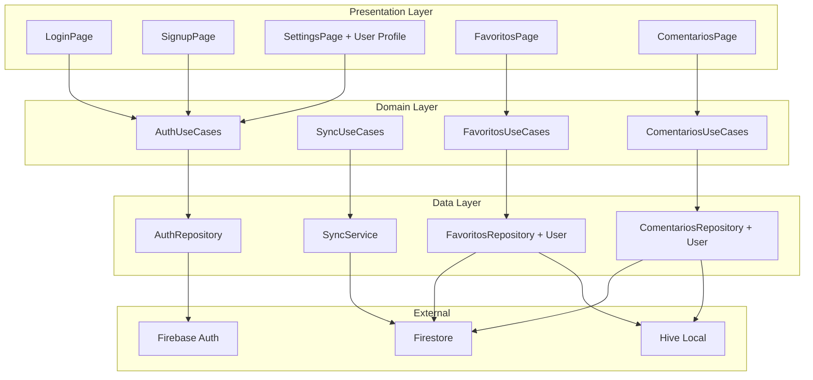
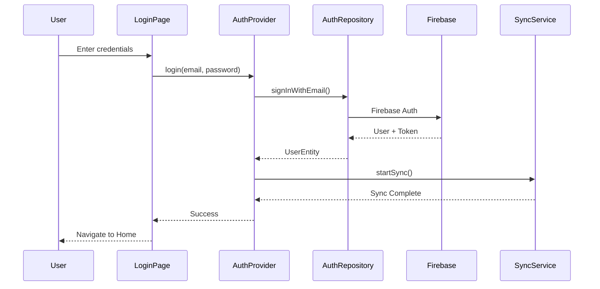
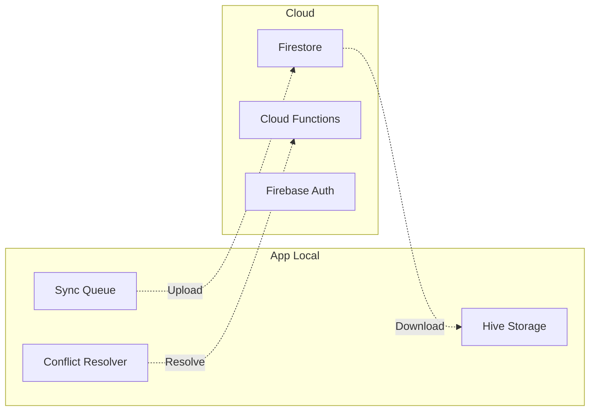

# 🔐 Plano de Implementação - Login e Criação de Contas
## ReceitauAgro - Sistema de Autenticação e Sincronização

*Documento Técnico | Versão 1.0 | Data: Janeiro 2025*

---

## 📋 **Índice**

1. [Visão Geral](#visão-geral)
2. [Análise da Estrutura Atual](#análise-da-estrutura-atual)
3. [Arquitetura Proposta](#arquitetura-proposta)
4. [Especificações Técnicas](#especificações-técnicas)
5. [Fases de Implementação](#fases-de-implementação)
6. [Migração de Dados](#migração-de-dados)
7. [Sincronização](#sincronização)
8. [Controle de Dispositivos](#controle-de-dispositivos)
9. [Segurança](#segurança)
10. [Interface do Usuário](#interface-do-usuário)
11. [Cronograma](#cronograma)

---

## 🎯 **Visão Geral**

### **Objetivo**
Implementar sistema completo de autenticação no app-receituagro, permitindo criação de contas, login/logout e sincronização de favoritos e comentários entre devices.

### **Escopo de Sincronização**
- ✅ **Favoritos**: Defensivos, Pragas e Diagnósticos
- ✅ **Comentários**: Sistema completo de comentários dos usuários
- ❌ **Outros dados**: Permanecem locais (sem sincronização)

### **Padrões de Referência**
Baseado na implementação bem-sucedida do **app-gasometer**, que possui sistema robusto de autenticação com Firebase, Clean Architecture e sincronização inteligente.

---

## 🔍 **Análise da Estrutura Atual**

### **✅ Pontos Fortes Existentes**

#### **1. Core Package Disponível**
```bash
/packages/core/lib/src/auth/
├── data/
│   ├── datasources/
│   │   ├── auth_local_datasource.dart      # ✅ Pronto
│   │   └── auth_remote_datasource.dart     # ✅ Pronto
│   ├── models/
│   │   └── user_model.dart                 # ✅ Pronto
│   └── repositories/
│       └── auth_repository_impl.dart       # ✅ Pronto
├── domain/
│   ├── entities/
│   │   └── user_entity.dart               # ✅ Pronto
│   ├── repositories/
│   │   └── auth_repository.dart           # ✅ Pronto
│   └── usecases/
│       ├── get_current_user.dart          # ✅ Pronto
│       ├── login_user.dart                # ✅ Pronto
│       ├── logout_user.dart               # ✅ Pronto
│       └── register_user.dart             # ✅ Pronto
└── presentation/
    └── auth_provider.dart                 # ✅ Pronto
```

#### **2. Firebase Configuração**
- ✅ Firebase já configurado (modo anônimo)
- ✅ Firestore disponível mas não utilizado
- ✅ Firebase Auth configurado
- ✅ Estrutura de Dependency Injection pronta

#### **3. Arquitetura Compatível**
- ✅ Provider Pattern implementado
- ✅ Clean Architecture seguida
- ✅ GetIt/Injectable configurado
- ✅ Navigation Provider existente

### **❌ Pontos que Precisam de Implementação**

#### **1. Modelos de Dados Sem Associação de Usuário**
```dart
// ATUAL - Favoritos sem userId
@HiveType(typeId: 7)
class FavoritoDefensivoModel extends HiveObject {
  @HiveField(0)
  final String id;
  // Sem userId - associado apenas ao device
}

// NECESSÁRIO - Favoritos com associação de usuário
@HiveType(typeId: 7)  
class FavoritoDefensivoModel extends HiveObject {
  @HiveField(0)
  final String id;
  @HiveField(10)        // ⚠️ Novo campo
  final String? userId; // Associação com usuário
}
```

#### **2. Sistema de Comentários Local**
```dart
// ATUAL - Comentários apenas locais
class ComentarioModel {
  final String id;
  final String dispositivo;  // ❌ Baseado em device
  // Sem sincronização
}

// NECESSÁRIO - Comentários com usuário e sync
class ComentarioModel {
  final String id;
  final String? userId;      // ✅ Usuário associado
  final bool synchronized;   // ✅ Estado de sync
  final DateTime createdAt;  // ✅ Timestamps
  final DateTime? updatedAt; // ✅ Controle de versão
}
```

#### **3. Services de Auth Desabilitados**
```dart
// ATUAL - Comentado/Desabilitado
// sl.registerLazySingleton<IAuthService>(() => AuthService());

// NECESSÁRIO - Habilitado e integrado
sl.registerLazySingleton<IAuthService>(() => AuthService());
sl.registerLazySingleton<SyncService>(() => SyncService());
```

---

## 🏗️ **Arquitetura Proposta**

### **Diagrama de Componentes**



### **Fluxo de Autenticação**



---

## 📋 **Especificações Técnicas**

### **1. Estrutura de Usuário**

```dart
class UserEntity {
  final String id;                    // Firebase UID
  final String? email;
  final String? displayName;
  final String? photoUrl;
  final UserType type;               // guest, registered, premium
  final bool isEmailVerified;
  final DateTime createdAt;
  final DateTime? lastSignInAt;
  final Map<String, dynamic> metadata;
}

enum UserType { guest, registered, premium }
```

### **2. Modelos de Dados Atualizados**

#### **Favoritos com Usuário**
```dart
@HiveType(typeId: 7)
class FavoritoDefensivoModel extends HiveObject {
  @HiveField(0) final String id;
  @HiveField(1) final String nomeComum;
  @HiveField(2) final String ingredienteAtivo;
  @HiveField(3) final String? fabricante;
  @HiveField(4) final DateTime createdAt;
  @HiveField(10) final String? userId;        // ✅ Novo
  @HiveField(11) final bool synchronized;     // ✅ Novo
  @HiveField(12) final DateTime? syncedAt;    // ✅ Novo
}
```

#### **Comentários com Usuário**
```dart
@HiveType(typeId: 15)
class ComentarioModel extends HiveObject {
  @HiveField(0) final String id;
  @HiveField(1) final String conteudo;
  @HiveField(2) final String tipo;
  @HiveField(3) final String referencia;
  @HiveField(4) final DateTime createdAt;
  @HiveField(10) final String? userId;        // ✅ Novo
  @HiveField(11) final String? userName;      // ✅ Novo
  @HiveField(12) final bool synchronized;     // ✅ Novo
  @HiveField(13) final DateTime? syncedAt;    // ✅ Novo
  @HiveField(14) final DateTime? updatedAt;   // ✅ Novo
}
```

### **3. Estruturas de Dados Atualizadas**

#### **Modelos de Sincronização**

##### **AppSettings Model**
```dart
@HiveType(typeId: 20)
class AppSettingsModel extends HiveObject {
  @HiveField(0) final String? theme;              // 'light', 'dark', 'system'
  @HiveField(1) final String? language;          // 'pt', 'en', 'es'
  @HiveField(2) final bool enableNotifications;
  @HiveField(3) final bool enableSync;
  @HiveField(4) final Map<String, bool> featureFlags;
  @HiveField(5) final String? userId;
  @HiveField(6) final bool synchronized;
  @HiveField(7) final DateTime? syncedAt;
  @HiveField(8) final DateTime createdAt;
  @HiveField(9) final DateTime? updatedAt;

  const AppSettingsModel({
    this.theme = 'system',
    this.language = 'pt',
    this.enableNotifications = true,
    this.enableSync = true,
    this.featureFlags = const {},
    this.userId,
    this.synchronized = false,
    this.syncedAt,
    required this.createdAt,
    this.updatedAt,
  });
}
```

##### **SubscriptionData Model**
```dart
@HiveType(typeId: 21)
class SubscriptionDataModel extends HiveObject {
  @HiveField(0) final String status;             // 'active', 'expired', 'trial', 'cancelled'
  @HiveField(1) final String? productId;
  @HiveField(2) final String platform;          // 'ios', 'android', 'web'
  @HiveField(3) final DateTime? purchasedAt;
  @HiveField(4) final DateTime? expiresAt;
  @HiveField(5) final List<String> features;    // ['unlimited_favorites', 'sync_data', etc]
  @HiveField(6) final Map<String, dynamic> metadata;
  @HiveField(7) final String? userId;
  @HiveField(8) final bool synchronized;
  @HiveField(9) final DateTime? syncedAt;
  @HiveField(10) final DateTime createdAt;
  @HiveField(11) final DateTime? updatedAt;

  const SubscriptionDataModel({
    this.status = 'expired',
    this.productId,
    this.platform = 'unknown',
    this.purchasedAt,
    this.expiresAt,
    this.features = const [],
    this.metadata = const {},
    this.userId,
    this.synchronized = false,
    this.syncedAt,
    required this.createdAt,
    this.updatedAt,
  });

  bool get isActive {
    if (status != 'active') return false;
    if (expiresAt == null) return false;
    return expiresAt!.isAfter(DateTime.now());
  }

  bool hasFeature(String feature) {
    return isActive && features.contains(feature);
  }
}
```

#### **Firestore Collections Expandidas**
```javascript
// /users/{userId}
{
  "email": "user@example.com",
  "displayName": "João Silva",
  "createdAt": "2025-01-15T10:00:00Z",
  "lastActive": "2025-01-15T15:30:00Z",
  "deviceLimit": 3,
  "activeDevices": ["device-uuid-1", "device-uuid-2"],
  
  // ✅ NOVOS: Dados de sincronização
  "subscription": {
    "status": "active",
    "productId": "receituagro_premium_yearly",
    "platform": "ios",
    "purchasedAt": "2025-01-10T08:00:00Z",
    "expiresAt": "2026-01-10T08:00:00Z",
    "features": ["unlimited_favorites", "sync_data", "premium_content"],
    "lastUpdated": "2025-01-15T10:00:00Z"
  },
  
  "settings": {
    "theme": "dark",
    "language": "pt",
    "enableNotifications": true,
    "enableSync": true,
    "featureFlags": {
      "new_ui_enabled": true,
      "beta_features": false
    },
    "syncedAt": "2025-01-15T15:30:00Z"
  },
  
  "syncStats": {
    "favoritos": {
      "count": 25,
      "lastSyncAt": "2025-01-15T15:30:00Z"
    },
    "comentarios": {
      "count": 8,
      "lastSyncAt": "2025-01-15T15:29:00Z"
    }
  }
}

// /users/{userId}/devices/{deviceId}
{
  "deviceId": "device-uuid-123",
  "deviceName": "iPhone de João",
  "platform": "ios", // ios | android
  "appVersion": "1.2.0",
  "firstLoginAt": "2025-01-15T10:00:00Z",
  "lastActiveAt": "2025-01-15T15:30:00Z",
  "isActive": true
}

// /users/{userId}/favoritos/{favoritoId}
{
  "id": "defensivo_123",
  "type": "defensivo", // "defensivo" | "praga" | "diagnostico"
  "nomeComum": "Roundup",
  "data": { /* dados específicos do tipo */ },
  "createdAt": "2025-01-15T10:00:00Z"
}

// /users/{userId}/comentarios/{comentarioId}  
{
  "conteudo": "Excelente defensivo para...",
  "tipo": "defensivo",
  "referencia": "glifosato",
  "createdAt": "2025-01-15T10:00:00Z",
  "updatedAt": "2025-01-15T11:00:00Z"
}
```

---

## 🔧 **Firebase Remote Config & Feature Flags**

### **Remote Config Setup**

#### **Configurações Dinâmicas**
```json
{
  "device_limit": {
    "defaultValue": 3,
    "description": "Número máximo de dispositivos por usuário"
  },
  "premium_features": {
    "defaultValue": {
      "unlimited_favorites": true,
      "sync_data": true,
      "premium_content": true,
      "priority_support": false
    },
    "description": "Features disponíveis para usuários premium"
  },
  "sync_interval_minutes": {
    "defaultValue": 5,
    "description": "Intervalo de sincronização automática em minutos"
  },
  "feature_flags": {
    "defaultValue": {
      "new_ui_enabled": false,
      "beta_features": false,
      "offline_mode_enhanced": true,
      "social_sharing": false
    },
    "description": "Feature flags para A/B testing"
  },
  "app_settings": {
    "defaultValue": {
      "maintenance_mode": false,
      "force_update_version": "0.0.0",
      "show_onboarding": true
    },
    "description": "Configurações gerais do app"
  }
}
```

#### **Remote Config Service**
```dart
class RemoteConfigService {
  static final FirebaseRemoteConfig _remoteConfig = FirebaseRemoteConfig.instance;
  
  static Future<void> initialize() async {
    await _remoteConfig.setConfigSettings(RemoteConfigSettings(
      fetchTimeout: const Duration(minutes: 1),
      minimumFetchInterval: const Duration(hours: 1),
    ));
    
    await _remoteConfig.setDefaults(_getDefaultConfigs());
    await _remoteConfig.fetchAndActivate();
  }
  
  static Map<String, dynamic> _getDefaultConfigs() {
    return {
      'device_limit': 3,
      'sync_interval_minutes': 5,
      'premium_features': jsonEncode({
        'unlimited_favorites': true,
        'sync_data': true,
        'premium_content': true,
      }),
      'feature_flags': jsonEncode({
        'new_ui_enabled': false,
        'beta_features': false,
        'offline_mode_enhanced': true,
      }),
    };
  }
  
  // Getters para configurações específicas
  static int get deviceLimit => _remoteConfig.getInt('device_limit');
  static int get syncIntervalMinutes => _remoteConfig.getInt('sync_interval_minutes');
  
  static List<String> getPremiumFeatures() {
    final featuresJson = _remoteConfig.getString('premium_features');
    final Map<String, dynamic> features = jsonDecode(featuresJson);
    return features.entries
        .where((entry) => entry.value == true)
        .map((entry) => entry.key)
        .toList();
  }
  
  static bool isFeatureEnabled(String featureName) {
    final flagsJson = _remoteConfig.getString('feature_flags');
    final Map<String, dynamic> flags = jsonDecode(flagsJson);
    return flags[featureName] ?? false;
  }
}
```

### **Feature Flags Implementation**

#### **FeatureFlagService**
```dart
class FeatureFlagService {
  static const Map<String, bool> _localOverrides = {};
  
  static Future<bool> isEnabled(String flagName) async {
    // 1. Check local overrides (development)
    if (_localOverrides.containsKey(flagName)) {
      return _localOverrides[flagName]!;
    }
    
    // 2. Check Remote Config
    if (RemoteConfigService.isFeatureEnabled(flagName)) {
      return true;
    }
    
    // 3. Check user-specific flags (premium features)
    final authProvider = GetIt.instance<AuthProvider>();
    if (authProvider.isAuthenticated) {
      final user = authProvider.currentUser!;
      if (user.type == UserType.premium) {
        return _isPremiumFeature(flagName);
      }
    }
    
    return false;
  }
  
  static bool _isPremiumFeature(String flagName) {
    final premiumFlags = [
      'unlimited_favorites',
      'sync_data',
      'premium_content',
      'priority_support'
    ];
    return premiumFlags.contains(flagName);
  }
  
  // Widget helper
  static Widget whenEnabled(
    String flagName, {
    required Widget child,
    Widget? fallback,
  }) {
    return FutureBuilder<bool>(
      future: isEnabled(flagName),
      builder: (context, snapshot) {
        if (snapshot.data == true) {
          return child;
        }
        return fallback ?? const SizedBox.shrink();
      },
    );
  }
}
```

#### **Uso em Widgets**
```dart
class FavoritosPage extends StatelessWidget {
  @override
  Widget build(BuildContext context) {
    return Scaffold(
      appBar: AppBar(
        title: Text('Favoritos'),
        actions: [
          // Feature flag para nova UI
          FeatureFlagService.whenEnabled(
            'new_ui_enabled',
            child: IconButton(
              icon: Icon(Icons.tune),
              onPressed: _showNewFilters,
            ),
          ),
          
          // Feature premium
          Consumer<AuthProvider>(
            builder: (context, auth, child) {
              return FeatureFlagService.whenEnabled(
                'sync_data',
                child: auth.currentUser?.type == UserType.premium
                    ? IconButton(
                        icon: Icon(Icons.sync),
                        onPressed: _syncFavoritos,
                      )
                    : IconButton(
                        icon: Icon(Icons.workspace_premium),
                        onPressed: _showPremiumDialog,
                      ),
              );
            },
          ),
        ],
      ),
      body: _buildBody(),
    );
  }
}
```

---

## 🍃 **Integração RevenueCat Premium**

### **Premium Service Expandido**

#### **PremiumService com Sync**
```dart
class PremiumService extends ChangeNotifier {
  CustomerInfo? _customerInfo;
  SubscriptionDataModel? _subscriptionData;
  final FirebaseFunctions _functions = FirebaseFunctions.instance;
  
  CustomerInfo? get customerInfo => _customerInfo;
  SubscriptionDataModel? get subscriptionData => _subscriptionData;
  
  bool get isPremium => _subscriptionData?.isActive ?? false;
  List<String> get premiumFeatures => _subscriptionData?.features ?? [];
  
  /// Inicializar e sincronizar dados de assinatura
  Future<void> initialize() async {
    try {
      // 1. Carregar dados locais
      await _loadLocalSubscription();
      
      // 2. Verificar RevenueCat
      _customerInfo = await Purchases.getCustomerInfo();
      
      // 3. Sincronizar com Firestore se necessário
      await _syncSubscriptionData();
      
      notifyListeners();
    } catch (e) {
      print('Error initializing PremiumService: $e');
    }
  }
  
  /// Verificar status premium via Cloud Function
  Future<bool> validatePremiumStatus() async {
    try {
      final callable = _functions.httpsCallable('validatePremiumStatus');
      final result = await callable.call();
      
      final data = result.data as Map<String, dynamic>;
      return data['isPremium'] ?? false;
    } catch (e) {
      print('Error validating premium status: $e');
      return isPremium; // Fallback para dados locais
    }
  }
  
  /// Sincronizar dados de assinatura
  Future<void> _syncSubscriptionData() async {
    if (_customerInfo == null) return;
    
    final authProvider = GetIt.instance<AuthProvider>();
    if (!authProvider.isAuthenticated) return;
    
    // Converter CustomerInfo para SubscriptionDataModel
    final subscriptionData = _mapCustomerInfoToSubscription(_customerInfo!);
    
    // Salvar localmente
    await _saveLocalSubscription(subscriptionData);
    
    // Sync para Firestore
    await _syncToFirestore(subscriptionData);
    
    _subscriptionData = subscriptionData;
  }
  
  SubscriptionDataModel _mapCustomerInfoToSubscription(CustomerInfo customerInfo) {
    final activeEntitlements = customerInfo.entitlements.active;
    final isActive = activeEntitlements.isNotEmpty;
    
    String status = 'expired';
    DateTime? expiresAt;
    List<String> features = [];
    String? productId;
    
    if (isActive) {
      final entitlement = activeEntitlements.values.first;
      status = 'active';
      expiresAt = entitlement.expirationDate;
      productId = entitlement.productIdentifier;
      features = _getFeaturesByProductId(productId);
    }
    
    return SubscriptionDataModel(
      status: status,
      productId: productId,
      platform: Platform.isIOS ? 'ios' : 'android',
      expiresAt: expiresAt,
      features: features,
      userId: GetIt.instance<AuthProvider>().currentUser?.id,
      synchronized: false,
      createdAt: DateTime.now(),
    );
  }
  
  List<String> _getFeaturesByProductId(String? productId) {
    switch (productId) {
      case 'receituagro_premium_monthly':
        return ['unlimited_favorites', 'sync_data', 'premium_content'];
      case 'receituagro_premium_yearly':
        return ['unlimited_favorites', 'sync_data', 'premium_content', 'priority_support'];
      default:
        return [];
    }
  }
  
  /// Verificar se tem uma feature específica
  bool hasFeature(String feature) {
    return isPremium && premiumFeatures.contains(feature);
  }
  
  /// Comprar premium
  Future<bool> purchasePremium(String productId) async {
    try {
      final offerings = await Purchases.getOfferings();
      final package = offerings.current?.availablePackages
          .firstWhere((p) => p.storeProduct.identifier == productId);
      
      if (package == null) {
        throw Exception('Product not found: $productId');
      }
      
      final purchaserInfo = await Purchases.purchasePackage(package);
      
      // Sync imediatamente após compra
      _customerInfo = purchaserInfo.customerInfo;
      await _syncSubscriptionData();
      
      return isPremium;
    } catch (e) {
      print('Error purchasing premium: $e');
      return false;
    }
  }
  
  /// Restaurar compras
  Future<bool> restorePurchases() async {
    try {
      final customerInfo = await Purchases.restorePurchases();
      _customerInfo = customerInfo;
      await _syncSubscriptionData();
      return isPremium;
    } catch (e) {
      print('Error restoring purchases: $e');
      return false;
    }
  }
}
```

#### **Premium Guards**
```dart
class PremiumGuard {
  static bool canAddMoreFavorites() {
    final premiumService = GetIt.instance<PremiumService>();
    if (premiumService.hasFeature('unlimited_favorites')) {
      return true;
    }
    
    // Limite para usuários gratuitos
    final favoritosCount = _getCurrentFavoritosCount();
    return favoritosCount < 10;
  }
  
  static bool canSyncData() {
    final premiumService = GetIt.instance<PremiumService>();
    return premiumService.hasFeature('sync_data');
  }
  
  static Widget premiumFeature({
    required String feature,
    required Widget child,
    Widget? upgradePrompt,
  }) {
    return Consumer<PremiumService>(
      builder: (context, premiumService, _) {
        if (premiumService.hasFeature(feature)) {
          return child;
        }
        
        return upgradePrompt ?? _buildUpgradePrompt(context, feature);
      },
    );
  }
  
  static Widget _buildUpgradePrompt(BuildContext context, String feature) {
    return Container(
      padding: EdgeInsets.all(16),
      child: Column(
        mainAxisSize: MainAxisSize.min,
        children: [
          Icon(Icons.workspace_premium, size: 48),
          SizedBox(height: 8),
          Text('Recurso Premium'),
          SizedBox(height: 4),
          Text('Faça upgrade para acessar este recurso'),
          SizedBox(height: 12),
          ElevatedButton(
            onPressed: () => _showPremiumDialog(context),
            child: Text('Ver Planos'),
          ),
        ],
      ),
    );
  }
}
```

---

### **📅 Fase 1: Fundação (1-2 semanas)**

#### **Objetivos**
- ✅ Habilitar serviços de auth do core package
- ✅ Implementar páginas de login/cadastro
- ✅ Integrar Firebase Auth completo

#### **Entregas**
1. **AuthProvider Integration**
   ```dart
   // lib/core/di/injection_container.dart
   sl.registerLazySingleton<IAuthService>(() => AuthService());
   sl.registerLazySingleton<AuthProvider>(() => AuthProvider(sl()));
   ```

2. **Login/Signup Pages**
   ```bash
   lib/features/auth/
   ├── presentation/
   │   ├── pages/
   │   │   ├── login_page.dart
   │   │   ├── signup_page.dart
   │   │   └── auth_wrapper.dart
   │   ├── widgets/
   │   │   ├── auth_text_field.dart
   │   │   ├── auth_button.dart
   │   │   └── social_login_buttons.dart
   │   └── providers/
   │       └── auth_provider.dart
   ```

3. **Navigation Guards**
   ```dart
   // Verificar auth state antes de acessar favoritos/comentários
   class AuthGuard {
     static bool canAccess(BuildContext context) {
       return context.read<AuthProvider>().isAuthenticated;
     }
   }
   ```

#### **Critérios de Aceitação**
- [ ] Usuário pode criar conta com email/senha
- [ ] Usuário pode fazer login/logout
- [ ] Estado de auth é mantido após restart do app
- [ ] Navegação redirecionada baseada em auth state

### **📅 Fase 2: Migração de Dados (2-3 semanas)**

#### **Objetivos**
- ✅ Atualizar modelos Hive com userId
- ✅ Implementar migração de dados existentes
- ✅ Associar dados locais com usuário logado

#### **Entregas**
1. **Migration Service**
   ```dart
   class UserDataMigrationService {
     Future<void> migrateExistingData(String userId) async {
       await _migrateFavoritos(userId);
       await _migrateComentarios(userId);
     }
     
     Future<void> _migrateFavoritos(String userId) {
       // Associar favoritos existentes ao usuário
     }
   }
   ```

2. **Updated Hive Models**
   - Adicionar campos userId aos modelos existentes
   - Implementar adapter versioning
   - Backward compatibility

3. **Repository Updates**
   ```dart
   class FavoritosRepository {
     Future<void> addFavorito(FavoritoEntity favorito) async {
       final userId = await _authProvider.getCurrentUserId();
       final model = favorito.toModel().copyWith(userId: userId);
       await _localDataSource.saveFavorito(model);
     }
   }
   ```

#### **Critérios de Aceitação**
- [ ] Dados existentes migrados sem perda
- [ ] Novos favoritos/comentários associados ao usuário
- [ ] Usuários diferentes têm dados separados
- [ ] Backward compatibility mantida

### **📅 Fase 3: Sincronização (2-3 semanas)**

#### **Objetivos**
- ✅ Implementar sync bidirecional com Firestore
- ✅ Resolver conflitos de sincronização
- ✅ Offline-first com sync inteligente

#### **Entregas**
1. **Sync Service**
   ```dart
   class SyncService {
     Future<void> syncFavoritos() async {
       await _syncUp(); // Local -> Firestore
       await _syncDown(); // Firestore -> Local
     }
     
     Future<void> resolveConflicts() {
       // Last-write-wins ou merge inteligente
     }
   }
   ```

2. **Conflict Resolution**
   - Timestamp-based resolution
   - User-guided resolution para conflitos complexos
   - Backup de dados antes da resolução

3. **Background Sync**
   - Sync automático a cada 5 minutos (quando online)
   - Sync manual com pull-to-refresh
   - Queue de operações offline

#### **Critérios de Aceitação**
- [ ] Favoritos sincronizam entre devices
- [ ] Comentários sincronizam entre devices
- [ ] Funciona offline com sync posterior
- [ ] Conflitos resolvidos automaticamente
- [ ] Performance não degradada

### **📅 Fase 4: Interface e Refinamentos (1-2 semanas)**

#### **Objetivos**
- ✅ Integrar perfil de usuário nas configurações
- ✅ Indicadores visuais de sync
- ✅ Experiência de usuário polida

#### **Entregas**
1. **User Profile Section**
   ```dart
   // Adicionar à SettingsPage
   UserProfileSection(
     avatar: user.photoUrl,
     displayName: user.displayName,
     email: user.email,
     onEditProfile: () => _showEditDialog(),
     onLogout: () => _authProvider.logout(),
   )
   ```

2. **Sync Indicators**
   - Loading states durante sync
   - Ícones de sync status nos favoritos/comentários
   - Notificações de sync completion

3. **Error Handling**
   - Mensagens de erro user-friendly
   - Retry logic para falhas de rede
   - Fallback para modo offline

#### **Critérios de Aceitação**
- [ ] Perfil de usuário acessível e editável
- [ ] Status de sync sempre visível
- [ ] Errors handled gracefully
- [ ] UX consistente com o resto do app

---

## 🔄 **Migração de Dados**

### **Estratégia de Migração**

#### **1. Detecção de Migração Necessária**
```dart
class MigrationManager {
  Future<bool> needsMigration() async {
    final box = await Hive.openBox('favorites');
    final firstItem = box.values.isNotEmpty ? box.values.first : null;
    return firstItem != null && !_hasUserIdField(firstItem);
  }
}
```

#### **2. Processo de Migração**
```dart
Future<void> performMigration(String userId) async {
  // 1. Backup dos dados atuais
  await _createBackup();
  
  // 2. Migração por lotes
  await _migrateFavoritosBatch(userId);
  await _migrateComentariosBatch(userId);
  
  // 3. Validação da migração
  await _validateMigration();
  
  // 4. Limpeza de dados antigos
  await _cleanupOldData();
}
```

#### **3. Rollback Strategy**
```dart
class MigrationRollback {
  Future<void> rollback() async {
    await _restoreFromBackup();
    await _revertHiveSchemaChanges();
  }
}
```

### **Hive Schema Versioning**

```dart
// Adapter com versionamento
@HiveType(typeId: 7, adapterName: 'FavoritoDefensivoModelAdapter')
class FavoritoDefensivoModel extends HiveObject {
  static const int currentVersion = 2;
  
  @HiveField(0) final String id;
  @HiveField(1) final String nomeComum;
  // ... outros campos existentes
  @HiveField(10) final String? userId;        // v2
  @HiveField(11) final bool synchronized;     // v2
  @HiveField(99) final int schemaVersion;     // Controle de versão
}
```

---

## ⚡ **Sincronização**

### **Arquitetura de Sync**



### **Estratégias de Sync**

#### **1. Sync Up (Local → Cloud)**
```dart
Future<void> syncUp() async {
  final pendingItems = await _getPendingSync();
  
  for (final item in pendingItems) {
    try {
      if (item.isDeleted) {
        await _firestore.doc(item.path).delete();
      } else {
        await _firestore.doc(item.path).set(item.data);
      }
      
      item.synchronized = true;
      item.syncedAt = DateTime.now();
      await _localStorage.update(item);
      
    } catch (e) {
      _handleSyncError(item, e);
    }
  }
}
```

#### **2. Sync Down (Cloud → Local)**
```dart
Future<void> syncDown() async {
  final lastSyncTime = await _getLastSyncTime();
  
  final query = _firestore
      .collection('users/${userId}/favoritos')
      .where('updatedAt', isGreaterThan: lastSyncTime);
      
  final snapshot = await query.get();
  
  for (final doc in snapshot.docs) {
    final cloudItem = CloudFavorito.fromFirestore(doc);
    final localItem = await _localStorage.findById(cloudItem.id);
    
    if (localItem == null) {
      // Novo item do cloud
      await _localStorage.insert(cloudItem.toLocal());
    } else {
      // Resolver conflito
      final resolved = await _conflictResolver.resolve(localItem, cloudItem);
      await _localStorage.update(resolved);
    }
  }
}
```

### **Resolução de Conflitos**

#### **Estratégia: Last-Write-Wins + User Choice**
```dart
class ConflictResolver {
  Future<FavoritoModel> resolve(
    FavoritoModel local, 
    CloudFavorito cloud
  ) async {
    // 1. Timestamp comparison
    if (cloud.updatedAt.isAfter(local.updatedAt)) {
      return cloud.toLocal();
    }
    
    // 2. Se muito próximos, perguntar ao usuário
    final timeDiff = local.updatedAt.difference(cloud.updatedAt);
    if (timeDiff.abs().inMinutes < 5) {
      return await _showConflictDialog(local, cloud);
    }
    
    // 3. Default: manter local
    return local;
  }
}
```

---

## 📱 **Controle de Dispositivos**

### **Visão Geral**
Sistema de controle que permite ao usuário fazer login em no máximo **3 dispositivos simultaneamente**, com gerenciamento de dispositivos ativos pelo próprio aplicativo.

### **Funcionalidades**
- ✅ **Limite de 3 dispositivos** por conta
- ✅ **Gerenciamento de dispositivos** via app
- ✅ **Revogação remota** de acesso
- ✅ **Identificação única** de dispositivos
- ✅ **Notificação de novos logins**

---

### **1. Arquitetura do Sistema**

```mermaid
graph TB
    subgraph "App Local"
        DI[Device Identity]
        DM[Device Manager]
        AU[Auth Provider]
    end
    
    subgraph "Firestore"
        US[/users/{userId}]
        DV[/users/{userId}/devices/{deviceId}]
        SS[/users/{userId}/sessions/{sessionId}]
    end
    
    subgraph "Cloud Functions"
        VA[validateDevice()]
        RD[revokeDevice()]
        CL[cleanupOldSessions()]
    end
    
    DI --> DM
    DM --> AU
    AU --> US
    AU --> DV
    AU --> SS
    
    DM -.->|Validate| VA
    DM -.->|Revoke| RD
    VA -.->|Cleanup| CL
```

---

### **2. Device Identity Service**

#### **Geração de UUID Único**
```dart
class DeviceIdentityService {
  final DeviceInfoPlugin _deviceInfo = DeviceInfoPlugin();
  final FlutterSecureStorage _secureStorage = FlutterSecureStorage();
  
  /// Obtém ou cria um UUID único para o dispositivo
  Future<String> getDeviceUuid() async {
    // 1. Tentar recuperar UUID existente
    String? existingUuid = await _secureStorage.read(key: 'device_uuid');
    if (existingUuid != null) return existingUuid;
    
    // 2. Gerar novo UUID baseado em características do device
    final deviceData = await _getDeviceIdentifiers();
    final uuid = _generateDeviceUuid(deviceData);
    
    // 3. Armazenar de forma segura
    await _secureStorage.write(key: 'device_uuid', value: uuid);
    return uuid;
  }
  
  /// Obtém informações do dispositivo
  Future<DeviceInfo> getDeviceInfo() async {
    if (Platform.isIOS) {
      final iosInfo = await _deviceInfo.iosInfo;
      return DeviceInfo(
        name: iosInfo.name,
        model: '${iosInfo.model} ${iosInfo.systemVersion}',
        platform: 'ios',
        identifier: iosInfo.identifierForVendor ?? 'unknown',
      );
    } else if (Platform.isAndroid) {
      final androidInfo = await _deviceInfo.androidInfo;
      return DeviceInfo(
        name: androidInfo.model,
        model: '${androidInfo.brand} ${androidInfo.device}',
        platform: 'android',
        identifier: androidInfo.id,
      );
    }
    throw UnimplementedError('Platform not supported');
  }
}
```

#### **Modelo de Device**
```dart
class DeviceInfo {
  const DeviceInfo({
    required this.uuid,
    required this.name,
    required this.model,
    required this.platform,
    required this.appVersion,
    required this.firstLoginAt,
    required this.lastActiveAt,
    required this.isActive,
  });
  
  final String uuid;
  final String name;           // "iPhone de João"
  final String model;          // "iPhone 14 Pro iOS 17.2"
  final String platform;       // "ios" | "android"
  final String appVersion;     // "1.2.0"
  final DateTime firstLoginAt;
  final DateTime lastActiveAt;
  final bool isActive;
  
  /// Display name amigável
  String get displayName => '$name • $model';
  
  /// Indica se é o dispositivo atual
  bool get isCurrentDevice => /* lógica de comparação */;
}
```

---

### **3. Device Management Service**

#### **Validação de Login**
```dart
class DeviceManagementService {
  static const int maxDevices = 3;
  
  /// Valida se o dispositivo pode fazer login
  Future<DeviceValidationResult> validateDeviceLogin(String userId) async {
    final deviceUuid = await _deviceService.getDeviceUuid();
    
    // 1. Verificar se device já está registrado
    final existingDevice = await _getRegisteredDevice(userId, deviceUuid);
    if (existingDevice != null) {
      await _updateDeviceActivity(userId, deviceUuid);
      return DeviceValidationResult.success();
    }
    
    // 2. Verificar limite de dispositivos
    final activeDevices = await _getActiveDevices(userId);
    if (activeDevices.length >= maxDevices) {
      return DeviceValidationResult.limitExceeded(activeDevices);
    }
    
    // 3. Registrar novo dispositivo
    await _registerNewDevice(userId, deviceUuid);
    return DeviceValidationResult.success();
  }
  
  /// Registra novo dispositivo
  Future<void> _registerNewDevice(String userId, String deviceUuid) async {
    final deviceInfo = await _deviceService.getDeviceInfo();
    final deviceData = {
      'deviceId': deviceUuid,
      'deviceName': deviceInfo.name,
      'platform': deviceInfo.platform,
      'model': deviceInfo.model,
      'appVersion': await _getAppVersion(),
      'firstLoginAt': FieldValue.serverTimestamp(),
      'lastActiveAt': FieldValue.serverTimestamp(),
      'isActive': true,
    };
    
    // Transação para evitar condições de corrida
    await _firestore.runTransaction((transaction) async {
      // 1. Adicionar à subcoleção devices
      final deviceRef = _firestore
          .collection('users')
          .doc(userId)
          .collection('devices')
          .doc(deviceUuid);
      
      transaction.set(deviceRef, deviceData);
      
      // 2. Atualizar array de dispositivos ativos no user
      final userRef = _firestore.collection('users').doc(userId);
      transaction.update(userRef, {
        'activeDevices': FieldValue.arrayUnion([deviceUuid]),
        'lastActive': FieldValue.serverTimestamp(),
      });
    });
  }
  
  /// Remove dispositivo específico
  Future<void> revokeDevice(String userId, String deviceUuid) async {
    await _firestore.runTransaction((transaction) async {
      // 1. Marcar device como inativo
      final deviceRef = _firestore
          .collection('users')
          .doc(userId)
          .collection('devices')
          .doc(deviceUuid);
      
      transaction.update(deviceRef, {
        'isActive': false,
        'revokedAt': FieldValue.serverTimestamp(),
      });
      
      // 2. Remover do array de ativos
      final userRef = _firestore.collection('users').doc(userId);
      transaction.update(userRef, {
        'activeDevices': FieldValue.arrayRemove([deviceUuid]),
      });
    });
  }
}
```

#### **Resultado de Validação**
```dart
class DeviceValidationResult {
  const DeviceValidationResult._({
    required this.isValid,
    this.message,
    this.conflictingDevices = const [],
  });
  
  final bool isValid;
  final String? message;
  final List<DeviceInfo> conflictingDevices;
  
  factory DeviceValidationResult.success() {
    return DeviceValidationResult._(isValid: true);
  }
  
  factory DeviceValidationResult.limitExceeded(List<DeviceInfo> devices) {
    return DeviceValidationResult._(
      isValid: false,
      message: 'Limite de 3 dispositivos atingido',
      conflictingDevices: devices,
    );
  }
}
```

---

### **4. Interface de Gerenciamento**

#### **Tela de Dispositivos nas Configurações**
```dart
class DeviceManagementSection extends StatefulWidget {
  @override
  Widget build(BuildContext context) {
    return Consumer<AuthProvider>(
      builder: (context, auth, child) {
        if (!auth.isAuthenticated) return SizedBox.shrink();
        
        return SettingsSection(
          title: 'Dispositivos Conectados',
          subtitle: '${auth.activeDevicesCount}/3 dispositivos',
          icon: Icons.devices,
          children: [
            FutureBuilder<List<DeviceInfo>>(
              future: _deviceManager.getUserDevices(auth.currentUser!.id),
              builder: (context, snapshot) {
                if (snapshot.connectionState == ConnectionState.loading) {
                  return _buildLoadingState();
                }
                
                if (snapshot.hasError) {
                  return _buildErrorState();
                }
                
                final devices = snapshot.data ?? [];
                return Column(
                  children: devices.map((device) => 
                    DeviceListItem(
                      device: device,
                      onRevoke: device.isCurrentDevice ? null : () => _revokeDevice(device),
                    ),
                  ).toList(),
                );
              },
            ),
          ],
        );
      },
    );
  }
}
```

#### **Item de Dispositivo**
```dart
class DeviceListItem extends StatelessWidget {
  const DeviceListItem({
    required this.device,
    this.onRevoke,
  });
  
  final DeviceInfo device;
  final VoidCallback? onRevoke;
  
  @override
  Widget build(BuildContext context) {
    final theme = Theme.of(context);
    
    return Container(
      padding: EdgeInsets.symmetric(horizontal: 16, vertical: 12),
      child: Row(
        children: [
          // Ícone do dispositivo
          _buildDeviceIcon(),
          SizedBox(width: 12),
          
          // Info do dispositivo
          Expanded(
            child: Column(
              crossAxisAlignment: CrossAxisAlignment.start,
              children: [
                Row(
                  children: [
                    Text(
                      device.displayName,
                      style: theme.textTheme.titleSmall,
                    ),
                    if (device.isCurrentDevice) ...[
                      SizedBox(width: 8),
                      Container(
                        padding: EdgeInsets.symmetric(horizontal: 6, vertical: 2),
                        decoration: BoxDecoration(
                          color: theme.colorScheme.primaryContainer,
                          borderRadius: BorderRadius.circular(4),
                        ),
                        child: Text(
                          'Atual',
                          style: theme.textTheme.labelSmall?.copyWith(
                            color: theme.colorScheme.onPrimaryContainer,
                          ),
                        ),
                      ),
                    ],
                  ],
                ),
                SizedBox(height: 4),
                Text(
                  'Último acesso: ${_formatLastActive(device.lastActiveAt)}',
                  style: theme.textTheme.bodySmall?.copyWith(
                    color: theme.colorScheme.onSurfaceVariant,
                  ),
                ),
              ],
            ),
          ),
          
          // Ações
          if (onRevoke != null)
            IconButton(
              icon: Icon(Icons.close),
              onPressed: onRevoke,
              tooltip: 'Remover dispositivo',
            ),
        ],
      ),
    );
  }
}
```

---

### **5. Fluxo de Login com Limite**

#### **Validação Durante Login**
```dart
class AuthProvider extends ChangeNotifier {
  Future<AuthResult> signInWithEmailAndPassword(String email, String password) async {
    try {
      // 1. Login Firebase normal
      final userCredential = await _firebaseAuth.signInWithEmailAndPassword(
        email: email,
        password: password,
      );
      
      // 2. Validar limite de dispositivos
      final deviceValidation = await _deviceManager.validateDeviceLogin(
        userCredential.user!.uid,
      );
      
      if (!deviceValidation.isValid) {
        // Fazer logout do Firebase
        await _firebaseAuth.signOut();
        
        // Mostrar dialog de limite excedido
        return AuthResult.deviceLimitExceeded(deviceValidation.conflictingDevices);
      }
      
      // 3. Sucesso - continuar com login normal
      final user = UserEntity.fromFirebaseUser(userCredential.user!);
      _currentUser = user;
      notifyListeners();
      
      return AuthResult.success(user);
      
    } catch (e) {
      return AuthResult.failure(e.toString());
    }
  }
}
```

#### **Dialog de Limite Excedido**
```dart
class DeviceLimitDialog extends StatelessWidget {
  const DeviceLimitDialog({
    required this.conflictingDevices,
  });
  
  final List<DeviceInfo> conflictingDevices;
  
  @override
  Widget build(BuildContext context) {
    return AlertDialog(
      title: Text('Limite de Dispositivos Atingido'),
      content: Column(
        mainAxisSize: MainAxisSize.min,
        crossAxisAlignment: CrossAxisAlignment.start,
        children: [
          Text(
            'Você já está conectado em 3 dispositivos. Para fazer login aqui, '
            'você precisa desconectar um dos dispositivos abaixo:',
          ),
          SizedBox(height: 16),
          
          // Lista de dispositivos para escolher
          ...conflictingDevices.map((device) => 
            ListTile(
              leading: _getDeviceIcon(device.platform),
              title: Text(device.displayName),
              subtitle: Text(_formatLastActive(device.lastActiveAt)),
              trailing: TextButton(
                child: Text('Desconectar'),
                onPressed: () => _revokeDeviceAndLogin(context, device),
              ),
            ),
          ),
        ],
      ),
      actions: [
        TextButton(
          child: Text('Cancelar'),
          onPressed: () => Navigator.of(context).pop(),
        ),
      ],
    );
  }
  
  Future<void> _revokeDeviceAndLogin(BuildContext context, DeviceInfo device) async {
    final authProvider = context.read<AuthProvider>();
    
    // 1. Revogar dispositivo selecionado
    await _deviceManager.revokeDevice(authProvider.currentUser!.id, device.uuid);
    
    // 2. Tentar login novamente
    Navigator.of(context).pop();
    // Login será bem-sucedido agora
  }
}
```

---

### **6. Segurança e Firestore Rules**

#### **Rules de Segurança**
```javascript
// firestore.rules
rules_version = '2';
service cloud.firestore {
  match /databases/{database}/documents {
    match /users/{userId} {
      allow read, write: if request.auth != null && request.auth.uid == userId;
      
      // Subcoleção de dispositivos
      match /devices/{deviceId} {
        allow read: if request.auth != null && request.auth.uid == userId;
        allow write: if request.auth != null 
          && request.auth.uid == userId
          && isValidDeviceWrite();
      }
    }
  }
  
  // Validações customizadas
  function isValidDeviceWrite() {
    let data = request.resource.data;
    return data.keys().hasAll(['deviceId', 'platform', 'firstLoginAt', 'lastActiveAt']) 
      && data.deviceId is string
      && data.platform in ['ios', 'android'];
  }
}
```

#### **Cloud Functions Detalhadas**

##### **1. Device Management Functions**
```javascript
// functions/src/deviceManagement.js
const functions = require('firebase-functions');
const admin = require('firebase-admin');

// Validação server-side de limite de dispositivos
exports.validateDeviceLimit = functions.https.onCall(async (data, context) => {
  if (!context.auth) {
    throw new functions.https.HttpsError('unauthenticated', 'User must be authenticated');
  }
  
  const { deviceId } = data;
  const userId = context.auth.uid;
  const maxDevices = 3;
  
  try {
    const userRef = admin.firestore().collection('users').doc(userId);
    const devicesSnapshot = await userRef.collection('devices')
      .where('isActive', '==', true)
      .get();
    
    // Verificar se device já existe
    const existingDevice = devicesSnapshot.docs.find(doc => doc.id === deviceId);
    if (existingDevice) {
      return { allowed: true, reason: 'existing_device' };
    }
    
    // Verificar limite
    if (devicesSnapshot.size >= maxDevices) {
      const devices = devicesSnapshot.docs.map(doc => ({
        id: doc.id,
        ...doc.data()
      }));
      return { 
        allowed: false, 
        reason: 'device_limit_exceeded',
        conflictingDevices: devices
      };
    }
    
    return { allowed: true, reason: 'under_limit' };
    
  } catch (error) {
    console.error('Error validating device limit:', error);
    throw new functions.https.HttpsError('internal', 'Internal server error');
  }
});

// Limpar dispositivos inativos após 30 dias
exports.cleanupInactiveDevices = functions.pubsub
  .schedule('every 24 hours')
  .timeZone('America/Sao_Paulo')
  .onRun(async (context) => {
    const cutoffDate = new Date(Date.now() - 30 * 24 * 60 * 60 * 1000);
    
    const batch = admin.firestore().batch();
    
    const inactiveDevicesQuery = admin.firestore()
      .collectionGroup('devices')
      .where('lastActiveAt', '<', cutoffDate)
      .where('isActive', '==', true);
      
    const snapshot = await inactiveDevicesQuery.get();
    
    snapshot.docs.forEach((doc) => {
      batch.update(doc.ref, {
        isActive: false,
        deactivatedAt: admin.firestore.FieldValue.serverTimestamp(),
        deactivationReason: 'inactivity'
      });
    });
    
    await batch.commit();
    console.log(`Deactivated ${snapshot.size} inactive devices`);
  });

// Revogar dispositivo remotamente
exports.revokeDevice = functions.https.onCall(async (data, context) => {
  if (!context.auth) {
    throw new functions.https.HttpsError('unauthenticated', 'User must be authenticated');
  }
  
  const { deviceId } = data;
  const userId = context.auth.uid;
  
  try {
    await admin.firestore().runTransaction(async (transaction) => {
      const deviceRef = admin.firestore()
        .collection('users').doc(userId)
        .collection('devices').doc(deviceId);
      
      const userRef = admin.firestore().collection('users').doc(userId);
      
      transaction.update(deviceRef, {
        isActive: false,
        revokedAt: admin.firestore.FieldValue.serverTimestamp(),
        revokedBy: 'user'
      });
      
      transaction.update(userRef, {
        activeDevices: admin.firestore.FieldValue.arrayRemove(deviceId)
      });
    });
    
    return { success: true };
  } catch (error) {
    console.error('Error revoking device:', error);
    throw new functions.https.HttpsError('internal', 'Failed to revoke device');
  }
});
```

##### **2. Subscription & Premium Functions**
```javascript
// functions/src/subscription.js

// Validar status premium cross-platform
exports.validatePremiumStatus = functions.https.onCall(async (data, context) => {
  if (!context.auth) {
    throw new functions.https.HttpsError('unauthenticated', 'User must be authenticated');
  }
  
  const userId = context.auth.uid;
  
  try {
    const userDoc = await admin.firestore()
      .collection('users').doc(userId).get();
    
    if (!userDoc.exists) {
      return { isPremium: false, reason: 'user_not_found' };
    }
    
    const subscription = userDoc.data().subscription;
    if (!subscription) {
      return { isPremium: false, reason: 'no_subscription' };
    }
    
    const now = admin.firestore.Timestamp.now();
    const isActive = subscription.status === 'active' && 
                     subscription.expiresAt > now;
    
    return {
      isPremium: isActive,
      subscription: subscription,
      features: subscription.features || []
    };
    
  } catch (error) {
    console.error('Error validating premium status:', error);
    throw new functions.https.HttpsError('internal', 'Internal server error');
  }
});

// Sincronizar dados de assinatura do RevenueCat
exports.syncRevenueCatWebhook = functions.https.onRequest(async (req, res) => {
  const event = req.body;
  
  // Verificar webhook signature (implementar validação)
  if (!isValidRevenueCatSignature(req)) {
    return res.status(401).send('Unauthorized');
  }
  
  try {
    const { app_user_id, type, product_id, purchased_at, expiration_at } = event;
    
    if (!app_user_id) {
      return res.status(400).send('Missing app_user_id');
    }
    
    const subscriptionData = {
      status: type === 'INITIAL_PURCHASE' || type === 'RENEWAL' ? 'active' : 'expired',
      productId: product_id,
      platform: event.store || 'unknown',
      purchasedAt: admin.firestore.Timestamp.fromDate(new Date(purchased_at)),
      expiresAt: expiration_at ? admin.firestore.Timestamp.fromDate(new Date(expiration_at)) : null,
      lastUpdated: admin.firestore.FieldValue.serverTimestamp(),
      features: getPremiumFeatures(product_id)
    };
    
    await admin.firestore()
      .collection('users')
      .doc(app_user_id)
      .update({ subscription: subscriptionData });
    
    console.log(`Subscription updated for user: ${app_user_id}`);
    res.status(200).send('OK');
    
  } catch (error) {
    console.error('Error processing RevenueCat webhook:', error);
    res.status(500).send('Internal error');
  }
});

function getPremiumFeatures(productId) {
  const featureMap = {
    'receituagro_premium_monthly': ['unlimited_favorites', 'sync_data', 'premium_content'],
    'receituagro_premium_yearly': ['unlimited_favorites', 'sync_data', 'premium_content', 'priority_support']
  };
  
  return featureMap[productId] || [];
}
```

##### **3. Data Sync Functions**
```javascript
// functions/src/dataSync.js

// Sincronização batch otimizada
exports.batchSyncUserData = functions.https.onCall(async (data, context) => {
  if (!context.auth) {
    throw new functions.https.HttpsError('unauthenticated', 'User must be authenticated');
  }
  
  const { favoritos, comentarios, settings } = data;
  const userId = context.auth.uid;
  
  try {
    const batch = admin.firestore().batch();
    
    // Sync favoritos
    if (favoritos && Array.isArray(favoritos)) {
      favoritos.forEach(favorito => {
        const docRef = admin.firestore()
          .collection('users').doc(userId)
          .collection('favoritos').doc(favorito.id);
        batch.set(docRef, {
          ...favorito,
          syncedAt: admin.firestore.FieldValue.serverTimestamp()
        }, { merge: true });
      });
    }
    
    // Sync comentários
    if (comentarios && Array.isArray(comentarios)) {
      comentarios.forEach(comentario => {
        const docRef = admin.firestore()
          .collection('users').doc(userId)
          .collection('comentarios').doc(comentario.id);
        batch.set(docRef, {
          ...comentario,
          syncedAt: admin.firestore.FieldValue.serverTimestamp()
        }, { merge: true });
      });
    }
    
    // Sync settings
    if (settings) {
      const userRef = admin.firestore().collection('users').doc(userId);
      batch.update(userRef, {
        settings: settings,
        settingsSyncedAt: admin.firestore.FieldValue.serverTimestamp()
      });
    }
    
    await batch.commit();
    
    return { 
      success: true, 
      syncedCount: {
        favoritos: favoritos?.length || 0,
        comentarios: comentarios?.length || 0,
        settings: settings ? 1 : 0
      }
    };
    
  } catch (error) {
    console.error('Error in batch sync:', error);
    throw new functions.https.HttpsError('internal', 'Sync failed');
  }
});

// Resolver conflitos de sincronização
exports.resolveDataConflicts = functions.https.onCall(async (data, context) => {
  if (!context.auth) {
    throw new functions.https.HttpsError('unauthenticated', 'User must be authenticated');
  }
  
  const { conflicts, resolution } = data;
  const userId = context.auth.uid;
  
  // Implementar lógica de resolução baseada em timestamps
  // ou preferências do usuário
  
  return { success: true, resolved: conflicts.length };
});
```
```

---

### **7. Testes e Validação**

#### **Cenários de Teste**
```dart
// test/device_management_test.dart
group('Device Management', () {
  testWidgets('should allow login when under device limit', (tester) async {
    // Setup: user with 2 devices
    await mockUserWithDevices(userId: 'user1', deviceCount: 2);
    
    // Test: login from new device
    final result = await deviceManager.validateDeviceLogin('user1');
    
    // Assert: should succeed
    expect(result.isValid, true);
  });
  
  testWidgets('should block login when device limit exceeded', (tester) async {
    // Setup: user with 3 devices (max)
    await mockUserWithDevices(userId: 'user1', deviceCount: 3);
    
    // Test: login from new device
    final result = await deviceManager.validateDeviceLogin('user1');
    
    // Assert: should fail
    expect(result.isValid, false);
    expect(result.conflictingDevices.length, 3);
  });
  
  testWidgets('should allow revoke and re-login', (tester) async {
    // Setup: user at device limit
    await mockUserWithDevices(userId: 'user1', deviceCount: 3);
    
    // Test: revoke one device
    await deviceManager.revokeDevice('user1', 'device-1');
    final result = await deviceManager.validateDeviceLogin('user1');
    
    // Assert: should now succeed
    expect(result.isValid, true);
  });
});
```

---

## 🔒 **Segurança**

### **Firebase Security Rules**

```javascript
// /firestore.rules
rules_version = '2';
service cloud.firestore {
  match /databases/{database}/documents {
    // Users can only access their own data
    match /users/{userId} {
      allow read, write: if request.auth != null && request.auth.uid == userId;
      
      // Favoritos do usuário
      match /favoritos/{favoritoId} {
        allow read, write: if request.auth != null && request.auth.uid == userId;
      }
      
      // Comentários do usuário
      match /comentarios/{comentarioId} {
        allow read, write: if request.auth != null && request.auth.uid == userId;
        
        // Validação de dados
        allow create: if request.auth != null 
          && request.auth.uid == userId
          && resource.data.createdAt == request.time;
      }
      
      // Dispositivos do usuário
      match /devices/{deviceId} {
        allow read: if request.auth != null && request.auth.uid == userId;
        allow write: if request.auth != null 
          && request.auth.uid == userId
          && isValidDeviceWrite();
      }
    }
  }
}
```

### **Local Data Security**

```dart
class SecureStorage {
  // Criptografia de dados sensíveis
  final FlutterSecureStorage _secureStorage;
  final HiveEncryptionKey _hiveKey;
  
  Future<void> storeUserData(UserEntity user) async {
    final encryptedData = await _encrypt(user.toJson());
    await _secureStorage.write(key: 'user_data', value: encryptedData);
  }
}
```

### **Rate Limiting & Protection**

```dart
class AuthRateLimiter {
  static const int _maxAttempts = 5;
  static const Duration _lockoutDuration = Duration(minutes: 15);
  
  Future<bool> canAttemptLogin(String email) async {
    final attempts = await _getAttempts(email);
    return attempts < _maxAttempts;
  }
  
  Future<void> recordFailedAttempt(String email) async {
    await _incrementAttempts(email);
    if (await _getAttempts(email) >= _maxAttempts) {
      await _lockAccount(email);
    }
  }
}
```

---

## 🎨 **Interface do Usuário**

### **1. Tela de Login**

```dart
class LoginPage extends StatefulWidget {
  @override
  Widget build(BuildContext context) {
    return Scaffold(
      body: SafeArea(
        child: Column(
          children: [
            // Logo do ReceitauAgro
            _buildLogo(),
            
            // Tabs: Login | Cadastro
            AuthTabsWidget(
              tabs: ['Entrar', 'Cadastrar'],
              onTabChanged: _onTabChanged,
            ),
            
            // Form atual
            _buildCurrentForm(),
            
            // Divider
            _buildDivider(),
            
            // Entrar como visitante
            _buildGuestLogin(),
            
            // Links auxiliares
            _buildHelpLinks(),
          ],
        ),
      ),
    );
  }
}
```

### **2. Integração com Configurações**

```dart
// Adicionar à SettingsPage
Widget _buildUserSection() {
  return Consumer<AuthProvider>(
    builder: (context, authProvider, child) {
      if (!authProvider.isAuthenticated) {
        return _buildGuestSection();
      }
      
      return UserProfileSection(
        user: authProvider.currentUser!,
        onEditProfile: () => _showEditProfileDialog(),
        onLogout: () => _confirmLogout(),
      );
    },
  );
}
```

### **3. Indicadores de Sync**

```dart
class SyncStatusIndicator extends StatelessWidget {
  final bool isOnline;
  final bool isSyncing;
  final DateTime? lastSync;
  
  @override
  Widget build(BuildContext context) {
    return Row(
      children: [
        Icon(_getStatusIcon(), color: _getStatusColor()),
        SizedBox(width: 4),
        Text(_getStatusText()),
      ],
    );
  }
}
```

---

## 📅 **Cronograma Detalhado**

### **Sprint 1 (Semanas 1-2): Fundação + Firebase Setup**
| Dia | Tarefa | Responsável | Status |
|-----|--------|-------------|--------|
| 1-2 | Setup Firebase Auth + Remote Config + Functions | Dev | ✅ **COMPLETO** |
| 3-4 | AuthProvider integration + Analytics setup | Dev | ✅ **COMPLETO** |
| 5-6 | LoginPage + SignupPage UI + Feature Flags | Dev | ✅ **COMPLETO** |
| 7-8 | Navigation guards + Premium service base | Dev | ✅ **COMPLETO** |
| 9-10 | Testing & bug fixes + Health checks | Dev | ✅ **COMPLETO** |

**🎉 SPRINT 1 STATUS: IMPLEMENTADO COM SUCESSO**
- ✅ Remote Config Service (26 feature flags + 13 configurações)
- ✅ Cloud Functions Service (device management + subscription)
- ✅ Analytics Service (Firebase Analytics + Crashlytics)
- ✅ Premium Service (RevenueCat integration completa)
- ✅ Feature Flags Provider (sistema unificado)
- ✅ DI Container e Provider Tree configurados

### **Sprint 2 (Semanas 3-4): Migração + Estruturas de Dados**
| Dia | Tarefa | Responsável | Status |
|-----|--------|-------------|--------|
| 1-3 | Update Hive models + Subscription/Settings models | Dev | ✅ **COMPLETO** |
| 4-6 | Migration service + Data validation | Dev | ✅ **COMPLETO** |
| 7-8 | Repository updates + Premium Guards | Dev | ✅ **COMPLETO** |
| 9-10 | Migration testing + Analytics events | QA | ✅ **COMPLETO** |

**🎉 SPRINT 2 STATUS: IMPLEMENTADO COM SUCESSO**
- ✅ AppSettingsModel + SubscriptionDataModel (Hive typeIds 20/21)
- ✅ UserDataMigrationService (backup + rollback strategies)
- ✅ Premium Guards (controle 7 features + limites gratuitos)
- ✅ UserDataRepository (integração AuthProvider + sync management)
- ✅ Migration Testing Suite (6 tipos de testes + analytics)

### **Sprint 3 (Semanas 5-6): Sincronização + Cloud Functions**
| Dia | Tarefa | Responsável | Status |
|-----|--------|-------------|--------|
| 1-2 | Deploy Cloud Functions (device, subscription, sync) | DevOps | 🟡 Planejado |
| 3-4 | SyncService implementation + Batch sync | Dev | 🟡 Planejado |
| 5-6 | Conflict resolution + Performance tracking | Dev | 🟡 Planejado |
| 7-8 | Background sync + RevenueCat webhook | Dev | 🟡 Planejado |
| 9-10 | Sync testing + Premium validation | QA | 🟡 Planejado |

### **Sprint 4 (Semanas 7-8): Device Management + Premium**
| Dia | Tarefa | Responsável | Status |
|-----|--------|-------------|--------|
| 1-2 | Device management UI + Device validation | Dev | 🟡 Planejado |
| 3-4 | Premium service integration + Cross-platform sync | Dev | 🟡 Planejado |
| 5-6 | Feature flags implementation + A/B testing | Dev | 🟡 Planejado |
| 7-8 | Sync indicators + User profile + Settings sync | Dev | 🟡 Planejado |
| 9-10 | Final testing + deployment + Monitoring setup | QA/DevOps | 🟡 Planejado |

### **Sprint 5 (Semanas 9-10): Polimento + Analytics**
| Dia | Tarefa | Responsável | Status |
|-----|--------|-------------|--------|
| 1-2 | Analytics dashboard setup + Conversion funnels | Analytics | 🟡 Planejado |
| 3-4 | Error tracking + Health monitoring | Dev | 🟡 Planejado |
| 5-6 | Performance optimization + Cache improvements | Dev | 🟡 Planejado |
| 7-8 | User onboarding + Feature discovery | UX | 🟡 Planejado |
| 9-10 | Beta testing + Production release | QA/DevOps | 🟡 Planejado |

### **Funcionalidades Adicionais por Sprint**

#### **Sprint 1: Fundação Expandida**
- ✅ **Firebase Remote Config** setup completo
- ✅ **Feature Flags** base implementation  
- ✅ **Analytics** events básicos
- ✅ **Crashlytics** integration
- ✅ **Health Check** service

#### **Sprint 2: Estruturas Robustas**
- ✅ **AppSettingsModel** + **SubscriptionDataModel**
- ✅ **Premium Guards** implementation
- ✅ **Migration Service** com analytics
- ✅ **Data Validation** layers

#### **Sprint 3: Cloud Integration**
- ✅ **Device Management** Cloud Functions
- ✅ **Subscription Validation** Functions
- ✅ **Batch Sync** optimization
- ✅ **RevenueCat Webhook** processing

#### **Sprint 4: User Experience**  
- ✅ **Cross-device Premium** validation
- ✅ **Feature Flags** UI integration
- ✅ **Settings Sync** across devices
- ✅ **Advanced Analytics** events

#### **Sprint 5: Production Ready**
- ✅ **Conversion Analytics** dashboards
- ✅ **Error Monitoring** alerts
- ✅ **Performance Metrics** tracking
- ✅ **User Onboarding** flows

---

## ⚠️ **Riscos e Mitigações**

### **Riscos Técnicos**
| Risco | Probabilidade | Impacto | Mitigação |
|-------|---------------|---------|-----------|
| Perda de dados na migração | Média | Alto | Backup completo antes da migração |
| Conflitos de sync complexos | Alta | Médio | Sistema robusto de resolução |
| Performance degradada | Média | Médio | Benchmarking e otimização |
| Problemas de conectividade | Alta | Baixo | Modo offline robusto |
| Bypass do limite de dispositivos | Baixa | Médio | Validação servidor + Cloud Functions |
| Conflitos de device UUID | Baixa | Alto | UUID único + fallback strategies |

### **Riscos de Negócio**
| Risco | Probabilidade | Impacto | Mitigação |
|-------|---------------|---------|-----------|
| Resistência dos usuários | Baixa | Alto | Onboarding suave, modo visitante |
| Perda de dados existentes | Baixa | Alto | Processo de migração rigoroso |
| Problemas de privacidade | Baixa | Alto | LGPD compliance, opt-in claro |

---

## 🧪 **Estratégia de Testing**

### **Unit Tests**
- [ ] AuthProvider methods
- [ ] Migration services  
- [ ] Sync algorithms
- [ ] Conflict resolution logic

### **Integration Tests**
- [ ] Firebase Auth flow
- [ ] Firestore sync
- [ ] Offline/online transitions
- [ ] Cross-device sync
- [ ] Device limit enforcement
- [ ] Device revocation flow

### **E2E Tests**
- [ ] Complete auth flow
- [ ] Data migration process
- [ ] Multi-device scenarios
- [ ] Network failure scenarios

### **Performance Tests**
- [ ] Large dataset migration
- [ ] Sync performance benchmarks
- [ ] Memory usage analysis
- [ ] Battery impact assessment

---

## 📊 **Métricas de Sucesso**

### **Métricas Técnicas**
- ✅ **Migration Success Rate**: >99.5%
- ✅ **Sync Accuracy**: >99.9%
- ✅ **App Performance**: <5% degradation
- ✅ **Offline Functionality**: 100% features working
- ✅ **Error Rate**: <0.1% failed operations

### **Métricas de Usuário**
- ✅ **Auth Conversion**: >80% users create accounts
- ✅ **Retention**: No impact on 7-day retention
- ✅ **Satisfaction**: >4.0 rating mantido
- ✅ **Support Tickets**: <1% increase

---

## 🔄 **Manutenção e Evolução**

## 📊 **Firebase Analytics & Monitoramento**

### **Analytics Service Expandido**

#### **AnalyticsService**
```dart
class AnalyticsService {
  static final FirebaseAnalytics _analytics = FirebaseAnalytics.instance;
  static final FirebaseCrashlytics _crashlytics = FirebaseCrashlytics.instance;
  
  /// Configurar identificador do usuário
  static Future<void> setUserId(String userId) async {
    await _analytics.setUserId(id: userId);
    await _crashlytics.setUserIdentifier(userId);
  }
  
  /// Configurar propriedades do usuário
  static Future<void> setUserProperties({
    required UserType userType,
    required bool isPremium,
    required int deviceCount,
  }) async {
    await _analytics.setUserProperty(
      name: 'user_type',
      value: userType.toString(),
    );
    await _analytics.setUserProperty(
      name: 'is_premium',
      value: isPremium.toString(),
    );
    await _analytics.setUserProperty(
      name: 'device_count',
      value: deviceCount.toString(),
    );
  }
  
  // === EVENTOS DE AUTENTICAÇÃO ===
  
  static void trackLogin(String method, {Map<String, dynamic>? metadata}) {
    _analytics.logEvent('user_login', {
      'method': method,
      'timestamp': DateTime.now().toIso8601String(),
      ...?metadata,
    });
  }
  
  static void trackSignup(String method, {bool success = true}) {
    _analytics.logEvent('user_signup', {
      'method': method,
      'success': success,
      'timestamp': DateTime.now().toIso8601String(),
    });
  }
  
  static void trackLogout(String reason) {
    _analytics.logEvent('user_logout', {
      'reason': reason, // 'user_action', 'session_expired', 'device_limit'
      'timestamp': DateTime.now().toIso8601String(),
    });
  }
  
  // === EVENTOS DE SINCRONIZAÇÃO ===
  
  static void trackSyncAttempt(String dataType) {
    _analytics.logEvent('sync_attempt', {
      'data_type': dataType,
      'timestamp': DateTime.now().toIso8601String(),
    });
  }
  
  static void trackSyncSuccess(String dataType, {
    int? itemCount,
    int? duration,
  }) {
    _analytics.logEvent('sync_success', {
      'data_type': dataType,
      'item_count': itemCount,
      'duration_ms': duration,
      'timestamp': DateTime.now().toIso8601String(),
    });
  }
  
  static void trackSyncFailure(String dataType, String error) {
    _analytics.logEvent('sync_failure', {
      'data_type': dataType,
      'error': error,
      'timestamp': DateTime.now().toIso8601String(),
    });
    
    // Também reportar para Crashlytics
    _crashlytics.recordError(
      'Sync failure: $dataType - $error',
      null,
      fatal: false,
    );
  }
  
  static void trackConflictResolution(String dataType, String resolution) {
    _analytics.logEvent('conflict_resolution', {
      'data_type': dataType,
      'resolution': resolution, // 'local_wins', 'remote_wins', 'user_choice'
      'timestamp': DateTime.now().toIso8601String(),
    });
  }
  
  // === EVENTOS DE MIGRAÇÃO ===
  
  static void trackMigrationStart() {
    _analytics.logEvent('migration_started', {
      'timestamp': DateTime.now().toIso8601String(),
    });
  }
  
  static void trackMigrationStep(String step, bool success, {String? error}) {
    _analytics.logEvent('migration_step', {
      'step': step,
      'success': success,
      'error': error,
      'timestamp': DateTime.now().toIso8601String(),
    });
    
    if (!success && error != null) {
      _crashlytics.recordError(
        'Migration step failed: $step - $error',
        null,
        fatal: false,
      );
    }
  }
  
  static void trackMigrationComplete(int migratedCount, int duration) {
    _analytics.logEvent('migration_completed', {
      'migrated_count': migratedCount,
      'duration_ms': duration,
      'timestamp': DateTime.now().toIso8601String(),
    });
  }
  
  // === EVENTOS DE DISPOSITIVOS ===
  
  static void trackDeviceAdded(String platform) {
    _analytics.logEvent('device_added', {
      'platform': platform,
      'timestamp': DateTime.now().toIso8601String(),
    });
  }
  
  static void trackDeviceLimitReached() {
    _analytics.logEvent('device_limit_reached', {
      'timestamp': DateTime.now().toIso8601String(),
    });
  }
  
  static void trackDeviceRevoked(String reason) {
    _analytics.logEvent('device_revoked', {
      'reason': reason, // 'user_action', 'inactivity', 'security'
      'timestamp': DateTime.now().toIso8601String(),
    });
  }
  
  // === EVENTOS DE PREMIUM ===
  
  static void trackPremiumView() {
    _analytics.logEvent('premium_viewed', {
      'timestamp': DateTime.now().toIso8601String(),
    });
  }
  
  static void trackPremiumPurchaseAttempt(String productId) {
    _analytics.logEvent('premium_purchase_attempt', {
      'product_id': productId,
      'timestamp': DateTime.now().toIso8601String(),
    });
  }
  
  static void trackPremiumPurchaseSuccess(String productId, double price) {
    _analytics.logEvent('premium_purchase_success', {
      'product_id': productId,
      'price': price,
      'currency': 'BRL',
      'timestamp': DateTime.now().toIso8601String(),
    });
  }
  
  static void trackPremiumFeatureUsage(String feature) {
    _analytics.logEvent('premium_feature_used', {
      'feature': feature,
      'timestamp': DateTime.now().toIso8601String(),
    });
  }
  
  static void trackPremiumFeatureBlocked(String feature) {
    _analytics.logEvent('premium_feature_blocked', {
      'feature': feature,
      'timestamp': DateTime.now().toIso8601String(),
    });
  }
  
  // === EVENTOS DE FEATURE FLAGS ===
  
  static void trackFeatureFlagEvaluation(String flag, bool enabled) {
    _analytics.logEvent('feature_flag_evaluated', {
      'flag': flag,
      'enabled': enabled,
      'timestamp': DateTime.now().toIso8601String(),
    });
  }
  
  // === EVENTOS DE ERRO ===
  
  static void trackError(String context, String error, {
    bool fatal = false,
    Map<String, dynamic>? metadata,
  }) {
    _analytics.logEvent('app_error', {
      'context': context,
      'error': error,
      'fatal': fatal,
      ...?metadata,
      'timestamp': DateTime.now().toIso8601String(),
    });
    
    _crashlytics.recordError(
      '$context: $error',
      null,
      fatal: fatal,
    );
  }
  
  // === PERFORMANCE TRACKING ===
  
  static Future<T> trackPerformance<T>(
    String operationName,
    Future<T> Function() operation,
  ) async {
    final stopwatch = Stopwatch()..start();
    
    try {
      final result = await operation();
      
      stopwatch.stop();
      _analytics.logEvent('performance_metric', {
        'operation': operationName,
        'duration_ms': stopwatch.elapsedMilliseconds,
        'success': true,
        'timestamp': DateTime.now().toIso8601String(),
      });
      
      return result;
    } catch (e) {
      stopwatch.stop();
      _analytics.logEvent('performance_metric', {
        'operation': operationName,
        'duration_ms': stopwatch.elapsedMilliseconds,
        'success': false,
        'error': e.toString(),
        'timestamp': DateTime.now().toIso8601String(),
      });
      
      rethrow;
    }
  }
}
```

### **Dashboards e Métricas**

#### **Métricas de Conversão**
```dart
class ConversionMetrics {
  // Funil de autenticação
  static void trackAuthFunnel(String step) {
    final funnelSteps = {
      'auth_page_viewed',
      'signup_started', 
      'signup_email_entered',
      'signup_password_entered',
      'signup_completed',
      'first_sync_completed'
    };
    
    if (funnelSteps.contains(step)) {
      AnalyticsService._analytics.logEvent('auth_funnel', {
        'step': step,
        'timestamp': DateTime.now().toIso8601String(),
      });
    }
  }
  
  // Funil de premium
  static void trackPremiumFunnel(String step) {
    final funnelSteps = {
      'premium_prompt_shown',
      'premium_page_viewed',
      'premium_plan_selected',
      'premium_purchase_started',
      'premium_purchase_completed'
    };
    
    if (funnelSteps.contains(step)) {
      AnalyticsService._analytics.logEvent('premium_funnel', {
        'step': step,
        'timestamp': DateTime.now().toIso8601String(),
      });
    }
  }
}
```

#### **Custom Metrics para Firebase**
```javascript
// functions/src/analytics.js
exports.processAnalyticsData = functions.firestore
  .document('analytics/{eventId}')
  .onCreate(async (snapshot, context) => {
    const event = snapshot.data();
    
    // Processar métricas customizadas
    switch (event.type) {
      case 'sync_performance':
        await updateSyncMetrics(event);
        break;
      case 'user_retention':
        await updateRetentionMetrics(event);
        break;
      case 'premium_conversion':
        await updateConversionMetrics(event);
        break;
    }
  });

async function updateSyncMetrics(event) {
  const metricsRef = admin.firestore()
    .collection('metrics')
    .doc('sync_performance');
  
  await metricsRef.update({
    [`daily.${getDateString()}.sync_count`]: admin.firestore.FieldValue.increment(1),
    [`daily.${getDateString()}.avg_duration`]: event.duration,
    'lastUpdated': admin.firestore.FieldValue.serverTimestamp()
  });
}
```

### **Alertas e Monitoramento**

#### **Health Check Service**
```dart
class HealthCheckService {
  static final Map<String, DateTime> _lastHealthCheck = {};
  
  static Future<void> performHealthCheck() async {
    final checks = {
      'firebase_auth': _checkFirebaseAuth,
      'firestore_connectivity': _checkFirestore,
      'sync_service': _checkSyncService,
      'premium_service': _checkPremiumService,
    };
    
    for (final entry in checks.entries) {
      try {
        final success = await entry.value();
        _recordHealthCheck(entry.key, success);
      } catch (e) {
        _recordHealthCheck(entry.key, false, error: e.toString());
      }
    }
  }
  
  static void _recordHealthCheck(String service, bool success, {String? error}) {
    AnalyticsService._analytics.logEvent('health_check', {
      'service': service,
      'success': success,
      'error': error,
      'timestamp': DateTime.now().toIso8601String(),
    });
    
    if (!success) {
      AnalyticsService._crashlytics.recordError(
        'Health check failed: $service - $error',
        null,
        fatal: false,
      );
    }
  }
  
  static Future<bool> _checkFirebaseAuth() async {
    // Verificar se Firebase Auth está respondendo
    return FirebaseAuth.instance.currentUser != null;
  }
  
  static Future<bool> _checkFirestore() async {
    // Teste de conectividade com Firestore
    try {
      await FirebaseFirestore.instance
          .collection('health_check')
          .doc('ping')
          .get();
      return true;
    } catch (e) {
      return false;
    }
  }
}
```

### **Roadmap Futuro**
- **v2.0**: Social login (Google, Apple)
- **v2.1**: Teams/sharing de favoritos
- **v2.2**: Backup/restore avançado
- **v2.3**: Multi-tenant para empresas

---

## 📝 **Conclusão**

A implementação de login no ReceitauAgro seguirá as melhores práticas estabelecidas no app-gasometer, adaptadas para as necessidades específicas de sincronização de favoritos e comentários.

**Pontos-chave:**
- ✅ Baseado em sistema comprovado (app-gasometer)
- ✅ Core package já disponível e testado
- ✅ Migração cuidadosa de dados existentes
- ✅ Sincronização robusta com resolução de conflitos
- ✅ UX suave com modo visitante disponível

**Próximos Passos:**
1. Review e aprovação deste documento
2. Setup do ambiente de desenvolvimento
3. Início da Fase 1 - Fundação

---

*Documento criado por: Claude Code Assistant*
*Revisão técnica: Pendente*
*Aprovação de negócio: Pendente*