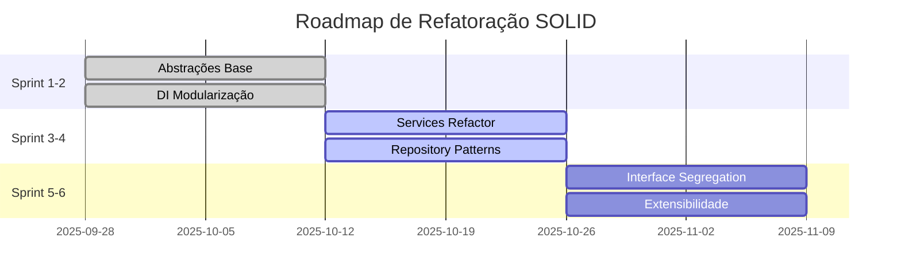

# 🗺️ Roadmap de Refatoração SOLID

## 📅 Cronograma Geral - 6 Sprints (12 semanas)



## 🎯 Fase 1: Fundação (Sprint 1-2) - CRÍTICO

### Sprint 1: Dependency Inversion (Semanas 1-2)
**Objetivo:** Estabelecer abstrações base para quebrar dependencies diretas

#### 📋 Tarefas Prioritárias

##### 1.1 Criar Abstrações Core
```typescript
Esforço: 2 dias
Prioridade: 🔴 Crítico
Dependências: Nenhuma
```

**Deliverables:**
- [ ] `IPremiumService` interface
- [ ] `IStorageService` interface  
- [ ] `ICloudSyncService` interface
- [ ] `IValidationService` interface
- [ ] `IDataRepository<T>` interface

**Arquivos a criar:**
```
lib/core/contracts/
├── i_premium_service.dart
├── i_storage_service.dart
├── i_cloud_sync_service.dart
├── i_validation_service.dart
└── i_data_repository.dart
```

##### 1.2 Implementar Abstrações em Services Críticos
```typescript
Esforço: 3 dias
Prioridade: 🔴 Crítico
Dependências: 1.1
```

**Targets:**
- [ ] `PremiumService` → `IPremiumService`
- [ ] `HiveService` → `IStorageService`
- [ ] `ValidationService` → `IValidationService`

---

### Sprint 2: Modularização DI (Semanas 3-4)
**Objetivo:** Quebrar container monolítico em módulos especializados

#### 📋 Tarefas

##### 2.1 Criar Módulos DI
```typescript
Esforço: 2 dias
Prioridade: 🔴 Crítico
Dependências: 1.2
```

**Nova estrutura:**
```
lib/core/di/modules/
├── auth_module.dart
├── data_module.dart
├── premium_module.dart
├── validation_module.dart
└── storage_module.dart
```

##### 2.2 Refatorar Container Principal
```typescript
Esforço: 1 dia
Prioridade: 🔴 Crítico
Dependências: 2.1
```

**Antes:**
```dart
class InjectionContainer {
  void configure() {
    // 500+ linhas de configuração
  }
}
```

**Depois:**
```dart
class InjectionContainer {
  void configure() {
    AuthModule().configure(getIt);
    DataModule().configure(getIt);
    PremiumModule().configure(getIt);
    // etc...
  }
}
```

---

## 🏗️ Fase 2: Modularização (Sprint 3-4) - ALTO

### Sprint 3: Single Responsibility (Semanas 5-6)

#### 📋 Tarefas Principais

##### 3.1 Quebrar PremiumService
```typescript
Esforço: 3 dias
Prioridade: 🟡 Alto
Dependências: Fase 1
```

**Separação:**
- [ ] `PremiumLicenseService` - Gerenciar licenças
- [ ] `PremiumSyncService` - Sincronização
- [ ] `PremiumFeatureValidator` - Validação de features
- [ ] `PremiumUIService` - Interações UI

##### 3.2 Quebrar DataCleaner
```typescript
Esforço: 2 dias
Prioridade: 🟡 Alto
Dependências: Fase 1
```

**Separação:**
- [ ] `DataCleanupService` - Limpeza
- [ ] `DataValidationService` - Validação
- [ ] `DataMigrationService` - Migração
- [ ] `DataBackupService` - Backup

---

### Sprint 4: Repository Patterns (Semanas 7-8)

#### 📋 Tarefas

##### 4.1 Padronizar Repositories
```typescript
Esforço: 3 dias
Prioridade: 🟡 Alto
Dependências: 3.1, 3.2
```

**Targets:**
- [ ] Aplicar `IDataRepository<T>` em todos os repositories
- [ ] Remover dependencies diretas
- [ ] Implementar padrão de resultado (`Result<T>`)

##### 4.2 Criar Repository Factory
```typescript
Esforço: 1 dia
Prioridade: 🟡 Alto
Dependências: 4.1
```

```dart
abstract class IRepositoryFactory {
  IDataRepository<T> create<T>();
}
```

---

## 🔧 Fase 3: Otimização (Sprint 5-6) - MÉDIO

### Sprint 5: Interface Segregation (Semanas 9-10)

#### 📋 Tarefas

##### 5.1 Segregar IDataService
```typescript
Esforço: 2 dias
Prioridade: 🟢 Médio
Dependências: Fase 2
```

**Quebrar em:**
- [ ] `IRepository<T>` - CRUD operations
- [ ] `ISyncService` - Sincronização
- [ ] `ICacheService` - Cache operations
- [ ] `IExportService` - Import/Export

##### 5.2 Refatorar Providers
```typescript
Esforço: 2 dias
Prioridade: 🟢 Médio
Dependências: 5.1
```

**Aplicar ISP em:**
- [ ] `PremiumProvider`
- [ ] `AuthProvider` 
- [ ] `DataProvider`

---

### Sprint 6: Open/Closed Principle (Semanas 11-12)

#### 📋 Tarefas

##### 6.1 Implementar Factory Patterns
```typescript
Esforço: 2 dias
Prioridade: 🟢 Médio
Dependências: Fase 2
```

**Targets:**
- [ ] `PragaTypeFactory` - Extensível para novos tipos
- [ ] `ValidatorFactory` - Registro de validadores
- [ ] `ExporterFactory` - Múltiplos formatos

##### 6.2 Registry Pattern para Extensibilidade
```typescript
Esforço: 2 dias
Prioridade: 🟢 Médio
Dependências: 6.1
```

```dart
class ComponentRegistry<T> {
  void register(String key, T component);
  T? resolve(String key);
}
```

---

## 📊 Métricas de Progresso

### Fase 1 - Fundação
| Métrica | Baseline | Target | Status |
|---------|----------|--------|--------|
| DIP Violations | 5 | 0 | 🟡 Planejado |
| Abstrações | 20% | 70% | 🟡 Planejado |
| DI Complexity | Alto | Baixo | 🟡 Planejado |

### Fase 2 - Modularização  
| Métrica | Baseline | Target | Status |
|---------|----------|--------|--------|
| SRP Violations | 12 | 3 | 🟡 Planejado |
| Class Complexity | Alto | Médio | 🟡 Planejado |
| Code Reuse | 30% | 60% | 🟡 Planejado |

### Fase 3 - Otimização
| Métrica | Baseline | Target | Status |
|---------|----------|--------|--------|
| ISP Violations | 5 | 0 | 🟡 Planejado |
| OCP Violations | 8 | 2 | 🟡 Planejado |
| Extensibility | Baixa | Alta | 🟡 Planejado |

---

## 🚀 Critérios de Aceitação por Sprint

### ✅ Sprint 1 - Done Criteria
- [ ] Todas as abstrações core criadas
- [ ] Testes unitários para interfaces (>80% coverage)
- [ ] Documentação de APIs atualizada
- [ ] Code review aprovado
- [ ] Zero breaking changes

### ✅ Sprint 2 - Done Criteria  
- [ ] Container DI modularizado
- [ ] Tempo de inicialização mantido (<2s)
- [ ] Todos os modules testados
- [ ] Migration guide criado

### ✅ Sprint 3 - Done Criteria
- [ ] Services monolíticos quebrados
- [ ] Responsabilidades claramente separadas
- [ ] Testes de integração passando
- [ ] Performance mantida

### ✅ Sprint 4 - Done Criteria
- [ ] Repositories padronizados
- [ ] Pattern Result<T> implementado
- [ ] Factory pattern aplicado
- [ ] Error handling consistente

### ✅ Sprint 5 - Done Criteria
- [ ] Interfaces segregadas
- [ ] Providers refatorados
- [ ] Dependencies reduzidas >50%
- [ ] Clean interfaces documentadas

### ✅ Sprint 6 - Done Criteria
- [ ] Factory patterns implementados
- [ ] Registry pattern funcional
- [ ] Extensibilidade demonstrada
- [ ] Performance benchmarks OK

---

## ⚠️ Riscos e Mitigações

| Risco | Probabilidade | Impacto | Mitigação |
|-------|--------------|---------|-----------|
| **Breaking Changes** | Média | Alto | Feature flags + incremental migration |
| **Performance Impact** | Baixa | Médio | Benchmarks contínuos |
| **Team Learning Curve** | Alta | Médio | Training sessions + documentation |
| **Scope Creep** | Média | Alto | Strict definition of done |

---

## 🎯 ROI Esperado

### Benefícios Quantitativos
- **🔧 Tempo de desenvolvimento**: -30% para novas features
- **🐛 Bugs em produção**: -50% 
- **⏱️ Time to market**: -25%
- **📈 Test coverage**: +35%

### Benefícios Qualitativos
- **👥 Developer Experience**: Melhor
- **🏗️ Maintainability**: Significantemente melhor
- **🚀 Scalability**: Preparado para crescimento
- **🔄 Code Reuse**: Maximizado

---

## 📞 Próximos Passos

1. **Aprovação do roadmap** pela tech lead
2. **Assign de desenvolvedores** para Sprint 1
3. **Setup de métricas** de progresso
4. **Kick-off** da Fase 1

**DRI (Directly Responsible Individual):** Tech Lead  
**Reviewers:** Senior Developers  
**Stakeholders:** Product Team