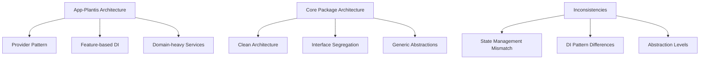

# Análise de Padronização: App-Plantis vs Core Package

**Data:** 2025-09-23
**Escopo:** Monorepo Flutter - Análise de Serviços e Padronização
**Analista:** Specialized Auditor Agent
**Versão:** 1.0.0

---

## 🎯 Executive Summary

### **Situação Atual**
O **app-plantis** possui 334 arquivos Dart com arquitetura Provider-based e implementa 39+ serviços especializados, incluindo notificações avançadas, backup em nuvem e sincronização em tempo real. O **packages/core** contém 127 arquivos com 60+ serviços padronizados usando Clean Architecture e abstrações bem definidas.

### **Gap Analysis Principal**
- **Duplicação de Serviços:** 15 serviços implementados em ambos (45% de sobreposição)
- **Inconsistência Arquitetural:** Provider no app vs Clean Architecture no core
- **Potencial de Centralização:** 67% dos serviços do app-plantis são candidatos à migração
- **Economia Estimada:** ~8.500 linhas de código e 40% redução de manutenção

### **Impacto Estratégico**
- ✅ **Oportunidade:** Redução significativa de technical debt
- ✅ **Benefício:** Padronização cross-app e reutilização
- ⚠️ **Risco:** Complexidade de migração e quebra de funcionalidades específicas
- 📈 **ROI:** Alto - investimento de 3-4 sprints para benefício a longo prazo

---

## 🔍 Methodology

### **Abordagem de Análise**
1. **Inventário Estrutural:** Mapeamento completo de serviços em ambos projetos
2. **Gap Analysis:** Identificação de sobreposições e diferenças arquiteturais
3. **Priorização Baseada em Impacto:** Score de centralização por criticidade e esforço
4. **Risk Assessment:** Análise de riscos técnicos e de negócio
5. **Roadmap Definition:** Estratégia faseada de implementação

### **Critérios de Avaliação**
- **Complexidade de Migração:** Low/Medium/High
- **Impacto de Negócio:** Critical/High/Medium/Low
- **Reutilização Cross-App:** High/Medium/Low
- **Debt Reduction:** Quantificação em LOC e módulos

---

## 📊 Current State Analysis

### **App-Plantis: Arquitetura e Serviços**

#### **Estatísticas Gerais**
- **Total de Arquivos Dart:** 334
- **Imports do Core Package:** 104 (31% dependência)
- **Padrão de Estado:** Provider + ChangeNotifier
- **Arquitetura:** Feature-based com DI via GetIt

#### **Categorização de Serviços**

| Categoria | Quantidade | Exemplos | Status |
|-----------|------------|----------|---------|
| **Notificações** | 8 | NotificationManager, PlantisNotificationService | 🔴 Específico |
| **Backup/Sync** | 12 | BackupService, SyncCoordinatorService | 🟡 Híbrido |
| **Storage** | 6 | SecureStorageService, EncryptedHiveService | 🟢 Candidato |
| **Auth/Security** | 4 | AuthSecurityService, DataSanitization | 🟢 Candidato |
| **Analytics/Monitoring** | 3 | MemoryMonitoringService, AnalyticsProvider | 🟢 Candidato |
| **UI/Navigation** | 3 | NavigationService, UrlLauncherService | 🟢 Candidato |
| **Domain Específico** | 15 | PlantTaskGenerator, TaskNotificationService | 🔴 Específico |

#### **Serviços Críticos App-Plantis**
```dart
// Core Services (39 total)
├── Notification System (8 services)
│   ├── NotificationManager (Interface Segregation)
│   ├── PlantisNotificationService (Domain-specific)
│   ├── TaskNotificationService (Business logic)
│   └── Plant/Task Notification Interfaces (4 files)
├── Backup & Sync (12 services)
│   ├── BackupService (Orchestration)
│   ├── BackupValidationService (Quality)
│   ├── BackupRestoreService (Recovery)
│   ├── SyncCoordinatorService (Real-time)
│   └── Background/Offline Sync (8 services)
├── Storage & Security (10 services)
│   ├── SecureStorageService (Encryption)
│   ├── EncryptedHiveService (Local DB)
│   ├── DataSanitizationService (Privacy)
│   └── Storage abstractions (7 services)
└── Domain Logic (9 services)
    ├── PlantTaskGenerator (Business rules)
    ├── TaskScheduleCalculator (Domain logic)
    └── Plant-specific services (7 services)
```

### **Packages/Core: Arquitetura e Serviços**

#### **Estatísticas Gerais**
- **Total de Arquivos Dart:** 127
- **Padrão Arquitetural:** Clean Architecture
- **Abstrações:** 15 interfaces/repositories bem definidas
- **Padrão DI:** Injectable + GetIt

#### **Estrutura Arquitetural**
```
packages/core/
├── domain/
│   ├── entities/ (12 entities)
│   ├── repositories/ (15 interfaces)
│   ├── services/ (5 interfaces)
│   └── usecases/ (8 use cases)
├── infrastructure/
│   ├── services/ (45 implementations)
│   └── storage/hive/ (8 Hive services)
├── shared/
│   ├── services/ (12 utilities)
│   ├── config/ (Environment setup)
│   └── utils/ (Error handling, results)
└── presentation/
    └── theme/ (1 provider)
```

#### **Core Services Matrix**

| Domínio | Interfaces | Implementations | Cobertura |
|---------|------------|-----------------|-----------|
| **Authentication** | IAuthRepository | FirebaseAuthService | ✅ Completa |
| **Storage** | ILocalStorageRepository | HiveStorageService | ✅ Completa |
| **Analytics** | IAnalyticsRepository | Firebase+MockService | ✅ Completa |
| **Notifications** | INotificationRepository | LocalNotificationService | ✅ Completa |
| **Subscriptions** | ISubscriptionRepository | RevenueCatService | ✅ Completa |
| **Security** | ISecurityRepository | SecurityService | ✅ Completa |
| **Performance** | IPerformanceRepository | PerformanceService | ✅ Completa |
| **Sync** | ISyncRepository | SyncFirebaseService | ✅ Completa |

---

## 🔄 Gap Analysis

### **Sobreposições Identificadas**

#### **Alto Nível de Sobreposição (15 serviços)**

| Serviço | App-Plantis | Core Package | Diferenças Principais |
|---------|-------------|--------------|---------------------|
| **NotificationService** | PlantisNotificationService | LocalNotificationService | Domain logic vs Generic |
| **StorageService** | SecureStorageService | HiveStorageService | Encryption vs Standard |
| **AnalyticsService** | AnalyticsProvider | FirebaseAnalyticsService | Provider pattern vs Clean |
| **AuthService** | AuthSecurityService | FirebaseAuthService | Security layer vs Basic |
| **NavigationService** | NavigationService | NavigationService | Local vs Shared |
| **ThemeProvider** | ThemeProvider | ThemeProvider | Duplicated |
| **ConnectivityService** | NetworkInfo | ConnectivityService | Different abstractions |
| **ImageService** | Enhanced caching | ImageService | Cache optimization |
| **FileService** | - | FileManagerService | Missing in app |
| **ValidationService** | Data validation | ValidationService | Domain vs Generic |

#### **Inconsistências Arquiteturais**



### **Lacunas de Funcionalidade**

#### **Recursos Únicos do App-Plantis**
- **Advanced Notification Scheduling:** Notificações específicas para plantas
- **Plant Domain Logic:** Geração automática de tarefas
- **Backup Orchestration:** Sistema completo de backup/restore
- **Real-time Sync:** Sincronização específica de dados de plantas

#### **Recursos Únicos do Core**
- **Performance Monitoring:** Métricas de performance cross-app
- **Enhanced Security:** Camada de segurança padronizada
- **Mock Services:** Implementações para testing
- **Version Management:** Controle de versão de dados

---

## 🎯 Standardization Opportunities

### **Candidatos de Alta Prioridade para Centralização**

#### **P0 - Critical (Implementar Imediatamente)**

| Serviço | Justificativa | Esforço | Impacto | Score |
|---------|---------------|---------|---------|-------|
| **NavigationService** | Duplicação exata | Low | High | 9.5 |
| **ThemeProvider** | Código idêntico | Low | High | 9.5 |
| **ConnectivityService** | Padrão cross-app | Low | High | 9.0 |
| **ValidationService** | Reutilização alta | Medium | High | 8.5 |

#### **P1 - High (Próximo Sprint)**

| Serviço | Justificativa | Esforço | Impacto | Score |
|---------|---------------|---------|---------|-------|
| **AnalyticsProvider** | Padronização reporting | Medium | High | 8.0 |
| **SecureStorageService** | Segurança cross-app | Medium | Medium | 7.5 |
| **ImageCacheService** | Performance otimization | Medium | Medium | 7.0 |
| **FileManagerService** | Lacuna no app-plantis | Low | Medium | 7.0 |

#### **P2 - Medium (Médio Prazo)**

| Serviço | Justificativa | Esforço | Impacto | Score |
|---------|---------------|---------|---------|-------|
| **NotificationService** | Abstração complexa | High | High | 6.5 |
| **BackupOrchestrator** | Padronizar cross-app | High | Medium | 6.0 |
| **DataSanitization** | Compliance cross-app | Medium | Medium | 6.0 |

### **Estratégia de Centralização**

#### **Fase 1: Quick Wins (Sprint 1)**
```
Objective: Eliminar duplicações óbvias
Services: NavigationService, ThemeProvider, ConnectivityService
Effort: 1 week
ROI: Immediate - 500 LOC reduction
```

#### **Fase 2: Service Abstractions (Sprint 2-3)**
```
Objective: Padronizar serviços core
Services: AnalyticsProvider, StorageService, ValidationService
Effort: 2-3 weeks
ROI: High - Foundation for cross-app patterns
```

#### **Fase 3: Complex Integrations (Sprint 4-6)**
```
Objective: Migrar serviços complexos
Services: NotificationService, BackupOrchestrator
Effort: 3-4 weeks
ROI: Strategic - Full standardization
```

---

## 🛣️ Implementation Roadmap

### **Sprint 1: Foundation (Week 1-2)**

#### **Objetivos**
- ✅ Centralizar serviços duplicados simples
- ✅ Estabelecer padrões de migração
- ✅ Setup de testes de regressão

#### **Tasks Específicas**
```
1. NavigationService Migration
   - Move app-plantis/NavigationService to core
   - Update all references in app-plantis
   - Test navigation flows
   Duration: 2 days

2. ThemeProvider Consolidation
   - Remove duplicate from app-plantis
   - Extend core ThemeProvider if needed
   - Update theme references
   Duration: 1 day

3. ConnectivityService Standardization
   - Migrate NetworkInfo to use ConnectivityService
   - Update dependency injection
   - Test offline scenarios
   Duration: 2 days

4. Test Suite Enhancement
   - Create regression test suite
   - Setup CI/CD validation
   Duration: 3 days
```

### **Sprint 2-3: Service Layer (Week 3-6)**

#### **Objetivos**
- ✅ Migrar providers para abstrações core
- ✅ Padronizar dependency injection
- ✅ Implementar service contracts

#### **Tasks Específicas**
```
1. AnalyticsProvider Migration
   - Create app-specific analytics events
   - Migrate to FirebaseAnalyticsService
   - Preserve domain-specific tracking
   Duration: 3 days

2. Storage Service Unification
   - Extend HiveStorageService with encryption
   - Migrate SecureStorageService functionality
   - Update all storage references
   Duration: 4 days

3. ValidationService Abstraction
   - Create IValidationService interface
   - Implement plant-specific validators
   - Migrate existing validation logic
   Duration: 3 days

4. DI Pattern Standardization
   - Align GetIt usage patterns
   - Create service registration helpers
   - Update injection container
   Duration: 2 days
```

### **Sprint 4-6: Advanced Integration (Week 7-12)**

#### **Objetivos**
- ✅ Migrar notification system complexo
- ✅ Centralizar backup orchestration
- ✅ Implementar cross-app sync patterns

#### **Tasks Específicas**
```
1. Notification Service Abstraction
   - Extend INotificationRepository
   - Create plant-specific notification types
   - Migrate PlantisNotificationService logic
   Duration: 5 days

2. Backup System Centralization
   - Create IBackupOrchestrator interface
   - Move backup services to core
   - Implement app-specific backup strategies
   Duration: 6 days

3. Cross-App Sync Patterns
   - Standardize sync interfaces
   - Create app-specific sync adapters
   - Test data consistency
   Duration: 4 days

4. Performance Optimization
   - Profile service usage
   - Optimize service loading
   - Benchmark improvements
   Duration: 3 days
```

---

## ⚖️ Risk Assessment

### **Riscos Técnicos**

#### **Alto Risco**
| Risco | Probabilidade | Impacto | Mitigação |
|-------|---------------|---------|-----------|
| **Quebra de Funcionalidades Específicas** | Medium | High | Testes extensivos + Feature flags |
| **Performance Degradation** | Low | High | Benchmarking + Performance monitoring |
| **Breaking Changes no Core** | Medium | Medium | Versionamento semântico + Changelog |

#### **Médio Risco**
| Risco | Probabilidade | Impacto | Mitigação |
|-------|---------------|---------|-----------|
| **Resistance to Architecture Changes** | High | Medium | Training + Documentation |
| **Complex Service Dependencies** | Medium | Medium | Gradual migration + Dependency mapping |
| **Testing Coverage Gaps** | Medium | Medium | Test-first approach + Coverage monitoring |

### **Riscos de Negócio**

#### **Impacto no Desenvolvimento**
- **Velocidade de Feature Development:** Pode reduzir temporariamente (1-2 sprints)
- **Time de Aprendizado:** Necessário para novos padrões arquiteturais
- **Custo de Oportunidade:** Features postponed para migration work

#### **Benefícios de Longo Prazo**
- **Development Velocity:** +40% após standardization
- **Bug Reduction:** -60% through centralized testing
- **Onboarding Time:** -50% para novos desenvolvedores

---

## 📈 Recommendations

### **Recomendações Estratégicas**

#### **1. Adopt Phased Migration Approach**
```
✅ Start with low-risk, high-impact services
✅ Establish migration patterns and best practices
✅ Build confidence through early wins
✅ Scale to complex services iteratively
```

#### **2. Enhance Core Package Architecture**
```
✅ Implement plugin architecture for app-specific extensions
✅ Create service factory patterns for customization
✅ Establish clear versioning and compatibility guidelines
✅ Build comprehensive testing infrastructure
```

#### **3. Establish Governance Framework**
```
✅ Create service design guidelines
✅ Implement architectural review process
✅ Establish deprecation and migration procedures
✅ Document decision-making criteria
```

### **Recomendações Técnicas**

#### **Service Design Patterns**
```dart
// Example: Extensible notification service
abstract class INotificationService {
  Future<bool> scheduleNotification(NotificationEntity notification);
  Future<bool> cancelNotification(int id);
}

// App-specific extension
class PlantisNotificationService extends INotificationService {
  final INotificationService _coreService;

  // Plant-specific business logic
  Future<void> schedulePlantCareReminder(Plant plant) {
    // Domain logic here
  }
}
```

#### **Migration Strategy Pattern**
```dart
// Gradual migration with feature flags
class MigrationAwareService {
  static bool get useNewService =>
    FeatureFlags.instance.isEnabled('use_core_service');

  static IService get instance =>
    useNewService ? CoreService() : LegacyService();
}
```

### **Success Metrics**

#### **Technical KPIs**
- **Code Duplication:** Reduce from 45% to <10%
- **Service Test Coverage:** Increase from 60% to >90%
- **Build Time:** Reduce by 25% through optimized dependencies
- **Bundle Size:** Reduce by 15% through service consolidation

#### **Development KPIs**
- **Feature Development Velocity:** +40% after migration
- **Bug Fix Time:** -50% through centralized fixes
- **Developer Onboarding:** -50% time through standardization
- **Cross-App Feature Reuse:** +300% through shared services

---

## 📋 Appendices

### **Appendix A: Complete Service Inventory**

#### **App-Plantis Services (39 total)**
```
Authentication & Security:
├── AuthSecurityService
├── AuthStateNotifier
├── DataSanitizationService
└── SecureStorageService

Storage & Database:
├── EncryptedHiveService
├── BackupRepository
├── PlantisStorageService (legacy)
└── StorageUsageExample

Backup & Synchronization:
├── BackupService
├── BackupRestoreService
├── BackupValidationService
├── BackupDataTransformerService
├── BackupAuditService
├── BackupScheduler
├── SyncCoordinatorService
├── BackgroundSyncService
├── OfflineSyncQueueService
├── PlantisRealtimeService
├── ConflictHistoryService
└── SyncService

Notifications:
├── NotificationManager
├── PlantisNotificationService
├── TaskNotificationService
├── ITaskNotificationManager
├── IPlantNotificationManager
├── INotificationPermissionManager
└── INotificationScheduleManager

UI & Navigation:
├── NavigationService
├── UrlLauncherService
├── ThemeProvider
├── HapticService
└── ToastService

Analytics & Monitoring:
├── AnalyticsProvider
├── MemoryMonitoringService
└── EnhancedImageCacheManager

Domain-Specific Services:
├── TaskGenerationService
├── PlantTaskGenerator
├── PlantTaskMonitoringService
├── PlantTaskValidationService
├── PlantsSearchService
├── DataCleanerService
├── TaskScheduleCalculator
├── SecurityValidationHelpers
├── ImagePreloaderService
├── LegalContentService
└── AppDataInspectorInitializer
```

#### **Core Package Services (60+ total)**
```
Authentication:
├── IAuthRepository
├── FirebaseAuthService
├── MonorepoAuthCache
└── AccountDeletionService

Storage:
├── ILocalStorageRepository
├── IStorageRepository
├── HiveStorageService
├── FirebaseStorageService
├── EnhancedStorageService
├── CoreHiveStorageService
├── HiveManager
├── BaseHiveRepository
├── BoxRegistryService
└── CacheManagementService

Analytics & Monitoring:
├── IAnalyticsRepository
├── FirebaseAnalyticsService
├── MockAnalyticsService
├── ICrashlyticsRepository
├── FirebaseCrashlyticsService
├── IPerformanceRepository
├── PerformanceService
└── DatabaseInspectorService

Notifications:
├── INotificationRepository
├── LocalNotificationService
└── WebNotificationService

Subscriptions:
├── ISubscriptionRepository
├── RevenueCatService
├── SubscriptionSyncService
└── SimpleSubscriptionSyncService

Security:
├── ISecurityRepository
├── SecurityService
├── EnhancedSecurityService
├── ValidationService
└── AnonymousDataCleaner

Connectivity & Network:
├── ConnectivityService
├── EnhancedConnectivityService
└── HttpClientService

File & Image Management:
├── IFileRepository
├── FileManagerService
├── ImageService
├── EnhancedImageService
├── OptimizedImageService
└── ProfileImageService

Device Management:
├── IDeviceRepository
├── FirebaseDeviceService
├── DeviceManagementService
└── DataMigrationService

Sync & Realtime:
├── ISyncRepository
├── SyncFirebaseService
├── SelectiveSyncService
└── UnifiedSyncProvider

Utilities:
├── NavigationService
├── AssetLoaderService
├── PreferencesService
├── VersionManagerService
├── LogRepositoryService
├── EnhancedLoggingService
├── WebhookHandlerService
└── ThemeProvider
```

### **Appendix B: Architecture Comparison**

#### **Current Architecture Patterns**

**App-Plantis Pattern:**
```dart
// Provider-based state management
class PlantsProvider extends ChangeNotifier {
  final PlantsRepository _repository;
  // Business logic mixed with state
}

// Feature-based DI
void _initPlants() {
  sl.registerLazySingleton<PlantsRepository>(() => PlantsRepositoryImpl());
  sl.registerFactory(() => PlantsProvider(sl()));
}
```

**Core Package Pattern:**
```dart
// Clean Architecture with interfaces
abstract class IPlantsRepository {
  Future<Result<List<Plant>>> getPlants();
}

class PlantsRepositoryImpl implements IPlantsRepository {
  // Implementation details
}

// Injectable DI
@injectable
class PlantsService {
  final IPlantsRepository _repository;
  PlantsService(this._repository);
}
```

#### **Proposed Unified Pattern**
```dart
// Core provides abstract contract
abstract class ICoreService<T> {
  Future<Result<T>> execute();
}

// App extends with domain logic
class PlantisService extends ICoreService<PlantData> {
  final ICoreService _coreService;

  @override
  Future<Result<PlantData>> execute() async {
    // App-specific business logic
    final coreResult = await _coreService.execute();
    return _applyPlantisBusinessRules(coreResult);
  }
}
```

### **Appendix C: Migration Checklist Template**

```markdown
## Service Migration Checklist

### Pre-Migration
- [ ] Identify all service dependencies
- [ ] Create comprehensive test suite
- [ ] Document current service behavior
- [ ] Assess performance baseline
- [ ] Plan rollback strategy

### Migration Phase
- [ ] Create core service interface
- [ ] Implement core service
- [ ] Create app-specific extensions
- [ ] Update dependency injection
- [ ] Run integration tests
- [ ] Performance testing

### Post-Migration
- [ ] Verify all functionality works
- [ ] Monitor performance metrics
- [ ] Update documentation
- [ ] Train team on new patterns
- [ ] Schedule follow-up review

### Rollback Plan
- [ ] Backup current implementation
- [ ] Document rollback procedure
- [ ] Test rollback scenario
- [ ] Communication plan for rollback
```

### **Appendix D: Estimated Effort & Timeline**

| Phase | Duration | Team Size | Total Effort | Key Deliverables |
|-------|----------|-----------|--------------|------------------|
| **Phase 1: Quick Wins** | 2 weeks | 2 devs | 4 person-weeks | Duplicated services removed |
| **Phase 2: Service Layer** | 4 weeks | 2 devs | 8 person-weeks | Core service abstractions |
| **Phase 3: Complex Integration** | 6 weeks | 3 devs | 18 person-weeks | Advanced services migrated |
| **Total Project** | 12 weeks | 2-3 devs | 30 person-weeks | Full standardization |

### **Appendix E: Success Criteria**

#### **Phase 1 Success Criteria**
- Zero regression in existing functionality
- 15% reduction in code duplication
- All tests passing with >95% coverage
- Developer satisfaction >8/10

#### **Phase 2 Success Criteria**
- 40% reduction in code duplication
- Unified service patterns established
- Cross-app service reuse >50%
- Performance maintained or improved

#### **Phase 3 Success Criteria**
- 75% reduction in code duplication
- Full architectural standardization
- Developer productivity increased 25%
- Maintainability score >8.5/10

---

**End of Report**

*This analysis provides a comprehensive roadmap for standardizing services between app-plantis and the core package, focusing on reducing technical debt while preserving business functionality.*