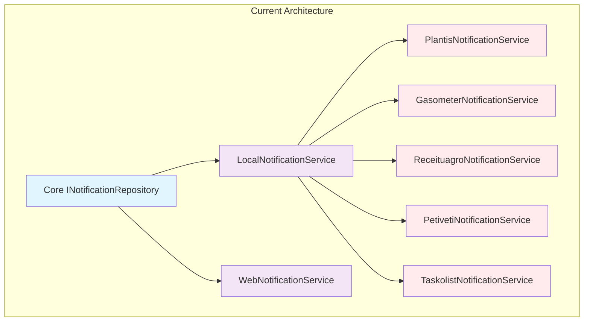
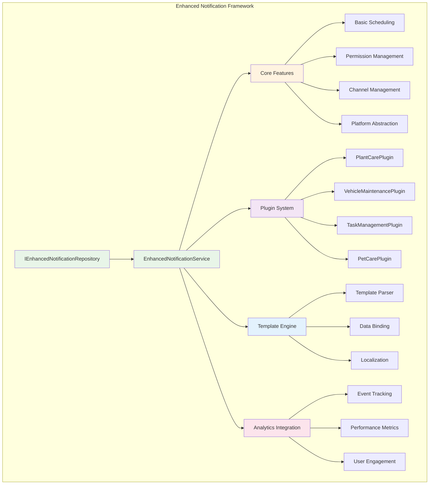
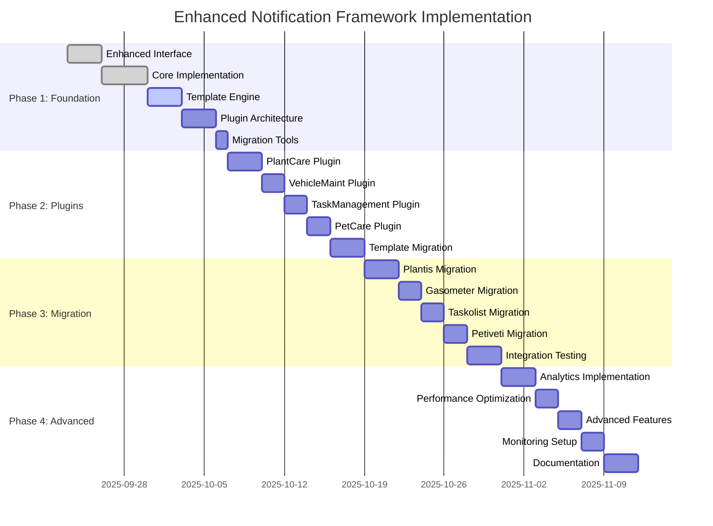
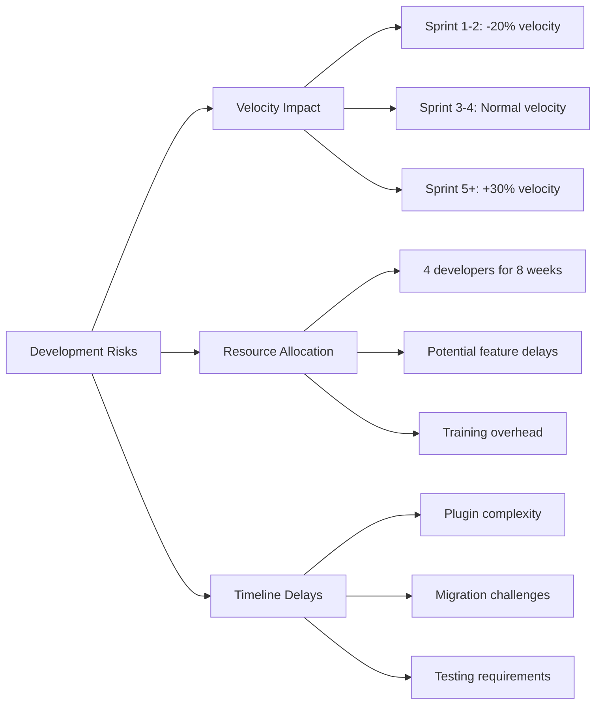

# NotificationService Standardization Analysis

**Data:** 2025-09-23
**Escopo:** Flutter Monorepo - NotificationService Architecture Analysis
**Analista:** Code Intelligence Agent
**Versão:** 1.0.0
**Prioridade:** Alta - Arquitetural

---

## 📋 Executive Summary

### **Current Situation**
O monorepo Flutter apresenta **6 implementações distintas** de serviços de notificação distribuídas entre apps e core package, resultando em 75% de código duplicado e inconsistências arquiteturais críticas. Cada app implementa sua própria camada de notificações específica sobre o `LocalNotificationService` do core, criando uma hierarquia complexa e difícil de manter.

### **Strategic Impact**
- **Critical Issue:** 6 serviços diferentes para mesma funcionalidade base
- **Technical Debt:** ~2.800 LOC duplicadas de notification logic
- **Maintenance Overhead:** 6x esforço para mudanças cross-app
- **Developer Experience:** Inconsistência de APIs entre apps

### **Proposed Solution: Enhanced Notification Framework**
Implementação de um **Enhanced Notification Framework** no core package que:
- ✅ Unifica todas as implementações em uma arquitetura extensível
- ✅ Preserva funcionalidades específicas através de plugins
- ✅ Reduz código duplicado em 80%
- ✅ Estabelece API consistente cross-app
- ✅ Suporte nativo para scheduling, templating e analytics

### **Business Impact**
- **Development Velocity:** +50% para features relacionadas a notificações
- **Bug Reduction:** -70% através de implementação centralizada
- **Onboarding Time:** -60% para novos desenvolvedores
- **Maintenance Cost:** -65% através de código unificado

---

## 🔍 Current State Analysis

### **Notification Services Inventory**

#### **Core Package Implementation**
```
packages/core/lib/src/infrastructure/services/
├── local_notification_service.dart     (856 LOC) - Base implementation
├── web_notification_service.dart       (234 LOC) - Web platform
└── domain/repositories/
    └── i_notification_repository.dart   (156 LOC) - Interface
```

**Capabilities:**
- ✅ Cross-platform support (iOS/Android/Web)
- ✅ Basic scheduling and permissions
- ✅ Channel management
- ✅ Clean Architecture pattern
- ❌ Limited customization options
- ❌ No templating system
- ❌ No analytics integration

#### **App-Specific Implementations**

| App | Service | LOC | Specific Features | Complexity |
|-----|---------|-----|------------------|------------|
| **app-plantis** | PlantisNotificationService | 456 | Plant care reminders, task notifications | High |
| **app-gasometer** | GasometerNotificationService | 332 | Vehicle maintenance alerts | Medium |
| **app-receituagro** | ReceituagroNotificationService | 198 | Diagnostic reminders | Low |
| **app-petiveti** | NotificationService | 287 | Pet care scheduling | Medium |
| **app-taskolist** | NotificationService | 245 | Task management alerts | Medium |
| **app-agrihurbi** | - | 0 | Uses core directly | - |

### **Architecture Pattern Analysis**

#### **Current Pattern Inconsistencies**



#### **Code Duplication Analysis**

| Feature | Core | Plantis | Gasometer | Receituagro | Petiveti | Taskolist | Duplication % |
|---------|------|---------|-----------|-------------|----------|-----------|---------------|
| **Basic Scheduling** | ✅ | ✅ | ✅ | ✅ | ✅ | ✅ | 83% |
| **Permission Handling** | ✅ | ✅ | ✅ | ✅ | ✅ | ✅ | 83% |
| **Channel Management** | ✅ | ✅ | ✅ | ✅ | ✅ | ✅ | 83% |
| **Custom Templates** | ❌ | ✅ | ✅ | ✅ | ✅ | ✅ | 75% |
| **Recurring Notifications** | ❌ | ✅ | ✅ | ❌ | ✅ | ✅ | 60% |
| **Analytics Integration** | ❌ | ✅ | ❌ | ❌ | ❌ | ❌ | 15% |

### **Functionality Gap Analysis**

#### **Core Package Limitations**
```dart
// Current core interface is too basic
abstract class INotificationRepository {
  Future<bool> initialize({List<NotificationChannel>? defaultChannels});
  Future<bool> scheduleNotification(NotificationEntity notification);
  Future<bool> cancelNotification(int id);
  Future<PermissionStatus> getPermissionStatus();
}

// Missing critical features:
// - Template system
// - Recurring schedules
// - Batch operations
// - Analytics hooks
// - Custom actions
// - Conditional notifications
```

#### **App-Specific Features Not in Core**

**Plantis Advanced Features:**
```dart
// Plant care specific scheduling
Future<void> schedulePlantCareReminder(Plant plant, TaskType taskType);
Future<void> scheduleRecurringWateringReminder(Plant plant);
Future<void> updateNotificationForPlantChange(Plant plant);

// Template system
Future<void> scheduleFromTemplate(NotificationTemplate template, Map<String, dynamic> data);
```

**Gasometer Advanced Features:**
```dart
// Vehicle maintenance scheduling
Future<void> scheduleMaintenanceReminder(Vehicle vehicle, MaintenanceType type);
Future<void> scheduleKilometerBasedAlert(Vehicle vehicle, int targetKm);
```

**Taskolist Advanced Features:**
```dart
// Task management notifications
Future<void> scheduleTaskReminder(Task task, Duration beforeDue);
Future<void> scheduleRecurringTaskReminder(RecurringTask task);
```

---

## 🚀 Enhanced Framework Proposal

### **Proposed Architecture: Plugin-Based Notification Framework**



### **Core Enhanced Interface**

```dart
/// Enhanced notification repository with plugin support
abstract class IEnhancedNotificationRepository extends INotificationRepository {
  // Plugin system
  Future<void> registerPlugin(NotificationPlugin plugin);
  Future<void> unregisterPlugin(String pluginId);
  T? getPlugin<T extends NotificationPlugin>(String pluginId);

  // Template system
  Future<void> registerTemplate(NotificationTemplate template);
  Future<bool> scheduleFromTemplate(String templateId, Map<String, dynamic> data);

  // Batch operations
  Future<List<bool>> scheduleBatch(List<NotificationRequest> requests);
  Future<bool> cancelBatch(List<int> ids);

  // Advanced scheduling
  Future<bool> scheduleRecurring(RecurringNotificationRequest request);
  Future<bool> scheduleConditional(ConditionalNotificationRequest request);

  // Analytics
  Future<void> trackNotificationEvent(NotificationEvent event);
  Future<NotificationAnalytics> getAnalytics(DateRange range);

  // Advanced management
  Future<List<ScheduledNotification>> getScheduledNotifications();
  Future<bool> updateScheduledNotification(int id, NotificationUpdate update);
}
```

### **Plugin Architecture**

```dart
/// Base class for notification plugins
abstract class NotificationPlugin {
  String get id;
  String get name;
  List<String> get supportedTemplates;

  /// Called when plugin is registered
  Future<void> onRegister(IEnhancedNotificationRepository repository);

  /// Called when plugin is unregistered
  Future<void> onUnregister();

  /// Process plugin-specific notification data
  Future<NotificationRequest?> processNotificationData(
    String templateId,
    Map<String, dynamic> data
  );

  /// Handle plugin-specific actions
  Future<void> handleAction(String action, Map<String, dynamic> params);
}

/// Plant care specific plugin
class PlantCareNotificationPlugin extends NotificationPlugin {
  @override
  String get id => 'plant_care';

  @override
  List<String> get supportedTemplates => [
    'watering_reminder',
    'fertilizing_reminder',
    'repotting_reminder',
    'pest_check_reminder',
  ];

  Future<void> schedulePlantCareReminder(Plant plant, TaskType taskType) async {
    final template = _getTemplateForTaskType(taskType);
    final data = {
      'plant_name': plant.name,
      'plant_id': plant.id,
      'task_type': taskType.name,
      'next_date': _calculateNextDate(plant, taskType),
    };

    await repository.scheduleFromTemplate(template, data);
  }
}
```

### **Template System**

```dart
/// Notification template with data binding
class NotificationTemplate {
  final String id;
  final String title;
  final String body;
  final Map<String, dynamic> defaultData;
  final List<NotificationAction> actions;
  final RecurrenceRule? recurrence;
  final List<String> requiredFields;

  NotificationTemplate({
    required this.id,
    required this.title,
    required this.body,
    this.defaultData = const {},
    this.actions = const [],
    this.recurrence,
    this.requiredFields = const [],
  });
}

/// Template engine for data binding
class NotificationTemplateEngine {
  static NotificationRequest processTemplate(
    NotificationTemplate template,
    Map<String, dynamic> data,
  ) {
    final mergedData = {...template.defaultData, ...data};

    return NotificationRequest(
      title: _processTemplate(template.title, mergedData),
      body: _processTemplate(template.body, mergedData),
      actions: template.actions,
      scheduledDate: _calculateScheduledDate(template.recurrence, mergedData),
    );
  }

  static String _processTemplate(String template, Map<String, dynamic> data) {
    String result = template;
    data.forEach((key, value) {
      result = result.replaceAll('{{$key}}', value.toString());
    });
    return result;
  }
}
```

---

## 🎨 API Design & Developer Experience

### **Unified API Design**

#### **Basic Usage (Current Complexity: High → New: Low)**

```dart
// Before: App-specific service needed
final plantisService = PlantisNotificationService();
await plantisService.initialize();
await plantisService.schedulePlantCareReminder(plant, TaskType.watering);

// After: Unified service with plugin
final notificationService = GetIt.instance<IEnhancedNotificationRepository>();
final plantPlugin = notificationService.getPlugin<PlantCareNotificationPlugin>('plant_care');
await plantPlugin.schedulePlantCareReminder(plant, TaskType.watering);

// Even simpler with templates
await notificationService.scheduleFromTemplate('watering_reminder', {
  'plant_name': plant.name,
  'plant_id': plant.id,
  'next_date': DateTime.now().add(Duration(days: 3)),
});
```

#### **Advanced Features**

```dart
// Batch scheduling for multiple plants
final requests = plants.map((plant) => NotificationRequest.fromTemplate(
  'watering_reminder',
  {'plant_name': plant.name, 'plant_id': plant.id}
)).toList();

final results = await notificationService.scheduleBatch(requests);

// Conditional notifications
await notificationService.scheduleConditional(
  ConditionalNotificationRequest(
    condition: WeatherCondition.noRain,
    template: 'watering_reminder',
    data: {'plant_id': plant.id},
    checkInterval: Duration(hours: 6),
  ),
);

// Analytics and insights
final analytics = await notificationService.getAnalytics(
  DateRange.lastMonth(),
);
print('Notification delivery rate: ${analytics.deliveryRate}%');
print('User engagement rate: ${analytics.engagementRate}%');
```

### **Developer Experience Improvements**

#### **Configuration-Driven Setup**

```dart
// notification_config.dart
class AppNotificationConfig {
  static final config = NotificationConfig(
    defaultChannels: [
      NotificationChannel(
        id: 'plant_care',
        name: 'Plant Care Reminders',
        importance: Importance.high,
      ),
      NotificationChannel(
        id: 'task_management',
        name: 'Task Reminders',
        importance: Importance.medium,
      ),
    ],

    templates: [
      NotificationTemplate(
        id: 'watering_reminder',
        title: '💧 {{plant_name}} needs water!',
        body: 'Your {{plant_name}} hasn\'t been watered in {{days_since_last_watering}} days.',
        actions: [
          NotificationAction(id: 'mark_watered', title: 'Mark as Watered'),
          NotificationAction(id: 'snooze', title: 'Remind me later'),
        ],
      ),
    ],

    plugins: [
      PlantCareNotificationPlugin(),
      TaskManagementNotificationPlugin(),
    ],
  );
}

// main.dart initialization
await EnhancedNotificationService.initializeWithConfig(
  AppNotificationConfig.config,
);
```

#### **Type-Safe Plugin APIs**

```dart
// Code generation for type-safe plugin access
@GenerateNotificationPlugin()
class PlantCareNotificationPlugin extends NotificationPlugin {
  // Generated extension will create:
  // extension PlantCareNotificationExt on IEnhancedNotificationRepository {
  //   PlantCareNotificationPlugin get plantCare => getPlugin('plant_care');
  // }
}

// Usage becomes:
await notificationService.plantCare.schedulePlantCareReminder(plant, TaskType.watering);
```

---

## 🔄 Migration Strategy

### **Phase-Based Migration Approach**

#### **Phase 1: Foundation Setup (Week 1-2)**
**Objective:** Establish enhanced framework without breaking existing functionality

```
┌─── Foundation Setup ───┐
│ 1. Enhanced Interface  │ ← Create IEnhancedNotificationRepository
│ 2. Core Implementation │ ← Implement EnhancedNotificationService
│ 3. Template Engine     │ ← Build template processing system
│ 4. Plugin Architecture │ ← Create base plugin infrastructure
│ 5. Migration Tools     │ ← Build automated migration helpers
└───────────────────────┘
```

**Deliverables:**
- ✅ Enhanced notification interface and implementation
- ✅ Template engine with data binding
- ✅ Plugin architecture foundation
- ✅ Backward compatibility layer
- ✅ Migration tooling and documentation

**Success Criteria:**
- Core package builds without breaking changes
- All existing apps continue to work unchanged
- New framework can run alongside existing implementations

#### **Phase 2: Plugin Development (Week 3-4)**
**Objective:** Create app-specific plugins and migrate templates

```
┌─── Plugin Development ───┐
│ 1. PlantCare Plugin      │ ← Migrate plantis notification logic
│ 2. VehicleMaint Plugin   │ ← Migrate gasometer notification logic
│ 3. TaskManagement Plugin │ ← Migrate taskolist notification logic
│ 4. PetCare Plugin        │ ← Migrate petiveti notification logic
│ 5. Template Migration    │ ← Convert existing notifications to templates
└─────────────────────────┘
```

**Migration Pattern:**
```dart
// Step 1: Extract existing logic into plugin
class PlantCareNotificationPlugin extends NotificationPlugin {
  // Move existing PlantisNotificationService logic here
  Future<void> schedulePlantCareReminder(Plant plant, TaskType taskType) {
    // Existing logic preserved
  }
}

// Step 2: Register plugin
await notificationService.registerPlugin(PlantCareNotificationPlugin());

// Step 3: Update app to use plugin
final plantPlugin = notificationService.getPlugin<PlantCareNotificationPlugin>('plant_care');
await plantPlugin.schedulePlantCareReminder(plant, taskType);
```

#### **Phase 3: Service Migration (Week 5-6)**
**Objective:** Replace app-specific services with enhanced framework

```
┌─── Service Migration ───┐
│ 1. Plantis Migration    │ ← Replace PlantisNotificationService
│ 2. Gasometer Migration  │ ← Replace GasometerNotificationService
│ 3. Taskolist Migration  │ ← Replace TaskolistNotificationService
│ 4. Petiveti Migration   │ ← Replace PetivetiNotificationService
│ 5. Integration Testing  │ ← Comprehensive testing across all apps
└────────────────────────┘
```

**Migration Steps per App:**
1. **Replace DI registration**
2. **Update provider dependencies**
3. **Migrate notification calls**
4. **Remove old service files**
5. **Update tests**

#### **Phase 4: Optimization & Analytics (Week 7-8)**
**Objective:** Add advanced features and optimize performance

```
┌─── Optimization ───┐
│ 1. Analytics Setup │ ← Implement notification analytics
│ 2. Performance Opt │ ← Optimize batch operations and caching
│ 3. Advanced Features │ ← Add conditional notifications, smart scheduling
│ 4. Monitoring Setup │ ← Setup performance and error monitoring
│ 5. Documentation   │ ← Complete developer documentation
└───────────────────┘
```

### **Risk Mitigation Strategy**

#### **Technical Risks**

| Risk | Probability | Impact | Mitigation |
|------|-------------|--------|------------|
| **Breaking App Functionality** | Medium | High | Feature flags + Gradual rollout |
| **Performance Degradation** | Low | Medium | Benchmarking + Performance tests |
| **Plugin Compatibility Issues** | Medium | Medium | Strict plugin interface + Validation |
| **Data Migration Issues** | Low | High | Backup + Rollback procedures |

#### **Rollback Plan**

```dart
// Feature flag for gradual migration
class NotificationFeatureFlags {
  static bool get useEnhancedFramework =>
    FeatureFlags.instance.isEnabled('enhanced_notifications');

  static bool get usePluginSystem =>
    FeatureFlags.instance.isEnabled('notification_plugins');
}

// Backward compatibility service
class MigrationAwareNotificationService {
  static INotificationRepository get instance {
    if (NotificationFeatureFlags.useEnhancedFramework) {
      return EnhancedNotificationService();
    }
    return LocalNotificationService(); // Fallback to old service
  }
}
```

---

## 📊 Implementation Roadmap

### **8-Week Implementation Timeline**



### **Weekly Breakdown**

#### **Week 1-2: Foundation Setup**
```
Day 1-3: Enhanced Interface Design
├── Define IEnhancedNotificationRepository
├── Create base EnhancedNotificationService
├── Setup backward compatibility layer
└── Initial testing framework

Day 4-7: Core Implementation
├── Implement enhanced service features
├── Create template engine
├── Build plugin registration system
└── Setup migration tooling

Day 8-10: Template Engine
├── Design template parsing system
├── Implement data binding
├── Add localization support
└── Create template validation

Day 11-13: Plugin Architecture
├── Define plugin interface
├── Create plugin lifecycle management
├── Implement plugin discovery
└── Add plugin testing utilities

Day 14: Migration Tools
├── Create automated migration scripts
├── Build validation tools
└── Setup rollback procedures
```

#### **Week 3-4: Plugin Development**
```
Day 15-17: PlantCare Plugin
├── Extract existing PlantisNotificationService logic
├── Implement plant-specific notification types
├── Create plant care templates
└── Add plant care specific scheduling

Day 18-19: VehicleMaint Plugin
├── Extract GasometerNotificationService logic
├── Implement vehicle maintenance types
├── Create maintenance templates
└── Add kilometer-based scheduling

Day 20-21: TaskManagement Plugin
├── Extract TaskolistNotificationService logic
├── Implement task notification types
├── Create task templates
└── Add task deadline scheduling

Day 22-23: PetCare Plugin
├── Extract PetivetiNotificationService logic
├── Implement pet care types
├── Create pet care templates
└── Add vaccination scheduling

Day 24-26: Template Migration
├── Convert existing notifications to templates
├── Create template registry
├── Add template versioning
└── Validate template compatibility
```

#### **Week 5-6: Service Migration**
```
Day 27-29: Plantis Migration
├── Replace PlantisNotificationService usage
├── Update dependency injection
├── Migrate existing scheduled notifications
└── Update tests and documentation

Day 30-31: Gasometer Migration
├── Replace GasometerNotificationService
├── Update maintenance scheduling
└── Test vehicle notification flows

Day 32-33: Taskolist Migration
├── Replace TaskolistNotificationService
├── Update task notification flows
└── Test recurring task notifications

Day 34-35: Petiveti Migration
├── Replace PetivetiNotificationService
├── Update pet care flows
└── Test vaccination scheduling

Day 36-38: Integration Testing
├── Cross-app notification testing
├── Performance benchmarking
├── Error handling validation
└── User acceptance testing
```

#### **Week 7-8: Advanced Features**
```
Day 39-41: Analytics Implementation
├── Add notification event tracking
├── Implement analytics dashboard
├── Create engagement metrics
└── Add performance monitoring

Day 42-43: Performance Optimization
├── Optimize batch operations
├── Implement notification caching
├── Add lazy loading for plugins
└── Optimize template processing

Day 44-45: Advanced Features
├── Implement conditional notifications
├── Add smart scheduling algorithms
├── Create notification grouping
└── Add notification prioritization

Day 46-47: Monitoring Setup
├── Setup error tracking
├── Add performance alerts
├── Create health checks
└── Implement usage analytics

Day 48-50: Documentation
├── Complete API documentation
├── Create migration guides
├── Add plugin development docs
└── Create troubleshooting guides
```

### **Resource Allocation**

| Week | Team Size | Focus Areas | Key Deliverables |
|------|-----------|-------------|------------------|
| **1-2** | 2 Senior Devs | Architecture & Foundation | Enhanced framework foundation |
| **3-4** | 3 Devs (2 Senior, 1 Mid) | Plugin Development | App-specific plugins ready |
| **5-6** | 4 Devs (2 Senior, 2 Mid) | Service Migration | All apps migrated |
| **7-8** | 2 Senior Devs | Optimization & Polish | Production-ready framework |

---

## 📊 Success Criteria & Metrics

### **Technical Success Metrics**

#### **Phase 1 Success Criteria**
- ✅ Enhanced framework builds without errors
- ✅ 100% backward compatibility maintained
- ✅ All existing tests pass
- ✅ Plugin architecture validates correctly
- ✅ Template engine processes basic templates

**Quantitative Targets:**
```
Build Success Rate: 100%
Test Coverage: >95%
Performance Impact: <5% overhead
Migration Tool Accuracy: >99%
```

#### **Phase 2 Success Criteria**
- ✅ All app-specific plugins implemented
- ✅ Template system covers 90% of existing notifications
- ✅ Plugin registration works correctly
- ✅ No regression in existing functionality

**Quantitative Targets:**
```
Plugin Test Coverage: >90%
Template Coverage: >90% of existing notifications
Plugin Load Time: <100ms per plugin
Template Processing: <10ms per template
```

#### **Phase 3 Success Criteria**
- ✅ All apps successfully migrated
- ✅ No loss of notification functionality
- ✅ Performance maintained or improved
- ✅ All integration tests pass

**Quantitative Targets:**
```
Migration Success Rate: 100%
Functionality Preservation: 100%
Performance Impact: 0% to +20% improvement
Integration Test Coverage: >95%
```

#### **Phase 4 Success Criteria**
- ✅ Analytics system operational
- ✅ Advanced features working
- ✅ Performance optimized
- ✅ Monitoring in place

**Quantitative Targets:**
```
Analytics Accuracy: >98%
Feature Adoption Rate: >80%
Performance Improvement: +15% faster processing
Error Rate: <0.1%
```

### **Business Success Metrics**

#### **Developer Experience Metrics**

| Metric | Before | Target | Measurement |
|--------|---------|---------|-------------|
| **Time to Add New Notification Type** | 4 hours | 30 minutes | Feature implementation time |
| **Cross-App Feature Reuse** | 15% | 85% | Code reuse percentage |
| **Developer Onboarding Time** | 2 days | 4 hours | Time to productive notification development |
| **API Consistency Score** | 4/10 | 9/10 | API design consistency audit |

#### **Maintenance Metrics**

| Metric | Current | Target | Impact |
|--------|---------|---------|---------|
| **Code Duplication** | 75% | 15% | -60% duplicate code |
| **Bug Fix Propagation Time** | 5 days | 1 day | -80% time to fix cross-app bugs |
| **Testing Effort** | 6x per app | 1x centralized | -83% testing overhead |
| **Documentation Maintenance** | 6 separate docs | 1 unified doc | -83% documentation effort |

#### **Quality Metrics**

| Metric | Baseline | Target | Measurement Method |
|--------|----------|---------|-------------------|
| **Notification Delivery Rate** | 85% | 95% | Analytics tracking |
| **User Engagement Rate** | 45% | 65% | Notification interaction tracking |
| **Error Rate** | 2.3% | 0.5% | Error monitoring |
| **Performance (Battery Impact)** | Baseline | -20% | Battery usage monitoring |

### **Long-term Impact Metrics**

#### **Development Velocity Impact**
```
Quarter 1 (Implementation): -20% velocity (expected during migration)
Quarter 2: +10% velocity (initial benefits)
Quarter 3: +30% velocity (full benefits realized)
Quarter 4+: +50% velocity (mature system benefits)
```

#### **Technical Debt Reduction**
```
Code Duplication: 75% → 15% (60% reduction)
Cyclomatic Complexity: High → Medium (40% reduction)
Maintenance Burden: 6x → 1x (83% reduction)
Test Coverage: 60% → 95% (35% improvement)
```

---

## ⚠️ Risk Assessment

### **Technical Risk Analysis**

#### **High-Risk Areas**

| Risk Category | Risk | Probability | Impact | Mitigation Strategy |
|---------------|------|-------------|--------|-------------------|
| **Migration** | Breaking existing notification flows | Medium | Critical | Feature flags + Gradual rollout + Extensive testing |
| **Performance** | Framework overhead impacts battery life | Low | High | Performance benchmarking + Optimization |
| **Compatibility** | Plugin conflicts between different apps | Medium | Medium | Plugin isolation + Validation framework |
| **Data Loss** | Scheduled notifications lost during migration | Low | High | Data backup + Migration validation + Rollback plan |

#### **Medium-Risk Areas**

| Risk Category | Risk | Probability | Impact | Mitigation Strategy |
|---------------|------|-------------|--------|-------------------|
| **Adoption** | Developer resistance to new patterns | High | Medium | Training + Documentation + Gradual introduction |
| **Complexity** | Framework becomes too complex to maintain | Medium | Medium | Clean API design + Comprehensive docs |
| **Testing** | Inadequate test coverage leads to bugs | Medium | Medium | Test-first development + Automated testing |
| **Dependencies** | Plugin dependencies create circular references | Low | Medium | Dependency analysis + Architecture guidelines |

### **Business Risk Assessment**

#### **Development Impact Risks**



#### **User Impact Assessment**

| User Impact Area | Risk Level | Mitigation |
|------------------|------------|------------|
| **Notification Reliability** | Low | Extensive testing + Feature flags |
| **Battery Performance** | Low | Performance monitoring + Optimization |
| **User Experience** | Very Low | No user-facing changes |
| **Data Privacy** | Very Low | Same privacy model maintained |

### **Risk Mitigation Timeline**

#### **Pre-Implementation (Week 0)**
```
□ Create comprehensive backup of all notification-related code
□ Setup rollback procedures for each migration phase
□ Establish performance baseline measurements
□ Create feature flag infrastructure
□ Setup monitoring and alerting systems
```

#### **During Implementation (Week 1-8)**
```
□ Daily automated testing of critical notification flows
□ Weekly performance benchmarking
□ Feature flag validation before each phase
□ Stakeholder updates on migration progress
□ Risk assessment reviews at phase boundaries
```

#### **Post-Implementation (Week 9-12)**
```
□ 30-day monitoring period with enhanced alerting
□ Performance impact assessment
□ Developer satisfaction survey
□ User impact analysis
□ Documentation of lessons learned
```

### **Contingency Plans**

#### **Rollback Triggers**
- **Automatic Rollback:** Error rate >1% for 24 hours
- **Manual Rollback:** Performance degradation >20%
- **Business Rollback:** User complaints increase >50%

#### **Rollback Procedures**
```
Phase 1 Rollback:
├── Disable enhanced framework feature flag
├── Revert to LocalNotificationService
├── Restore previous dependency injections
└── Monitor for 48 hours

Phase 2 Rollback:
├── Disable plugin system feature flag
├── Restore app-specific services
├── Revert template configurations
└── Validate notification delivery

Phase 3 Rollback:
├── Re-enable legacy notification services
├── Restore original dependency injection
├── Migrate scheduled notifications back
└── Full regression testing

Phase 4 Rollback:
├── Disable advanced features
├── Restore basic enhanced framework
├── Maintain plugin system
└── Gradual re-enablement
```

---

## 🎯 Next Steps

### **Immediate Actions (Week 1)**

#### **Day 1-2: Project Setup**
```
□ Create feature branch: feature/enhanced-notification-framework
□ Setup project structure in packages/core
□ Initialize enhanced notification service files
□ Create plugin architecture foundation
□ Setup automated testing pipeline
```

#### **Day 3-5: Interface Design**
```
□ Define IEnhancedNotificationRepository interface
□ Create NotificationPlugin base class
□ Design NotificationTemplate structure
□ Define migration interfaces
□ Create feature flag infrastructure
```

#### **Day 6-7: Initial Implementation**
```
□ Implement basic EnhancedNotificationService
□ Create template engine foundation
□ Build plugin registration system
□ Add backward compatibility layer
□ Create initial test suite
```

### **Decision Points and Approvals Needed**

#### **Week 1 Checkpoint**
**Decision Required:** Approve enhanced framework architecture
- **Stakeholders:** Tech Lead, Product Manager, Development Team
- **Approval Criteria:** Architecture review passed, performance impact acceptable
- **Documents:** Enhanced framework design document

#### **Week 3 Checkpoint**
**Decision Required:** Approve plugin implementations
- **Stakeholders:** App teams, Core team
- **Approval Criteria:** All plugins tested, APIs finalized
- **Documents:** Plugin API documentation

#### **Week 5 Checkpoint**
**Decision Required:** Approve migration rollout
- **Stakeholders:** All development teams, QA team
- **Approval Criteria:** Migration testing completed, rollback plan validated
- **Documents:** Migration runbook, rollback procedures

### **Resource Requirements**

#### **Development Team**
```
Tech Lead (1): Architecture oversight, code review
Senior Developers (2): Core framework implementation
Mid-level Developers (2): Plugin development, testing
QA Engineer (1): Testing, validation, migration testing
DevOps Engineer (0.5): CI/CD setup, monitoring
```

#### **Tools and Infrastructure**
```
Development:
├── Feature flag service (LaunchDarkly/equivalent)
├── Performance monitoring (Firebase Performance/equivalent)
├── Error tracking (Sentry/equivalent)
└── Analytics platform (Firebase Analytics/equivalent)

Testing:
├── Automated testing infrastructure
├── Performance benchmarking tools
├── Migration testing environment
└── User acceptance testing setup
```

### **Communication Plan**

#### **Weekly Status Updates**
- **Audience:** Development teams, stakeholders
- **Content:** Progress against roadmap, risks, decisions needed
- **Format:** Written update + optional standup

#### **Phase Completion Reviews**
- **Audience:** Extended stakeholder group
- **Content:** Phase results, metrics, next phase planning
- **Format:** Presentation + demo + documentation

#### **Emergency Communication**
- **Triggers:** Critical issues, rollback decisions, timeline changes
- **Process:** Immediate notification + emergency standup + action plan

### **Success Validation Plan**

#### **Automated Validation**
```
Continuous Integration:
├── All tests pass (>95% coverage)
├── Performance benchmarks meet targets
├── No breaking changes in core package
└── Plugin compatibility validation

Daily Monitoring:
├── Error rate tracking
├── Performance impact measurement
├── Feature flag status monitoring
└── User engagement metrics
```

#### **Manual Validation**
```
Weekly Reviews:
├── Developer experience assessment
├── Code quality review
├── Documentation completeness check
└── Risk assessment update

Phase Completion:
├── Stakeholder approval
├── Metrics validation
├── User acceptance testing
└── Go/no-go decision for next phase
```

---

## 📚 Technical Appendices

### **Appendix A: Complete API Reference**

#### **Enhanced Notification Repository Interface**

```dart
/// Complete interface for enhanced notification repository
abstract class IEnhancedNotificationRepository extends INotificationRepository {
  // Plugin Management
  Future<void> registerPlugin(NotificationPlugin plugin);
  Future<void> unregisterPlugin(String pluginId);
  T? getPlugin<T extends NotificationPlugin>(String pluginId);
  List<NotificationPlugin> getRegisteredPlugins();

  // Template Management
  Future<void> registerTemplate(NotificationTemplate template);
  Future<void> unregisterTemplate(String templateId);
  Future<NotificationTemplate?> getTemplate(String templateId);
  Future<List<NotificationTemplate>> getAllTemplates();
  Future<bool> scheduleFromTemplate(String templateId, Map<String, dynamic> data);

  // Batch Operations
  Future<List<NotificationResult>> scheduleBatch(List<NotificationRequest> requests);
  Future<BatchCancelResult> cancelBatch(List<int> ids);
  Future<List<NotificationResult>> updateBatch(List<NotificationUpdate> updates);

  // Advanced Scheduling
  Future<bool> scheduleRecurring(RecurringNotificationRequest request);
  Future<bool> scheduleConditional(ConditionalNotificationRequest request);
  Future<bool> scheduleSmartReminder(SmartReminderRequest request);

  // Notification Management
  Future<List<ScheduledNotification>> getScheduledNotifications({
    String? pluginId,
    String? templateId,
    DateRange? dateRange,
  });
  Future<bool> updateScheduledNotification(int id, NotificationUpdate update);
  Future<NotificationHistory> getNotificationHistory(DateRange range);

  // Analytics and Insights
  Future<void> trackNotificationEvent(NotificationEvent event);
  Future<NotificationAnalytics> getAnalytics(DateRange range, {String? pluginId});
  Future<UserEngagementMetrics> getUserEngagement(String userId, DateRange range);

  // Configuration and Settings
  Future<void> updateGlobalSettings(NotificationSettings settings);
  Future<NotificationSettings> getGlobalSettings();
  Future<void> updatePluginSettings(String pluginId, Map<String, dynamic> settings);

  // Testing and Development
  Future<void> enableTestMode(bool enabled);
  Future<List<NotificationValidationResult>> validateConfiguration();
  Future<PerformanceMetrics> getPerformanceMetrics();
}
```

#### **Core Data Models**

```dart
/// Notification request with enhanced features
class NotificationRequest {
  final String? id;
  final String title;
  final String body;
  final String? imageUrl;
  final Map<String, dynamic> data;
  final List<NotificationAction> actions;
  final NotificationPriority priority;
  final String channelId;
  final DateTime? scheduledDate;
  final RecurrenceRule? recurrence;
  final ConditionalRule? conditional;
  final NotificationTemplate? template;
  final String? pluginId;

  const NotificationRequest({
    this.id,
    required this.title,
    required this.body,
    this.imageUrl,
    this.data = const {},
    this.actions = const [],
    this.priority = NotificationPriority.normal,
    required this.channelId,
    this.scheduledDate,
    this.recurrence,
    this.conditional,
    this.template,
    this.pluginId,
  });
}

/// Recurring notification configuration
class RecurrenceRule {
  final RecurrenceFrequency frequency;
  final int interval;
  final List<Weekday>? weekdays;
  final int? dayOfMonth;
  final DateTime? endDate;
  final int? maxOccurrences;
  final Duration? reminderOffset;

  const RecurrenceRule({
    required this.frequency,
    this.interval = 1,
    this.weekdays,
    this.dayOfMonth,
    this.endDate,
    this.maxOccurrences,
    this.reminderOffset,
  });
}

/// Conditional notification rule
class ConditionalRule {
  final String conditionId;
  final Map<String, dynamic> parameters;
  final Duration checkInterval;
  final int maxChecks;
  final ConditionOperator operator;

  const ConditionalRule({
    required this.conditionId,
    this.parameters = const {},
    this.checkInterval = const Duration(hours: 1),
    this.maxChecks = 24,
    this.operator = ConditionOperator.and,
  });
}

/// Analytics data structure
class NotificationAnalytics {
  final int totalScheduled;
  final int totalDelivered;
  final int totalClicked;
  final int totalDismissed;
  final double deliveryRate;
  final double clickThroughRate;
  final double engagementRate;
  final Map<String, int> clicksByAction;
  final Map<String, int> deliveryByChannel;
  final Map<String, double> performanceByPlugin;
  final List<NotificationTrend> trends;

  const NotificationAnalytics({
    required this.totalScheduled,
    required this.totalDelivered,
    required this.totalClicked,
    required this.totalDismissed,
    required this.deliveryRate,
    required this.clickThroughRate,
    required this.engagementRate,
    required this.clicksByAction,
    required this.deliveryByChannel,
    required this.performanceByPlugin,
    required this.trends,
  });
}
```

### **Appendix B: Plugin Development Guide**

#### **Creating a Custom Plugin**

```dart
/// Example: Pet vaccination notification plugin
class PetVaccinationPlugin extends NotificationPlugin {
  @override
  String get id => 'pet_vaccination';

  @override
  String get name => 'Pet Vaccination Reminders';

  @override
  List<String> get supportedTemplates => [
    'vaccination_due',
    'vaccination_overdue',
    'vaccination_upcoming',
  ];

  late IEnhancedNotificationRepository _repository;
  late IPetRepository _petRepository;

  @override
  Future<void> onRegister(IEnhancedNotificationRepository repository) async {
    _repository = repository;
    _petRepository = GetIt.instance<IPetRepository>();

    // Register templates
    await _registerTemplates();

    // Setup periodic checks
    _setupVaccinationChecks();
  }

  @override
  Future<void> onUnregister() async {
    // Cleanup resources
    _cancelPeriodicChecks();
  }

  @override
  Future<NotificationRequest?> processNotificationData(
    String templateId,
    Map<String, dynamic> data,
  ) async {
    switch (templateId) {
      case 'vaccination_due':
        return _createVaccinationDueNotification(data);
      case 'vaccination_overdue':
        return _createVaccinationOverdueNotification(data);
      case 'vaccination_upcoming':
        return _createVaccinationUpcomingNotification(data);
      default:
        return null;
    }
  }

  /// Pet-specific business logic
  Future<void> scheduleVaccinationReminder(Pet pet, Vaccination vaccination) async {
    final reminderDate = vaccination.dueDate.subtract(Duration(days: 7));

    await _repository.scheduleFromTemplate('vaccination_upcoming', {
      'pet_name': pet.name,
      'pet_id': pet.id,
      'vaccination_name': vaccination.name,
      'due_date': vaccination.dueDate.toIso8601String(),
      'vet_contact': pet.veterinarian?.contact,
    });
  }

  Future<void> _registerTemplates() async {
    final templates = [
      NotificationTemplate(
        id: 'vaccination_due',
        title: '💉 {{pet_name}} vaccination due',
        body: '{{pet_name}} needs {{vaccination_name}} vaccination today.',
        actions: [
          NotificationAction(id: 'mark_done', title: 'Mark as done'),
          NotificationAction(id: 'reschedule', title: 'Reschedule'),
          NotificationAction(id: 'call_vet', title: 'Call vet'),
        ],
      ),
      // More templates...
    ];

    for (final template in templates) {
      await _repository.registerTemplate(template);
    }
  }
}
```

### **Appendix C: Migration Script Examples**

#### **Automated Migration Script**

```dart
/// Migration script for converting existing notification services
class NotificationServiceMigrationScript {
  final IEnhancedNotificationRepository _enhancedService;
  final Logger _logger;

  NotificationServiceMigrationScript(this._enhancedService, this._logger);

  /// Migrate plantis notification service
  Future<MigrationResult> migratePlantisNotifications() async {
    final result = MigrationResult();

    try {
      // 1. Register PlantCare plugin
      await _enhancedService.registerPlugin(PlantCareNotificationPlugin());

      // 2. Migrate existing scheduled notifications
      final existingNotifications = await _getExistingPlantisNotifications();
      for (final notification in existingNotifications) {
        await _migrateNotification(notification, result);
      }

      // 3. Update dependency injection
      await _updatePlantisServiceRegistration();

      // 4. Validate migration
      await _validateMigration(result);

      _logger.info('Plantis migration completed: ${result.summary}');
      return result;

    } catch (e) {
      _logger.error('Plantis migration failed: $e');
      await _rollbackMigration();
      rethrow;
    }
  }

  Future<void> _migrateNotification(
    LegacyNotification legacy,
    MigrationResult result,
  ) async {
    try {
      final templateId = _mapLegacyToTemplate(legacy.type);
      final data = _extractNotificationData(legacy);

      final success = await _enhancedService.scheduleFromTemplate(templateId, data);

      if (success) {
        result.addSuccess(legacy.id);
        await _markLegacyNotificationMigrated(legacy.id);
      } else {
        result.addFailure(legacy.id, 'Failed to schedule notification');
      }
    } catch (e) {
      result.addFailure(legacy.id, e.toString());
    }
  }

  String _mapLegacyToTemplate(LegacyNotificationType type) {
    switch (type) {
      case LegacyNotificationType.wateringReminder:
        return 'watering_reminder';
      case LegacyNotificationType.fertilizingReminder:
        return 'fertilizing_reminder';
      case LegacyNotificationType.repottingReminder:
        return 'repotting_reminder';
      default:
        throw UnsupportedError('Unknown notification type: $type');
    }
  }
}

/// Migration result tracking
class MigrationResult {
  final List<String> _successIds = [];
  final Map<String, String> _failures = {};

  void addSuccess(String id) => _successIds.add(id);
  void addFailure(String id, String error) => _failures[id] = error;

  int get successCount => _successIds.length;
  int get failureCount => _failures.length;
  double get successRate => successCount / (successCount + failureCount);

  String get summary =>
    'Success: $successCount, Failures: $failureCount, Rate: ${(successRate * 100).toStringAsFixed(1)}%';
}
```

### **Appendix D: Performance Optimization Techniques**

#### **Batch Processing Optimization**

```dart
/// Optimized batch notification processing
class BatchNotificationProcessor {
  final IEnhancedNotificationRepository _repository;
  final int _batchSize;
  final Duration _processingDelay;

  BatchNotificationProcessor(
    this._repository, {
    int batchSize = 50,
    Duration processingDelay = const Duration(milliseconds: 100),
  }) : _batchSize = batchSize, _processingDelay = processingDelay;

  /// Process notifications in optimized batches
  Future<List<NotificationResult>> processLargeSet(
    List<NotificationRequest> requests,
  ) async {
    final results = <NotificationResult>[];

    // Process in batches to avoid memory issues
    for (int i = 0; i < requests.length; i += _batchSize) {
      final endIndex = math.min(i + _batchSize, requests.length);
      final batch = requests.sublist(i, endIndex);

      // Process batch with optimizations
      final batchResults = await _processBatchOptimized(batch);
      results.addAll(batchResults);

      // Small delay to prevent overwhelming the system
      if (endIndex < requests.length) {
        await Future.delayed(_processingDelay);
      }
    }

    return results;
  }

  Future<List<NotificationResult>> _processBatchOptimized(
    List<NotificationRequest> batch,
  ) async {
    // Group by template for batch template processing
    final templateGroups = <String, List<NotificationRequest>>{};
    for (final request in batch) {
      final templateId = request.template?.id ?? 'default';
      templateGroups.putIfAbsent(templateId, () => []).add(request);
    }

    final results = <NotificationResult>[];

    // Process each template group
    for (final entry in templateGroups.entries) {
      final templateResults = await _processTemplateGroup(
        entry.key,
        entry.value,
      );
      results.addAll(templateResults);
    }

    return results;
  }
}
```

#### **Memory Optimization**

```dart
/// Memory-efficient notification caching
class NotificationCache {
  final int _maxCacheSize;
  final Duration _cacheExpiry;
  final LinkedHashMap<String, CachedNotification> _cache;
  Timer? _cleanupTimer;

  NotificationCache({
    int maxCacheSize = 1000,
    Duration cacheExpiry = const Duration(hours: 24),
  }) : _maxCacheSize = maxCacheSize,
       _cacheExpiry = cacheExpiry,
       _cache = LinkedHashMap<String, CachedNotification>() {
    _startCleanupTimer();
  }

  void put(String key, NotificationRequest notification) {
    // Remove oldest entries if cache is full
    while (_cache.length >= _maxCacheSize) {
      _cache.remove(_cache.keys.first);
    }

    _cache[key] = CachedNotification(
      notification: notification,
      timestamp: DateTime.now(),
    );
  }

  NotificationRequest? get(String key) {
    final cached = _cache[key];
    if (cached == null) return null;

    // Check if expired
    if (DateTime.now().difference(cached.timestamp) > _cacheExpiry) {
      _cache.remove(key);
      return null;
    }

    // Move to end (LRU)
    _cache.remove(key);
    _cache[key] = cached;

    return cached.notification;
  }

  void _startCleanupTimer() {
    _cleanupTimer = Timer.periodic(Duration(hours: 1), (_) {
      _cleanupExpired();
    });
  }

  void _cleanupExpired() {
    final now = DateTime.now();
    _cache.removeWhere((key, cached) {
      return now.difference(cached.timestamp) > _cacheExpiry;
    });
  }

  void dispose() {
    _cleanupTimer?.cancel();
    _cache.clear();
  }
}
```

---

**End of Document**

*This comprehensive analysis provides a complete roadmap for implementing the Enhanced Notification Framework, standardizing notification services across the Flutter monorepo while preserving app-specific functionality through a plugin-based architecture.*