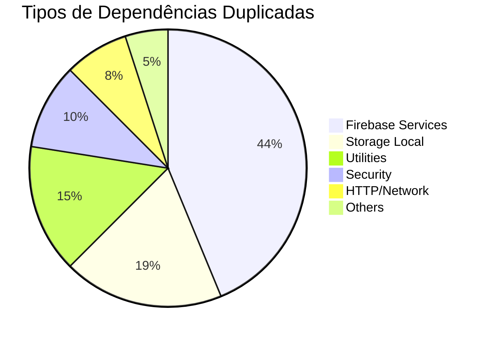

# 📊 Análise de Conflitos de Dependências - Flutter Monorepo

> **Relatório gerado em:** 25/09/2025
> **Escopo:** 6 aplicativos Flutter + packages/core
> **Objetivo:** Identificar dependências duplicadas e conflitos de versão

---

## 📋 Índice

- [📊 Resumo Executivo](#-resumo-executivo)
- [🏗️ Estrutura do Core Package](#%EF%B8%8F-estrutura-do-core-package)
- [🚨 Análise Detalhada por App](#-análise-detalhada-por-app)
- [📈 Métricas e Estatísticas](#-métricas-e-estatísticas)
- [🎯 Plano de Ação](#-plano-de-ação)
- [✅ Boas Práticas](#-boas-práticas)

---

## 📊 Resumo Executivo

### **Status Geral**
- **Total de apps analisados:** 6
- **Apps com conflitos críticos:** 3 🔴
- **Apps em migração:** 1 🟡
- **Apps implementados corretamente:** 2 🟢

### **Impacto dos Conflitos**
- **~42 dependências duplicadas** identificadas
- **Risco alto** de conflitos de versão em build/runtime
- **Manutenção dificultada** por scattered dependencies

### **Priorização**
1. **🔴 Crítico:** app-gasometer, app-plantis (19 duplicatas)
2. **🟡 Alto:** app-receituagro (15+ duplicatas)
3. **🟢 Bom:** app-taskolist, app-agrihurbi

---

## 🏗️ Estrutura do Core Package

### **Dependências Fornecidas pelo Core**
O `packages/core/pubspec.yaml` centraliza:

```yaml
# Firebase Stack (6 packages)
firebase_core: ^4.0.0
firebase_auth: ^6.0.1
firebase_analytics: ^12.0.0
firebase_crashlytics: ^5.0.0
firebase_storage: ^13.0.0
cloud_firestore: ^6.0.0

# Storage Local (3 packages)
hive: ^2.2.3
hive_flutter: ^1.1.0
shared_preferences: ^2.5.3

# Conectividade & HTTP
connectivity_plus: ^6.1.5
dio: ^5.9.0

# Notificações
flutter_local_notifications: ^19.4.0

# Segurança
flutter_secure_storage: ^9.2.4
local_auth: ^2.3.0
crypto: ^3.0.6

# RevenueCat & Utils
purchases_flutter: ^9.2.0
path_provider: ^2.1.5
# ... e outros 15+ packages
```

### **Princípio Fundamental**
> ⚡ **Single Source of Truth**: Apps que dependem do core NÃO devem redeclarar essas dependências

---

## 🚨 Análise Detalhada por App

### 🔴 **1. app-gasometer** - CRÍTICO
**Arquivo:** `apps/app-gasometer/pubspec.yaml`
**Linhas problemáticas:** 88-96

#### **Conflitos Identificados**
```yaml
# ❌ TODAS essas dependências JÁ estão no core:
cloud_firestore: any          # Core: ^6.0.0
firebase_auth: any            # Core: ^6.0.1
firebase_storage: any         # Core: ^13.0.0
shared_preferences: any       # Core: ^2.5.3
hive: any                     # Core: ^2.2.3
firebase_analytics: any       # Core: ^12.0.0
firebase_crashlytics: any     # Core: ^5.0.0
hive_flutter: any             # Core: ^1.1.0
firebase_core: any            # Core: ^4.0.0
```

#### **Risco**
- **Alto:** Uso de `any` pode causar incompatibilidades
- **9 dependências duplicadas**
- Potencial quebra em atualizações do core

#### **Outras Duplicatas**
```yaml
# Também duplicadas mas com versões específicas:
get_it: ^8.2.0               # Core: ^8.2.0
purchases_flutter: ^9.2.0    # Core: ^9.2.0
flutter_secure_storage: ^9.2.2 # Core: ^9.2.4 (versão divergente!)
path_provider: ^2.1.4        # Core: ^2.1.5 (versão divergente!)
# ... mais 4 duplicatas
```

---

### 🔴 **2. app-plantis** - CRÍTICO
**Arquivo:** `apps/app-plantis/pubspec.yaml`
**Linhas problemáticas:** 69-78

#### **Conflitos Identificados**
```yaml
# ❌ TODAS desnecessárias:
cloud_firestore: any          # Core: ^6.0.0
cloud_functions: any          # Core: ^6.0.0
firebase_storage: any         # Core: ^13.0.0
shared_preferences: any       # Core: ^2.5.3
hive: any                     # Core: ^2.2.3
flutter_secure_storage: any   # Core: ^9.2.4
path: any                     # Core: ^1.9.1
firebase_core: any            # Core: ^4.0.0
firebase_crashlytics: any     # Core: ^5.0.0
hive_flutter: any             # Core: ^1.1.0
```

#### **Risco**
- **10 dependências duplicadas**
- Mesmo padrão problemático do gasometer
- Status "any" especialmente perigoso

---

### 🟡 **3. app-receituagro** - ALTO RISCO
**Arquivo:** `apps/app-receituagro/pubspec.yaml`
**Linhas problemáticas:** 30-83

#### **Conflitos com Versões Específicas**
```yaml
# ❌ Duplicatas desnecessárias (mas versões corretas):
hive: ^2.2.3                  # ✓ Core: ^2.2.3
firebase_core: ^4.0.0         # ✓ Core: ^4.0.0
firebase_auth: ^6.0.1         # ✓ Core: ^6.0.1
firebase_crashlytics: ^5.0.0  # ✓ Core: ^5.0.0
firebase_analytics: ^12.0.0   # ✓ Core: ^12.0.0
cloud_firestore: ^6.0.0      # ✓ Core: ^6.0.0
cloud_functions: ^6.0.0      # ✓ Core: ^6.0.0
# ... mais 8+ duplicatas
```

#### **Status**
- **Versões corretas** mas **duplicação desnecessária**
- **15+ dependências** que poderiam ser removidas
- Manutenção dificultada

---

### 🟡 **4. app-petiveti** - EM MIGRAÇÃO
**Arquivo:** `apps/app-petiveti/pubspec.yaml`
**Linhas problemáticas:** 45-70

#### **Status de Migração**
```yaml
# Comentários indicam migração em progresso:
# MIGRATING TO CORE PACKAGE: Phase 1 - Keep essential direct deps
# TEMPORARY: Remove after core service integration complete

# ❌ Marcadas para remoção:
firebase_analytics: ^12.0.0   # TEMPORARY
firebase_crashlytics: ^5.0.0  # TEMPORARY
firebase_storage: ^13.0.0     # TEMPORARY
hive: ^2.2.3                  # TEMPORARY
shared_preferences: ^2.5.3    # TEMPORARY
```

#### **Ação Recomendada**
- **Finalizar migração** conforme planejado
- Remover dependências marcadas como TEMPORARY
- **8+ dependências** para limpeza

---

### 🟢 **5. app-agrihurbi** - BOM
**Arquivo:** `apps/app-agrihurbi/pubspec.yaml`

#### **Problemas Menores**
```yaml
# ⚠️ Apenas 2 problemas identificados:
shared_preferences: ^2.3.2    # ❌ Core: ^2.5.3 (versão antiga)
hive: ^2.2.3                  # ❌ Duplicata desnecessária
```

#### **Status**
- **Boa implementação geral**
- Apenas correções menores necessárias
- Exemplo positivo de uso do core

---

### 🟢 **6. app-taskolist** - REFERÊNCIA
**Arquivo:** `apps/app-taskolist/pubspec.yaml`

#### **Implementação Correta**
```yaml
# ✅ Mínimas dependências diretas para compatibilidade:
hive: any                     # Para build_runner/hive_generator
firebase_core: any            # Para inicialização específica
firebase_crashlytics: any     # Para reports específicos
```

#### **Status**
- **✅ Implementação exemplar**
- Apenas 3 dependências mínimas necessárias
- **Modelo a ser seguido**

---

## 📈 Métricas e Estatísticas

### **Distribuição de Conflitos**

| App | Conflitos Críticos | Conflitos Menores | Total | Prioridade |
|-----|:-------------------:|:-----------------:|:-----:|:----------:|
| **app-gasometer** | 9 | 4 | 13 | 🔴 Alta |
| **app-plantis** | 10 | 0 | 10 | 🔴 Alta |
| **app-receituagro** | 15+ | 0 | 15+ | 🟡 Média |
| **app-petiveti** | 8+ | 0 | 8+ | 🟡 Média |
| **app-agrihurbi** | 0 | 2 | 2 | 🟢 Baixa |
| **app-taskolist** | 0 | 0 | 0 | 🟢 ✅ |

### **Tipos de Conflitos**



### **Análise de Impacto**

- **🔴 Alto Risco (50%):** 3 apps com 32+ conflitos
- **🟡 Médio Risco (17%):** 1 app em migração
- **🟢 Baixo Risco (33%):** 2 apps implementados corretamente

---

## 🎯 Plano de Ação

### **Fase 1: Correções Críticas** ⏱️ 2-3 dias

#### **1.1 app-gasometer**
```bash
# Remover dependências duplicadas (linhas 88-96):
# - cloud_firestore: any
# - firebase_auth: any
# - firebase_storage: any
# - shared_preferences: any
# - hive: any
# - firebase_analytics: any
# - firebase_crashlytics: any
# - hive_flutter: any
# - firebase_core: any

# Testar build: flutter clean && flutter pub get
```

#### **1.2 app-plantis**
```bash
# Remover dependências duplicadas (linhas 69-78):
# - cloud_firestore: any
# - cloud_functions: any
# - firebase_storage: any
# - shared_preferences: any
# - hive: any
# - flutter_secure_storage: any
# - path: any
# - firebase_core: any
# - firebase_crashlytics: any
# - hive_flutter: any

# Testar build: flutter clean && flutter pub get
```

### **Fase 2: Limpeza Completa** ⏱️ 3-4 dias

#### **2.1 app-receituagro**
- Remover 15+ dependências duplicadas
- Manter apenas dependências específicas não abstraídas
- Documentar dependências mantidas

#### **2.2 app-petiveti**
- Finalizar migração para core package
- Remover dependências marcadas como TEMPORARY
- Testar funcionalidade social auth

### **Fase 3: Refinamentos** ⏱️ 1 dia

#### **3.1 app-agrihurbi**
```yaml
# Atualizar versão:
shared_preferences: ^2.5.3  # Era: ^2.3.2

# Remover:
# hive: ^2.2.3
```

#### **3.2 Validação Geral**
- Executar `flutter analyze` em todos os apps
- Executar testes unitários
- Verificar builds de produção

---

## ✅ Boas Práticas

### **❌ O que EVITAR**

```yaml
# ❌ NUNCA declarar dependências já no core:
dependencies:
  core:
    path: ../../packages/core
  firebase_core: any          # ❌ Já no core
  hive: ^2.2.3               # ❌ Já no core
  shared_preferences: any     # ❌ Já no core
```

### **✅ Implementação CORRETA**

```yaml
# ✅ Apenas core + dependências específicas:
dependencies:
  flutter:
    sdk: flutter

  # Core Package - Serviços compartilhados
  core:
    path: ../../packages/core

  # State Management específico
  provider: ^6.1.2           # ✅ Específico do app

  # Navigation específica
  go_router: ^16.1.0         # ✅ Não está no core

  # UI Components específicos
  fl_chart: ^1.0.0           # ✅ Específico para gráficos

  # NUNCA redeclarar o que já está no core
```

### **🔧 Casos Especiais Permitidos**

```yaml
# ✅ Casos onde duplicação é aceitável:

# Para build_runner/code generation:
hive: any                    # ✅ Necessário para hive_generator

# Para inicialização específica do app:
firebase_core: any           # ✅ Se necessário para setup específico

# Para versões específicas críticas:
some_package: ^1.2.3         # ✅ Se core usar versão incompatível
```

### **📝 Documentação Recomendada**

```yaml
dependencies:
  # Core Package - Fornece: Firebase*, Hive*, SharedPreferences, etc.
  core:
    path: ../../packages/core

  # App-specific dependencies ONLY:
  provider: ^6.1.2           # State management específico
  go_router: ^16.1.0         # Navigation não fornecida pelo core

  # Build dependencies (necessárias para geradores):
  hive: any                  # Requerido pelo hive_generator
```

---

## 🚀 Benefícios Esperados

### **Após Implementação**

1. **🔧 Manutenção Simplificada**
   - Updates centralizados no core package
   - Menos arquivos pubspec.yaml para manter

2. **🛡️ Consistência de Versões**
   - Eliminação de conflitos de versão
   - Builds mais estáveis

3. **⚡ Performance de Build**
   - Menos resolução de dependências
   - Cache mais eficiente

4. **📱 Qualidade do Produto**
   - Comportamento consistente entre apps
   - Menos bugs relacionados a versões

---

**📅 Próxima Revisão:** 30 dias após implementação
**👥 Responsável:** Time de Arquitetura Flutter
**📋 Status:** Aguardando aprovação para execução