# 👥 ReceituAGRO Cadastro - Fluxos de Trabalho do Usuário

## 📋 Índice dos Fluxos
1. [Fluxos de Gestão de Defensivos](#-fluxos-de-gestão-de-defensivos)
2. [Fluxos de Gestão de Pragas](#-fluxos-de-gestão-de-pragas)
3. [Fluxos de Gestão de Culturas](#-fluxos-de-gestão-de-culturas)
4. [Fluxos de Diagnósticos](#-fluxos-de-diagnósticos)
5. [Fluxos de Exportação](#-fluxos-de-exportação)
6. [Fluxos de Autenticação](#-fluxos-de-autenticação)

---

## 🛡️ Fluxos de Gestão de Defensivos

### **Fluxo 1: Visualizar Lista de Defensivos**

#### **🎯 Objetivo**: Navegar e filtrar defensivos cadastrados
#### **👤 Usuário**: Todos os perfis (Admin, Editor, Viewer)
#### **🚀 Início**: Usuário acessa dashboard principal

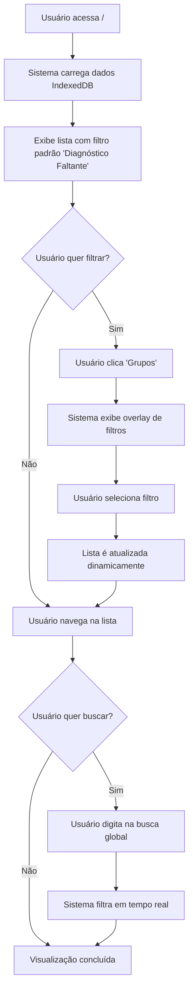

#### **📋 Passos Detalhados**:
1. **Carregamento Inicial**
   - Sistema carrega dados das tabelas: TBFITOSSANITARIOS, TBDIAGNOSTICO, TBFITOSSANITARIOSINFO
   - Processa contadores de diagnósticos
   - Aplica filtro padrão "Diagnóstico Faltante"

2. **Interação com Filtros**
   - Usuário clica no botão "Grupos" no toolbar
   - Sistema exibe overlay com 5 opções de filtro
   - Usuário seleciona filtro desejado
   - Lista atualiza automaticamente sem reload

3. **Busca Textual**
   - Usuário digita no campo de busca
   - Sistema filtra em tempo real em todos os campos visíveis
   - Resultados são destacados conforme termo buscado

#### **✅ Critérios de Sucesso**:
- Lista carrega em < 3 segundos
- Filtros respondem imediatamente
- Busca funciona em todos os campos
- Contadores são precisos

---

### **Fluxo 2: Cadastrar Novo Defensivo**

#### **🎯 Objetivo**: Adicionar novo defensivo ao sistema
#### **👤 Usuário**: Admin, Editor
#### **🚀 Início**: Usuário clica "Novo" na lista de defensivos

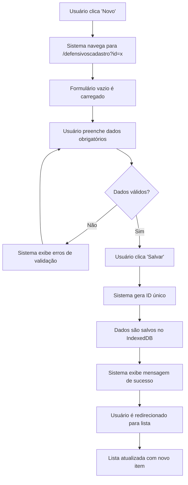

#### **📋 Passos Detalhados**:
1. **Preparação do Formulário**
   - Carrega listas de fabricantes, classificações
   - Inicializa campos vazios
   - Configura validações em tempo real

2. **Preenchimento dos Dados**
   - **Dados Básicos**: Nome comercial, técnico, fabricante, MAPA
   - **Classificações**: Agronômica, ambiental, toxicológica
   - **Características**: Formulação, modo de ação, concentração
   - **Propriedades**: Corrosivo, inflamável

3. **Validação e Salvamento**
   - Sistema valida campos obrigatórios
   - Verifica duplicação de MAPA/Nome
   - Gera IdReg único
   - Salva no IndexedDB
   - Atualiza contadores e índices

#### **✅ Critérios de Sucesso**:
- Todos os campos obrigatórios validados
- ID único gerado corretamente
- Dados salvos sem inconsistência
- Redirecionamento automático funcional

---

### **Fluxo 3: Editar Defensivo Existente**

#### **🎯 Objetivo**: Modificar dados de defensivo cadastrado
#### **👤 Usuário**: Admin, Editor
#### **🚀 Início**: Usuário clica no nome do defensivo na lista

```mermaid
graph TD
    A[Usuário clica nome do defensivo] --> B[Sistema navega para /defensivoscadastro?id={IdReg}]
    B --> C[Sistema carrega dados existentes]
    C --> D[Formulário preenchido é exibido]
    D --> E[Usuário modifica campos desejados]
    E --> F{Dados válidos?}
    F -->|Não| G[Sistema exibe erros específicos]
    G --> E
    F -->|Sim| H[Usuário clica 'Salvar']
    H --> I[Sistema atualiza registro no IndexedDB]
    I --> J[Log de auditoria é criado]
    J --> K[Mensagem de sucesso exibida]
    K --> L[Usuário retorna à lista]
```

#### **📋 Passos Detalhados**:
1. **Carregamento dos Dados**
   - Sistema busca registro por IdReg
   - Popula todos os campos do formulário
   - Carrega diagnósticos relacionados
   - Decodifica campos criptografados (toxico, etc.)

2. **Edição**
   - Usuário modifica campos necessários
   - Validação em tempo real impede erros
   - Sistema mantém histórico de changes

3. **Salvamento**
   - Valida integridade dos dados
   - Atualiza timestamp de modificação
   - Mantém relacionamentos existentes
   - Registra quem fez a alteração

#### **✅ Critérios de Sucesso**:
- Dados carregam corretamente
- Alterações são persistidas
- Relacionamentos mantidos
- Auditoria registrada

---

### **Fluxo 4: Excluir Defensivo**

#### **🎯 Objetivo**: Remover defensivo do sistema
#### **👤 Usuário**: Admin apenas
#### **🚀 Início**: Usuário clica ícone de lixeira na linha do defensivo

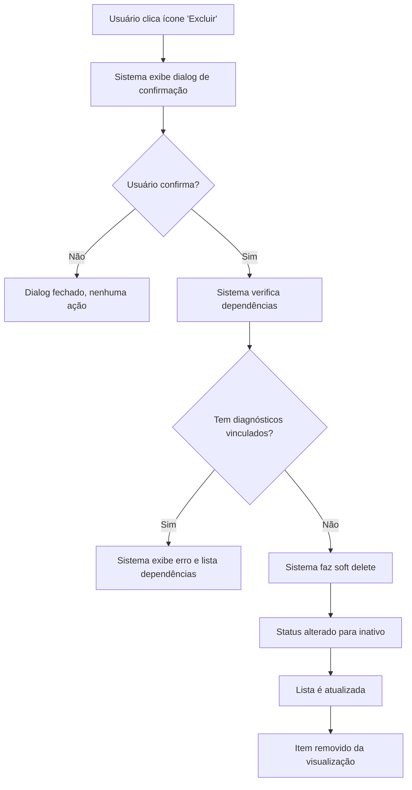

#### **📋 Passos Detalhados**:
1. **Confirmação**
   - Dialog modal com confirmação explícita
   - Exibe nome do item a ser excluído
   - Botões Sim/Não claros

2. **Verificação de Integridade**
   - Busca diagnósticos que referenciam o defensivo
   - Verifica outras dependências (logs, relatórios)
   - Impede exclusão se houver referências

3. **Exclusão Segura**
   - Soft delete (marca como inativo)
   - Mantém dados para auditoria
   - Remove da visualização normal
   - Log da operação

#### **✅ Critérios de Sucesso**:
- Confirmação obrigatória funciona
- Dependências são verificadas
- Dados não são perdidos permanentemente
- Interface atualiza corretamente

---

## 🐛 Fluxos de Gestão de Pragas

### **Fluxo 5: Navegar Catálogo de Pragas**

#### **🎯 Objetivo**: Explorar e pesquisar pragas cadastradas
#### **👤 Usuário**: Todos os perfis
#### **🚀 Início**: Usuário acessa menu Pragas

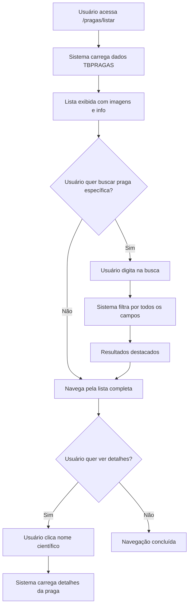

#### **📋 Passos Detalhados**:
1. **Carregamento do Catálogo**
   - Sistema carrega tabela TBPRAGAS
   - Verifica disponibilidade de imagens
   - Ordena por nome científico
   - Exibe indicadores visuais (imagem/info)

2. **Busca e Navegação**
   - Campo de busca funciona em tempo real
   - Filtra por: nome científico, comum, pseudônimos, tipo
   - Resultados são destacados conforme busca

3. **Visualização de Detalhes**
   - Nome científico é link clicável
   - Imagens são exibidas em thumbnail
   - Informações técnicas disponíveis

#### **✅ Critérios de Sucesso**:
- Todas as pragas carregam corretamente
- Busca é responsiva e precisa
- Imagens são exibidas quando disponíveis
- Links funcionam corretamente

---

### **Fluxo 6: Cadastrar Nova Praga**

#### **🎯 Objetivo**: Adicionar nova praga ao catálogo
#### **👤 Usuário**: Admin, Editor
#### **🚀 Início**: Usuário clica "Novo" na lista de pragas

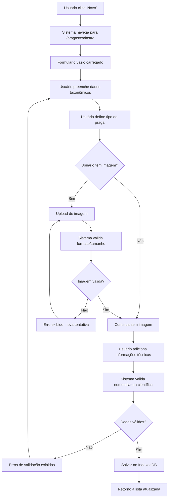

#### **📋 Passos Detalhados**:
1. **Dados Taxonômicos**
   - Nome científico (obrigatório, nomenclatura binomial)
   - Nome comum popular
   - Nomes secundários/sinônimos
   - Classificação: tipo, família, ordem

2. **Upload de Mídia**
   - Seleção de arquivo de imagem
   - Validação: JPG/PNG, max 2MB, min 300x300px
   - Redimensionamento automático se necessário
   - Nomenclatura baseada no nome científico

3. **Informações Complementares**
   - Características morfológicas
   - Hospedeiros principais
   - Distribuição geográfica
   - Métodos de controle

#### **✅ Critérios de Sucesso**:
- Nomenclatura científica validada
- Imagem salva corretamente
- Não há duplicação de espécies
- Dados estruturados adequadamente

---

## 🌱 Fluxos de Gestão de Culturas

### **Fluxo 7: Gerenciar Lista de Culturas**

#### **🎯 Objetivo**: Visualizar e manter cadastro de culturas
#### **👤 Usuário**: Admin, Editor, Viewer
#### **🚀 Início**: Usuário acessa menu Culturas

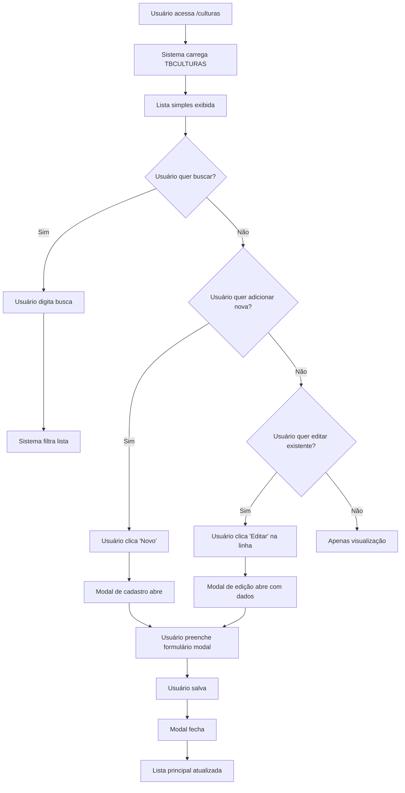

#### **📋 Passos Detalhados**:
1. **Visualização da Lista**
   - Tabela simples com 3 colunas: Cultura, Científico, Ações
   - Busca rápida por nome
   - Botão "Novo" sempre visível

2. **Operações CRUD via Modal**
   - Cadastro: Modal vazio para preenchimento
   - Edição: Modal preenchido com dados existentes
   - Exclusão: Confirmação inline (se implementada)

3. **Integração com Lista Principal**
   - Modal se sobrepõe à lista
   - Após operação, modal fecha automaticamente
   - Lista é recarregada com dados atualizados

#### **✅ Critérios de Sucesso**:
- Modal abre/fecha corretamente
- Dados são persistidos
- Lista atualiza sem reload completo
- Interface responsiva

---

## 🔬 Fluxos de Diagnósticos

### **Fluxo 8: Criar Relacionamento Diagnóstico**

#### **🎯 Objetivo**: Vincular praga, cultura e defensivo com dosagens
#### **👤 Usuário**: Admin, Editor especializado
#### **🚀 Início**: Usuário está editando um defensivo

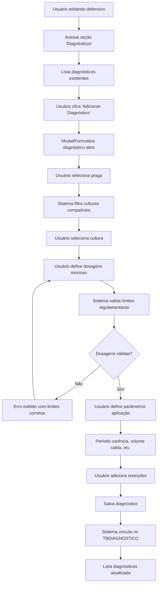

#### **📋 Passos Detalhados**:
1. **Seleção de Praga e Cultura**
   - Dropdown/Autocomplete de pragas
   - Filtro de culturas baseado na praga selecionada
   - Validação de compatibilidade praga-cultura

2. **Definição de Dosagens**
   - Campos dosagem mínima/máxima
   - Validação contra limites regulamentares
   - Cálculo automático de concentração na calda

3. **Parâmetros Técnicos**
   - Volume de calda (L/ha)
   - Número de aplicações
   - Intervalo entre aplicações
   - Período de carência
   - Condições especiais

4. **Restrições e Observações**
   - Restrições ambientais
   - Toxicidade para polinizadores
   - LMR (Limite Máximo de Resíduo)
   - Observações técnicas

#### **✅ Critérios de Sucesso**:
- Relacionamento correto entre entidades
- Dosagens validadas e seguras
- Todas as informações técnicas capturadas
- Dados consistentes no banco

---

### **Fluxo 9: Consultar Matriz de Compatibilidade**

#### **🎯 Objetivo**: Visualizar quais defensivos controlam cada praga por cultura
#### **👤 Usuário**: Todos os perfis (consulta técnica)
#### **🚀 Início**: Usuário quer consultar tratamento para praga específica

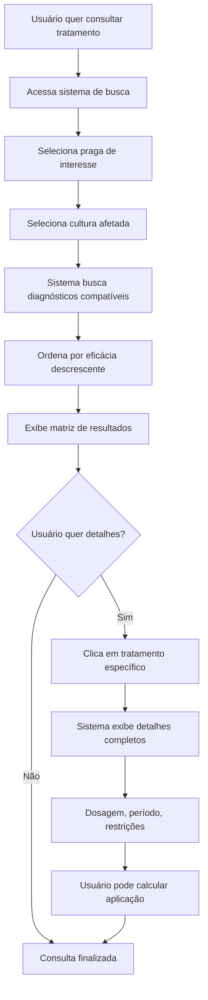

#### **📋 Passos Detalhados**:
1. **Interface de Consulta**
   - Seletores cascateados: praga → cultura
   - Auto-complete para agilizar busca
   - Filtros adicionais (classe, fabricante)

2. **Processamento da Consulta**
   - Busca na tabela TBDIAGNOSTICO
   - Join com dados de defensivos
   - Ordenação por critérios relevantes (eficácia, segurança)

3. **Exibição de Resultados**
   - Tabela com tratamentos disponíveis
   - Indicadores visuais (segurança, eficácia)
   - Links para detalhes completos

4. **Detalhamento Técnico**
   - Ficha completa do tratamento
   - Calculadora de dosagem
   - Recomendações específicas

#### **✅ Critérios de Sucesso**:
- Busca rápida e precisa
- Resultados relevantes e ordenados
- Informações técnicas completas
- Interface intuitiva para consulta

---

## 📤 Fluxos de Exportação

### **Fluxo 10: Exportar Dados do Sistema**

#### **🎯 Objetivo**: Gerar arquivos com dados para backup ou análise
#### **👤 Usuário**: Admin, Editor
#### **🚀 Início**: Usuário acessa menu Exportação

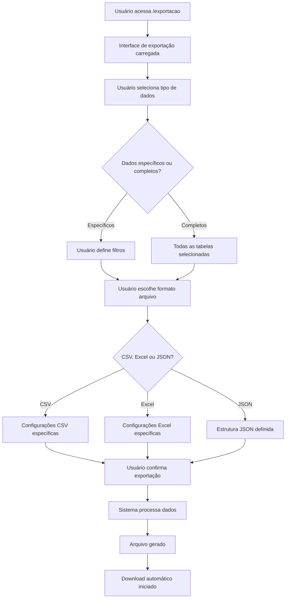

#### **📋 Passos Detalhados**:
1. **Seleção de Escopo**
   - Todas as tabelas ou seleção específica
   - Filtros por data, status, categoria
   - Preview do volume de dados

2. **Configuração do Formato**
   - **CSV**: Delimitador, codificação, cabeçalho
   - **Excel**: Múltiplas abas, formatação
   - **JSON**: Estrutura aninhada ou plana

3. **Processamento**
   - Validação da seleção
   - Processamento em background
   - Indicador de progresso

4. **Download**
   - Geração do arquivo final
   - Download automático no navegador
   - Log da operação de exportação

#### **✅ Critérios de Sucesso**:
- Todos os dados selecionados incluídos
- Formato de arquivo correto e íntegro
- Download funciona em todos os navegadores
- Performance adequada mesmo com grandes volumes

---

## 🔐 Fluxos de Autenticação

### **Fluxo 11: Login no Sistema**

#### **🎯 Objetivo**: Autenticar usuário e iniciar sessão
#### **👤 Usuário**: Todos os usuários registrados
#### **🚀 Início**: Usuário acessa URL do sistema sem estar autenticado

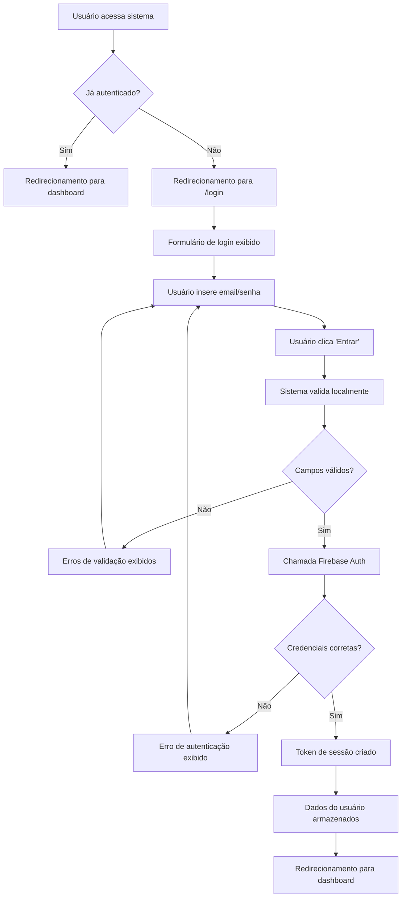

#### **📋 Passos Detalhados**:
1. **Detecção de Status**
   - Sistema verifica token existente
   - Valida validade do token Firebase
   - Redireciona conforme necessário

2. **Processo de Autenticação**
   - Validação local dos campos
   - Chamada ao Firebase Authentication
   - Tratamento de diferentes tipos de erro

3. **Estabelecimento de Sessão**
   - Armazenamento seguro do token
   - Carregamento de dados do perfil
   - Configuração de permissões
   - Inicialização do IndexedDB

4. **Navegação Pós-Login**
   - Redirecionamento para URL original (se existir)
   - Carregamento do dashboard padrão
   - Inicialização dos dados da aplicação

#### **✅ Critérios de Sucesso**:
- Autenticação segura via Firebase
- Sessão persistente entre navegações
- Tratamento adequado de erros
- Redirecionamento correto pós-login

---

### **Fluxo 12: Logout e Encerramento de Sessão**

#### **🎯 Objetivo**: Encerrar sessão do usuário com segurança
#### **👤 Usuário**: Usuário autenticado
#### **🚀 Início**: Usuário clica em "Sair" ou "Logout"

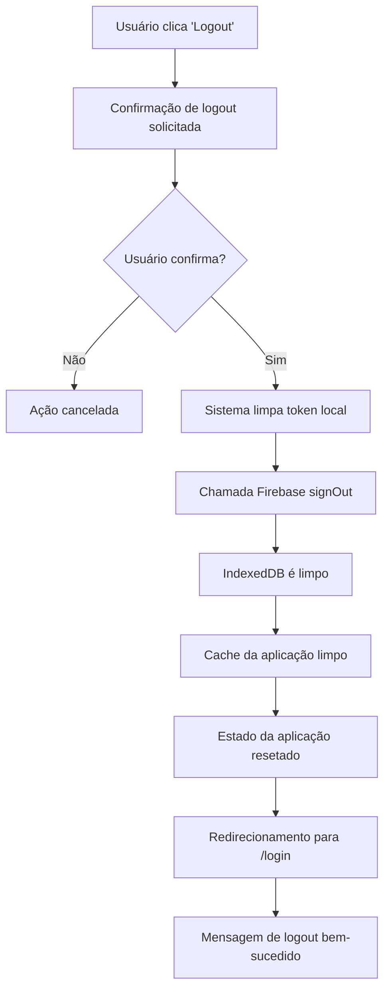

#### **📋 Passos Detalhados**:
1. **Confirmação** (opcional)
   - Dialog de confirmação se houver dados não salvos
   - Aviso sobre perda de progresso

2. **Limpeza de Sessão**
   - Remoção de tokens de autenticação
   - Signout do Firebase Auth
   - Limpeza do localStorage/sessionStorage

3. **Limpeza de Dados**
   - Clear do IndexedDB (dados sensíveis)
   - Limpeza de cache da aplicação
   - Reset do estado Vuex/state management

4. **Redirecionamento Seguro**
   - Navegação forçada para login
   - Prevenção de acesso por back button
   - Mensagem de confirmação do logout

#### **✅ Critérios de Sucesso**:
- Todos os dados de sessão removidos
- Firebase Auth deslogado corretamente
- Impossibilidade de voltar ao sistema via browser
- Feedback claro ao usuário

---

## 🔄 Fluxos de Sincronização e Manutenção

### **Fluxo 13: Inicialização da Aplicação**

#### **🎯 Objetivo**: Carregar todos os dados necessários na inicialização
#### **👤 Usuário**: Sistema automático
#### **🚀 Início**: Primeira carga da aplicação ou refresh

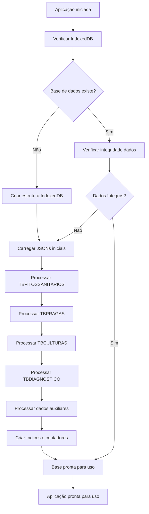

#### **📋 Passos Detalhados**:
1. **Verificação Inicial**
   - Check da existência do IndexedDB
   - Validação da estrutura das tabelas
   - Verificação de integridade básica

2. **Carregamento de Dados**
   - Load sequencial dos arquivos JSON
   - Processamento e transformação dos dados
   - Inserção no IndexedDB com validação

3. **Preparação de Índices**
   - Criação de índices para performance
   - Cálculo de contadores dinâmicos
   - Preparação de caches de consulta

4. **Validação Final**
   - Verificação de referências cruzadas
   - Contagem de registros por tabela
   - Sinalização de aplicação pronta

#### **✅ Critérios de Sucesso**:
- Todos os dados carregados sem erro
- Índices criados corretamente
- Performance de consulta otimizada
- Aplicação responsiva após inicialização

---

**Esta documentação de fluxos serve como guia completo para implementação da UX/UI na migração Flutter Web, garantindo que todos os caminhos do usuário sejam preservados e otimizados.**