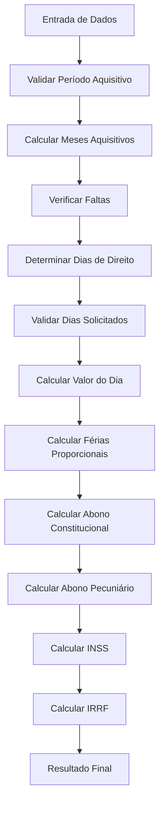

# Cálculo de Férias

## 📋 Visão Geral

Módulo responsável pelo cálculo de férias integrais, proporcionais, abono constitucional e pecuniário, considerando o período aquisitivo e faltas não justificadas.

**Arquivo Principal**: `/services/calculation_service.dart`

## 🧮 Fórmulas Matemáticas

### 1. **Cálculos Base**

#### Valor do Dia de Trabalho
```dart
double valorDia = salarioBruto / 30;
```

#### Férias Proporcionais
```dart
double feriasProporcionais = valorDia * diasGozados;
```

#### Abono Constitucional (1/3)
```dart
double abonoConstitucional = feriasProporcionais * (1.0 / 3.0);
```

### 2. **Cálculo do Período Aquisitivo**

#### Meses Aquisitivos
```dart
DateTime inicio = DateTime.parse(inicioAquisitivo);
DateTime fim = DateTime.parse(fimAquisitivo);
int diferençaDias = fim.difference(inicio).inDays;
int mesesAquisitivos = min(diferençaDias ~/ 30, 12);
```

#### Dias de Direito (Baseado nas Faltas)
```dart
int diasDireito = _calcularDiasDeAcordoComFaltas(faltasNaoJustificadas);

int _calcularDiasDeAcordoComFaltas(int faltas) {
  if (faltas <= 5) return 30;
  if (faltas <= 14) return 24;
  if (faltas <= 23) return 18;
  if (faltas <= 32) return 12;
  return 0; // Perde o direito
}
```

### 3. **Abono Pecuniário (Venda de Férias)**

#### Valor do Abono Pecuniário
```dart
// Máximo 1/3 das férias podem ser vendidas
int diasVendidos = min(diasVendidos, diasDireito ~/ 3);
double abonoPecuniario = (valorDia * diasVendidos) * (1 + 1.0/3.0);
```

### 4. **Cálculos de Descontos**

#### Base de Cálculo para IRRF
```dart
double baseIrrf = (feriasProporcionais + abonoConstitucional + abonoPecuniario) - descontoInss;
```

#### INSS sobre Férias
```dart
double inssFerias = _calcularInssProgressivo(
  feriasProporcionais + abonoConstitucional + abonoPecuniario
);
```

#### IRRF sobre Férias
```dart
double irrfFerias = _calcularIrrfProgressivo(baseIrrf, dependentes);
```

## 📊 Tabela de Redução por Faltas

| Faltas Não Justificadas | Dias de Férias | Redução |
|--------------------------|----------------|---------|
| 0 a 5 faltas | 30 dias | 0% |
| 6 a 14 faltas | 24 dias | 20% |
| 15 a 23 faltas | 18 dias | 40% |
| 24 a 32 faltas | 12 dias | 60% |
| Acima de 32 faltas | 0 dias | 100% (perde direito) |

## 🔧 Parâmetros de Entrada

| Parâmetro | Tipo | Descrição | Obrigatório |
|-----------|------|-----------|-------------|
| `salarioBruto` | double | Salário base do trabalhador | ✅ |
| `inicioAquisitivo` | String | Data de início do período aquisitivo | ✅ |
| `fimAquisitivo` | String | Data de fim do período aquisitivo | ✅ |
| `diasFerias` | int | Dias que serão gozados | ✅ |
| `faltasNaoJustificadas` | int | Número de faltas sem justificativa | ❌ (padrão: 0) |
| `diasVendidos` | int | Dias de abono pecuniário | ❌ (padrão: 0) |
| `dependentes` | int | Número de dependentes para IR | ❌ (padrão: 0) |

## ✅ Validações Implementadas

### **Validações de Período**
```dart
// Período aquisitivo não pode exceder 12 meses
if (mesesAquisitivos > 12) {
  mesesAquisitivos = 12;
}

// Data de fim deve ser posterior ao início
if (fim.isBefore(inicio)) {
  throw Exception('Data de fim deve ser posterior ao início');
}
```

### **Validações de Férias**
```dart
// Dias de férias não podem exceder o direito
if (diasFerias > diasDireito) {
  diasFerias = diasDireito;
}

// Abono pecuniário limitado a 1/3
int maxDiasVenda = diasDireito ~/ 3;
if (diasVendidos > maxDiasVenda) {
  diasVendidos = maxDiasVenda;
}

// Total de dias não pode exceder 30
if (diasFerias + diasVendidos > 30) {
  throw Exception('Total de dias não pode exceder 30');
}
```

### **Validação de Salário**
```dart
if (salarioBruto < salarioMinimo) {
  salarioBruto = salarioMinimo; // R$ 1.412,00
}
```

## 🎯 Constantes Utilizadas

```dart
// Períodos e percentuais
static const int DIAS_MES_FERIAS = 30;
static const double PERCENTUAL_ABONO_CONSTITUCIONAL = 1.0 / 3.0;
static const double PERCENTUAL_MAXIMO_ABONO_PECUNIARIO = 1.0 / 3.0;
static const int MESES_MAXIMOS_AQUISITIVO = 12;

// Tabela de faltas (dias de direito)
static const Map<int, int> TABELA_FALTAS = {
  5: 30,   // 0-5 faltas = 30 dias
  14: 24,  // 6-14 faltas = 24 dias  
  23: 18,  // 15-23 faltas = 18 dias
  32: 12,  // 24-32 faltas = 12 dias
  999: 0,  // 33+ faltas = 0 dias
};

// Valores de referência 2024
static const double SALARIO_MINIMO = 1412.00;
static const double TETO_INSS = 7786.02;
static const double DEDUCAO_DEPENDENTE_IRRF = 189.59;
```

## 🔄 Fluxo de Cálculo



## 📤 Estrutura de Saída

```dart
class FeriasResult {
  final int diasDireito;
  final int diasGozados;
  final int diasVendidos;
  final double valorDia;
  final double feriasProporcionais;
  final double abonoConstitucional;
  final double abonoPecuniario;
  final double totalBruto;
  final double descontoInss;
  final double descontoIrrf;
  final double totalLiquido;
  final String periodoAquisitivo;
  final Map<String, dynamic> detalhamento;
}
```

## 🧪 Exemplo de Cálculo

### **Cenário 1 - Férias Integrais**: 
- Salário: R$ 2.500,00
- Período: 12 meses completos
- Faltas: 3 (não justificadas)
- Dias de férias: 30 dias
- Abono pecuniário: 10 dias
- Dependentes: 1

### **Resultado**:
```dart
// Valor do dia: 2.500 / 30 = R$ 83,33
// Dias de direito: 30 (faltas ≤ 5)
// Férias proporcionais: 83,33 * 20 = R$ 1.666,60 (30 - 10 vendidos)
// Abono constitucional: 1.666,60 * (1/3) = R$ 555,53
// Abono pecuniário: (83,33 * 10) * (1 + 1/3) = R$ 1.111,07
// Total bruto: 1.666,60 + 555,53 + 1.111,07 = R$ 3.333,20
```

### **Cenário 2 - Férias Proporcionais**: 
- Salário: R$ 1.800,00
- Período: 8 meses trabalhados
- Faltas: 10 (não justificadas)
- Dias de férias: 16 dias
- Sem abono pecuniário

### **Resultado**:
```dart
// Valor do dia: 1.800 / 30 = R$ 60,00
// Dias de direito: 24 (6-14 faltas)
// Dias proporcionais: (24 * 8) / 12 = 16 dias
// Férias proporcionais: 60,00 * 16 = R$ 960,00
// Abono constitucional: 960,00 * (1/3) = R$ 320,00
// Total bruto: 960,00 + 320,00 = R$ 1.280,00
```

## 📅 Regras Especiais

### **Período Aquisitivo**
- **Duração**: 12 meses consecutivos de trabalho
- **Concessão**: Deve ser concedida nos 12 meses subsequentes
- **Fracionamento**: Máximo 2 períodos (um deve ter pelo menos 14 dias)

### **Abono Pecuniário**
- **Limite**: Máximo 1/3 das férias (10 dias)
- **Conversão**: Inclui o abono constitucional de 1/3
- **Prazo**: Deve ser requerido até 15 dias antes do início das férias

### **Faltas Justificadas (Não Reduzem)**
- Licença médica
- Licença maternidade/paternidade
- Faltas legais (casamento, luto, etc.)
- Suspensão disciplinar
- Acidente de trabalho

## 🚨 Observações Importantes

1. **Prescrição**: Direito prescreve em 5 anos após o fim do período concessivo
2. **Dobra**: Férias em dobro se não concedidas no prazo legal
3. **Coletivas**: Podem ser concedidas coletivamente (mínimo 10 dias)
4. **Menores**: Menores de 18 anos e maiores de 50 não podem fracionar
5. **Estudantes**: Coincidir com férias escolares quando possível
6. **Registro**: Obrigatório registro na carteira de trabalho

---

*Esta documentação foi gerada a partir da análise do código fonte original e serve como referência para migração e manutenção.*