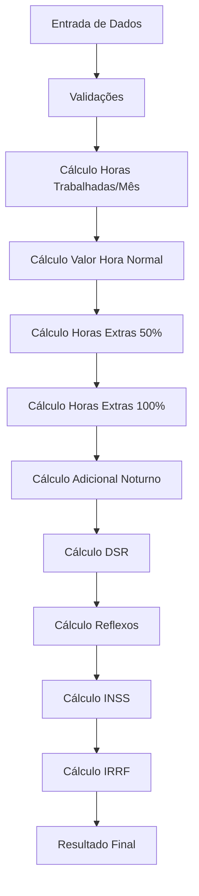

# Cálculo de Horas Extras

## 📋 Visão Geral

Módulo responsável pelo cálculo de horas extras, adicionais noturnos, DSR e reflexos em férias e 13º salário, seguindo a legislação trabalhista brasileira.

**Arquivo Principal**: `/services/calculation_service.dart`

## 🧮 Fórmulas Matemáticas

### 1. **Cálculos Base**

#### Horas Trabalhadas por Mês
```dart
double horasTrabalhadasMes = (horasSemanais * diasUteis) / 6;
```

#### Valor da Hora Normal
```dart
double valorHoraNormal = salarioBruto / horasTrabalhadasMes;
```

### 2. **Adicionais de Horas Extras**

#### Horas Extras 50%
```dart
double valorHora50 = valorHoraNormal * (1 + 0.50);
double totalHoras50 = horas50 * valorHora50;
```

#### Horas Extras 100%
```dart
double valorHora100 = valorHoraNormal * (1 + 1.00);
double totalHoras100 = horas100 * valorHora100;
```

#### Adicional Noturno
```dart
double valorHoraNoturna = valorHoraNormal * (1 + percentualNoturno / 100);
double totalHorasNoturnas = horasNoturnas * valorHoraNoturna;
```

### 3. **Cálculos de DSR (Descanso Semanal Remunerado)**

#### DSR sobre Horas Extras
```dart
double totalHorasExtras = totalHoras50 + totalHoras100;
double dsrHorasExtras = totalHorasExtras * (1.0 / 6.0);
```

### 4. **Reflexos em Verbas Indenizatórias**

#### Reflexo em Férias
```dart
double reflexoFerias = totalHorasExtras * (1.0 / 12.0);
```

#### Reflexo no 13º Salário  
```dart
double reflexoDecimoTerceiro = totalHorasExtras * (1.0 / 12.0);
```

## 📊 Tabelas de Referência

### **Faixas de INSS (2024)**
| Faixa | Salário de Contribuição | Alíquota | Dedução |
|-------|-------------------------|----------|---------|
| 1 | R$ 0,00 a R$ 1.412,00 | 7,5% | R$ 0,00 |
| 2 | R$ 1.412,01 a R$ 2.666,68 | 9,0% | R$ 21,18 |
| 3 | R$ 2.666,69 a R$ 4.000,03 | 12,0% | R$ 101,18 |
| 4 | R$ 4.000,04 a R$ 7.786,02 | 14,0% | R$ 181,18 |

### **Faixas de IRRF (2024)**
| Faixa | Base de Cálculo | Alíquota | Dedução |
|-------|-----------------|----------|---------|
| 1 | R$ 0,00 a R$ 2.112,00 | Isento | R$ 0,00 |
| 2 | R$ 2.112,01 a R$ 2.826,65 | 7,5% | R$ 158,40 |
| 3 | R$ 2.826,66 a R$ 3.751,05 | 15,0% | R$ 370,40 |
| 4 | R$ 3.751,06 a R$ 4.664,68 | 22,5% | R$ 651,73 |
| 5 | Acima de R$ 4.664,69 | 27,5% | R$ 884,96 |

## 🔧 Parâmetros de Entrada

| Parâmetro | Tipo | Descrição | Padrão |
|-----------|------|-----------|--------|
| `salarioBruto` | double | Salário base do trabalhador | - |
| `horasSemanais` | double | Jornada semanal de trabalho | 44.0 |
| `horas50` | double | Horas extras com adicional de 50% | 0.0 |
| `horas100` | double | Horas extras com adicional de 100% | 0.0 |
| `horasNoturnas` | double | Horas trabalhadas no período noturno | 0.0 |
| `percentualNoturno` | double | Percentual do adicional noturno | 20.0 |
| `horasDomingoFeriado` | double | Horas trabalhadas em domingos/feriados | 0.0 |
| `dependentes` | int | Número de dependentes para IR | 0 |
| `diasUteis` | double | Dias úteis no mês | 22.0 |

## ✅ Validações Implementadas

### **Limites de Valores**
```dart
// Salário mínimo
if (salarioBruto < salarioMinimo) {
  salarioBruto = salarioMinimo; // R$ 1.412,00
}

// Horas semanais
if (horasSemanais < 1 || horasSemanais > 60) {
  throw Exception('Horas semanais devem estar entre 1 e 60');
}

// Máximo de horas extras por mês
if (totalHorasExtras > 200) {
  throw Exception('Máximo de 200 horas extras por mês');
}

// INSS limitado ao teto
if (inssCalculado > tetoInss) {
  inssCalculado = tetoInss; // R$ 7.786,02
}
```

### **Adicional Noturno Mínimo**
```dart
if (percentualNoturno < 20.0) {
  percentualNoturno = 20.0; // Mínimo legal
}
```

## 🎯 Constantes Utilizadas

```dart
// Percentuais legais
static const double PERCENTUAL_HORAS_EXTRAS_50 = 0.50;
static const double PERCENTUAL_HORAS_EXTRAS_100 = 1.00;
static const double PERCENTUAL_DSR = 1.0 / 6.0;
static const double PERCENTUAL_REFLEXO_FERIAS = 1.0 / 12.0;
static const double PERCENTUAL_REFLEXO_DECIMO_TERCEIRO = 1.0 / 12.0;

// Valores de referência 2024
static const double SALARIO_MINIMO = 1412.00;
static const double TETO_INSS = 7786.02;
static const double DEDUCAO_DEPENDENTE_IRRF = 189.59;
static const double PERCENTUAL_ADICIONAL_NOTURNO_MINIMO = 20.0;
```

## 🔄 Fluxo de Cálculo



## 📤 Estrutura de Saída

```dart
class HorasExtrasResult {
  final double valorHoraNormal;
  final double totalHoras50;
  final double totalHoras100; 
  final double totalHorasNoturnas;
  final double dsrHorasExtras;
  final double reflexoFerias;
  final double reflexoDecimoTerceiro;
  final double totalBruto;
  final double descontoInss;
  final double descontoIrrf;
  final double totalLiquido;
  final Map<String, dynamic> detalhamento;
}
```

## 🧪 Exemplo de Cálculo

### **Cenário**: 
- Salário: R$ 3.000,00
- Jornada: 44h semanais
- 10 horas extras 50%
- 5 horas extras 100%
- 0 dependentes

### **Resultado**:
```dart
// Horas trabalhadas/mês: (44 * 22) / 6 = 161,33h
// Valor hora normal: 3.000 / 161,33 = R$ 18,60
// Horas extras 50%: 10 * (18,60 * 1,5) = R$ 279,00
// Horas extras 100%: 5 * (18,60 * 2) = R$ 186,00
// Total horas extras: R$ 465,00
// DSR: 465 * (1/6) = R$ 77,50
// Reflexo férias: 465 * (1/12) = R$ 38,75
// Reflexo 13º: 465 * (1/12) = R$ 38,75
```

## 🚨 Observações Importantes

1. **Legislação Vigente**: Todos os cálculos seguem a CLT e atualizações de 2024
2. **Adicional Noturno**: Período das 22:00 às 5:00, mínimo 20%
3. **DSR**: Aplica-se sobre todas as horas extras habituais
4. **Reflexos**: Incidem sobre férias e 13º salário quando habituais
5. **Teto INSS**: Limitado a R$ 7.786,02 em 2024
6. **Dedução IR**: R$ 189,59 por dependente em 2024

---

*Esta documentação foi gerada a partir da análise do código fonte original e serve como referência para migração e manutenção.*