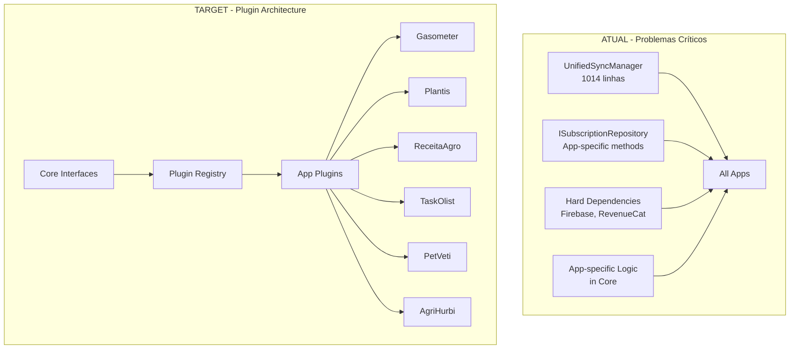

# 🏗️ Padrões Arquiteturais - Packages/Core

## 📐 Visão Geral da Arquitetura Core

### Arquitetura Atual vs. Target



## 🎯 Princípios Fundamentais para Core Package

### 1. Zero App Knowledge Rule
```
O Core NUNCA deve conhecer apps específicos
```
- **Core**: Define contratos e abstrações
- **Apps**: Implementam contratos específicos
- **Factory/Registry**: Conecta core com implementações

### 2. Plugin-First Architecture
```
Extensibilidade > Implementação
```
- **Interfaces abundantes**: Para todas as operações
- **Factory patterns**: Para criação dinâmica
- **Registry patterns**: Para descoberta de implementações

### 3. Fail-Safe Defaults
```
Core deve funcionar sem implementações específicas
```
- **Default implementations**: Para todos os contratos
- **Graceful degradation**: Quando plugins não disponíveis
- **Error boundaries**: Para isolamento de falhas

---

## 📱 Padrões para Services Compartilhados

### Sync Service Pattern - Correto

```dart
// ✅ CORRETO - Core define apenas contratos
abstract class ISyncService {
  String get serviceId;
  Future<SyncResult> sync();
  bool get canSync;
}

abstract class ISyncOrchestrator {
  Future<void> registerService(ISyncService service);
  Future<void> syncAll();
  Future<void> syncSpecific(String serviceId);
}

class SyncOrchestrator implements ISyncOrchestrator {
  final Map<String, ISyncService> _services = {};
  
  @override
  Future<void> registerService(ISyncService service) async {
    _services[service.serviceId] = service;
  }
  
  @override
  Future<void> syncAll() async {
    final futures = _services.values
        .where((service) => service.canSync)
        .map((service) => service.sync());
    
    await Future.wait(futures);
  }
}

// ❌ INCORRETO - God class conhece apps específicos
class UnifiedSyncManager {
  Future<void> syncGasometerData() { ... }
  Future<void> syncPlantisData() { ... }
  Future<void> syncReceituagroData() { ... }
  // 1000+ linhas de responsabilidades misturadas
}
```

### Repository Pattern - Interface Segregation

```dart
// ✅ CORRETO - Interfaces segregadas
abstract class IBaseRepository<T> {
  Future<List<T>> getAll();
  Future<T?> getById(String id);
  Future<void> save(T entity);
  Future<void> delete(String id);
}

abstract class ISyncableRepository<T> extends IBaseRepository<T> {
  Future<List<T>> getUnsynced();
  Future<void> markAsSynced(String id);
}

abstract class ICacheableRepository<T> extends IBaseRepository<T> {
  Future<void> clearCache();
  Future<void> warmupCache();
}

// Repository específico combina apenas interfaces necessárias
abstract class IVehicleRepository extends ISyncableRepository<Vehicle> {
  Future<List<Vehicle>> getByUserId(String userId);
}

// ❌ INCORRETO - Interface monolítica
abstract class ISubscriptionRepository {
  // Força todos os apps a implementar métodos irrelevantes
  Future<VehicleSubscription> getVehicleSubscription(); // Só gasometer usa
  Future<PlantSubscription> getPlantSubscription(); // Só plantis usa
  Future<TaskSubscription> getTaskSubscription(); // Só taskolist usa
}
```

---

## 🔧 Dependency Injection Patterns

### Module Pattern para Core

```dart
// ✅ CORRETO - Core Module sem conhecimento de apps
abstract class CoreModule {
  void configure(GetIt container);
}

class InfrastructureModule extends CoreModule {
  @override
  void configure(GetIt container) {
    // Apenas abstrações e defaults
    container.registerLazySingleton<INetworkService>(
      () => NetworkService(),
    );
    
    container.registerLazySingleton<ICacheManager>(
      () => DefaultCacheManager(),
    );
    
    container.registerFactory<ISyncOrchestrator>(
      () => SyncOrchestrator(),
    );
  }
}

class ServicesModule extends CoreModule {
  @override
  void configure(GetIt container) {
    // Services que dependem de abstrações
    container.registerLazySingleton<IAuthService>(
      () => FirebaseAuthServiceImpl(
        firebaseAuth: container<IFirebaseAuth>(),
        cache: container<ICacheManager>(),
      ),
    );
  }
}

// App-specific modules registram implementações
class GasometerModule extends CoreModule {
  @override
  void configure(GetIt container) {
    // Registra implementações específicas
    container.registerLazySingleton<ISyncService>(
      () => VehicleSyncService(),
    );
    
    container.registerLazySingleton<IVehicleRepository>(
      () => HiveVehicleRepository(),
    );
  }
}
```

### Factory Pattern para Extensibilidade

```dart
// ✅ CORRETO - Factory extensível
abstract class IServiceFactory<T> {
  T create(String identifier);
  bool supports(String identifier);
  void register(String identifier, T Function() creator);
}

class SyncServiceFactory implements IServiceFactory<ISyncService> {
  final Map<String, ISyncService Function()> _creators = {};
  
  @override
  void register(String identifier, ISyncService Function() creator) {
    _creators[identifier] = creator;
  }
  
  @override
  ISyncService create(String identifier) {
    final creator = _creators[identifier];
    if (creator == null) {
      throw UnsupportedError('No sync service for $identifier');
    }
    return creator();
  }
  
  @override
  bool supports(String identifier) => _creators.containsKey(identifier);
}

// Apps registram suas implementações
// Em gasometer_module.dart:
final factory = getIt<SyncServiceFactory>();
factory.register('vehicle', () => VehicleSyncService());

// Em plantis_module.dart:
final factory = getIt<SyncServiceFactory>();
factory.register('plant', () => PlantSyncService());
```

---

## 🎯 Plugin Architecture Pattern

### Plugin Registry System

```dart
// ✅ CORRETO - Sistema de plugins
abstract class IPlugin {
  String get id;
  String get version;
  Future<void> initialize();
  Future<void> dispose();
}

abstract class IPluginRegistry {
  void register(IPlugin plugin);
  void unregister(String pluginId);
  T? get<T extends IPlugin>(String pluginId);
  List<T> getAll<T extends IPlugin>();
}

class PluginRegistry implements IPluginRegistry {
  final Map<String, IPlugin> _plugins = {};
  
  @override
  void register(IPlugin plugin) {
    _plugins[plugin.id] = plugin;
  }
  
  @override
  T? get<T extends IPlugin>(String pluginId) {
    final plugin = _plugins[pluginId];
    return plugin is T ? plugin : null;
  }
  
  @override
  List<T> getAll<T extends IPlugin>() {
    return _plugins.values.whereType<T>().toList();
  }
}

// Plugin específico para domínio
abstract class ISyncPlugin extends IPlugin {
  Future<SyncResult> sync();
}

class VehicleSyncPlugin implements ISyncPlugin {
  @override
  String get id => 'vehicle_sync';
  
  @override
  String get version => '1.0.0';
  
  @override
  Future<SyncResult> sync() async {
    // Implementação específica para veículos
  }
}
```

### Event-Driven Communication

```dart
// ✅ CORRETO - Event bus para comunicação desacoplada
abstract class IEventBus {
  void publish<T>(T event);
  void subscribe<T>(void Function(T event) handler);
  void unsubscribe<T>(void Function(T event) handler);
}

class EventBus implements IEventBus {
  final Map<Type, List<Function>> _handlers = {};
  
  @override
  void publish<T>(T event) {
    final handlers = _handlers[T] ?? [];
    for (final handler in handlers) {
      try {
        handler(event);
      } catch (e) {
        // Log error but don't break other handlers
      }
    }
  }
  
  @override
  void subscribe<T>(void Function(T event) handler) {
    _handlers.putIfAbsent(T, () => []).add(handler);
  }
}

// Events para comunicação cross-app
class SyncCompletedEvent {
  final String serviceId;
  final SyncResult result;
  
  SyncCompletedEvent(this.serviceId, this.result);
}

class DataChangedEvent<T> {
  final T data;
  final String operation; // 'create', 'update', 'delete'
  
  DataChangedEvent(this.data, this.operation);
}
```

---

## 🔄 Error Handling Patterns

### Result Pattern para Core

```dart
// ✅ CORRETO - Result pattern para error handling
sealed class Result<T> {
  const Result();
  
  factory Result.success(T data) = Success<T>;
  factory Result.failure(CoreError error) = Failure<T>;
  
  bool get isSuccess => this is Success<T>;
  bool get isFailure => this is Failure<T>;
  
  T get data => switch (this) {
    Success(data: final data) => data,
    Failure() => throw StateError('Tried to get data from failure result'),
  };
  
  CoreError get error => switch (this) {
    Success() => throw StateError('Tried to get error from success result'),
    Failure(error: final error) => error,
  };
  
  // Functional methods
  Result<U> map<U>(U Function(T data) mapper) => switch (this) {
    Success(data: final data) => Result.success(mapper(data)),
    Failure(error: final error) => Result.failure(error),
  };
  
  Future<Result<U>> mapAsync<U>(Future<U> Function(T data) mapper) async =>
      switch (this) {
        Success(data: final data) => Result.success(await mapper(data)),
        Failure(error: final error) => Result.failure(error),
      };
}

class Success<T> extends Result<T> {
  final T data;
  const Success(this.data);
}

class Failure<T> extends Result<T> {
  final CoreError error;
  const Failure(this.error);
}
```

### Core Error Hierarchy

```dart
// ✅ CORRETO - Hierarquia de erros específica
abstract class CoreError {
  final String message;
  final String code;
  final DateTime timestamp;
  
  const CoreError(this.message, this.code) : timestamp = DateTime.now();
}

class NetworkError extends CoreError {
  final int? statusCode;
  const NetworkError(super.message, super.code, this.statusCode);
}

class CacheError extends CoreError {
  const CacheError(super.message, super.code);
}

class SyncError extends CoreError {
  final String serviceId;
  const SyncError(super.message, super.code, this.serviceId);
}

class PluginError extends CoreError {
  final String pluginId;
  const PluginError(super.message, super.code, this.pluginId);
}

// Error Handler centralizado
abstract class IErrorHandler {
  void handle(CoreError error);
  void report(CoreError error);
}

class CoreErrorHandler implements IErrorHandler {
  final IEventBus _eventBus;
  final ILogger _logger;
  
  CoreErrorHandler(this._eventBus, this._logger);
  
  @override
  void handle(CoreError error) {
    _logger.error('Core error: ${error.message}', error);
    _eventBus.publish(ErrorOccurredEvent(error));
  }
  
  @override
  void report(CoreError error) {
    // Send to crash reporting service
  }
}
```

---

## 📊 Performance Patterns

### Lazy Loading Pattern

```dart
// ✅ CORRETO - Lazy loading para services pesados
class LazyServiceManager {
  final Map<Type, Object Function()> _factories = {};
  final Map<Type, Object> _instances = {};
  
  void register<T>(T Function() factory) {
    _factories[T] = factory;
  }
  
  T get<T>() {
    if (_instances.containsKey(T)) {
      return _instances[T] as T;
    }
    
    final factory = _factories[T];
    if (factory == null) {
      throw Exception('Service $T not registered');
    }
    
    final instance = factory() as T;
    _instances[T] = instance;
    return instance;
  }
}

// Usage
final serviceManager = LazyServiceManager();

// Register heavy services
serviceManager.register<IHeavyAnalyticsService>(
  () => HeavyAnalyticsService(),
);

// Only created when first accessed
final analytics = serviceManager.get<IHeavyAnalyticsService>();
```

### Caching Strategy Pattern

```dart
// ✅ CORRETO - Strategy pattern para cache
abstract class ICacheStrategy<T> {
  Future<T?> get(String key);
  Future<void> put(String key, T value, Duration? ttl);
  Future<void> remove(String key);
  Future<void> clear();
}

class MemoryCacheStrategy<T> implements ICacheStrategy<T> {
  final Map<String, CacheEntry<T>> _cache = {};
  
  @override
  Future<T?> get(String key) async {
    final entry = _cache[key];
    if (entry == null || entry.isExpired) {
      return null;
    }
    return entry.value;
  }
  
  @override
  Future<void> put(String key, T value, Duration? ttl) async {
    _cache[key] = CacheEntry(value, ttl);
  }
}

class PersistentCacheStrategy<T> implements ICacheStrategy<T> {
  final IStorageService _storage;
  
  PersistentCacheStrategy(this._storage);
  
  @override
  Future<T?> get(String key) async {
    return await _storage.get<T>(key);
  }
  
  @override
  Future<void> put(String key, T value, Duration? ttl) async {
    await _storage.put(key, value);
  }
}

// Cache manager usa strategies
class CacheManager implements ICacheManager {
  final ICacheStrategy _strategy;
  
  CacheManager(this._strategy);
  
  Future<T?> get<T>(String key) => _strategy.get(key);
  Future<void> put<T>(String key, T value) => _strategy.put(key, value, null);
}
```

---

## 📝 Best Practices Summary

### ✅ DO's para Core Package

- **Use abstractions everywhere** - Interfaces para todas as operações
- **Implement plugin patterns** - Para extensibilidade máxima
- **Apply factory patterns** - Para criação dinâmica
- **Design for testability** - Mocks e test doubles fáceis
- **Document contracts thoroughly** - APIs bem documentadas
- **Version interfaces carefully** - Backward compatibility
- **Fail gracefully** - Default implementations sempre

### ❌ DON'Ts para Core Package

- **Never reference app-specific code** - Zero conhecimento de apps
- **Don't create god classes** - Responsabilidades focadas
- **Avoid hard dependencies** - Sempre através de abstrações
- **Don't implement business logic** - Core é infraestrutura
- **Never break backward compatibility** - Sem breaking changes
- **Don't couple with UI frameworks** - Core é headless
- **Avoid static dependencies** - Tudo injetável

---

## 🔗 Padrões de Integração

### App Integration Pattern

```dart
// ✅ CORRETO - Como apps devem integrar com core
class GasometerApp {
  static Future<void> initialize() async {
    // 1. Configure core modules
    await CoreInitializer.initialize([
      InfrastructureModule(),
      ServicesModule(),
    ]);
    
    // 2. Register app-specific implementations
    final registry = getIt<IPluginRegistry>();
    registry.register(VehicleSyncPlugin());
    registry.register(FuelTrackingPlugin());
    
    // 3. Configure app-specific services
    final syncFactory = getIt<SyncServiceFactory>();
    syncFactory.register('vehicle', () => VehicleSyncService());
    
    // 4. Subscribe to relevant events
    final eventBus = getIt<IEventBus>();
    eventBus.subscribe<SyncCompletedEvent>(_handleSyncCompleted);
  }
  
  static void _handleSyncCompleted(SyncCompletedEvent event) {
    if (event.serviceId == 'vehicle') {
      // Handle vehicle sync completion
    }
  }
}
```

Esta arquitetura garante que o packages/core seja verdadeiramente agnóstico a apps específicos, mas forneça toda a infraestrutura necessária para que os apps implementem suas funcionalidades específicas de forma consistente e extensível.