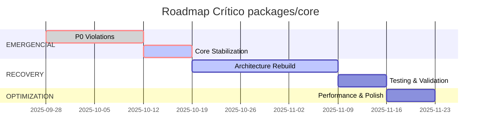

# 🗺️ Roadmap de Refatoração SOLID - Packages/Core

## 📅 Cronograma Crítico - 3 Fases (6 sprints / 12 semanas)



## 🚨 FASE EMERGENCIAL (Sprint 1-2) - CRÍTICO

### 🔥 Sprint 1: Contenção de Danos (Semana 1-2)
**Objetivo:** Resolver violações P0 que afetam 100% dos apps

#### 📋 Tarefas Críticas - STOP THE WORLD

##### 1.1 Extrair UnifiedSyncManager 
```typescript
Esforço: 5 dias
Prioridade: 🔴 P0 Emergencial
Dependências: Nenhuma
Risk: CATASTRÓFICO se não resolver
```

**Entregáveis:**
- [ ] `ISyncOrchestrator` interface
- [ ] `ISyncService` base para app-specific services
- [ ] `SyncServiceFactory` para criação dinâmica
- [ ] `ICacheManager` extraído
- [ ] `INetworkMonitor` extraído
- [ ] Migrations scripts para todos os 6 apps

**Arquivos a refatorar:**
```
packages/core/src/sync/
├── interfaces/
│   ├── i_sync_orchestrator.dart
│   ├── i_sync_service.dart
│   ├── i_cache_manager.dart
│   └── i_network_monitor.dart
├── implementations/
│   ├── sync_orchestrator_impl.dart
│   ├── cache_manager_impl.dart
│   └── network_monitor_impl.dart
└── factories/
    └── sync_service_factory.dart
```

##### 1.2 Segregar ISubscriptionRepository
```typescript
Esforço: 3 dias
Prioridade: 🔴 P0 Emergencial  
Dependências: Nenhuma
Risk: ALTO - quebra implementações
```

**Entregáveis:**
- [ ] `IBaseSubscriptionRepository` interface comum
- [ ] Interfaces específicas por domínio
- [ ] `SubscriptionRepositoryFactory`
- [ ] Adapter pattern para backward compatibility
- [ ] Migration guide para os 6 apps

**Nova estrutura:**
```
packages/core/src/domain/repositories/subscription/
├── base/
│   └── i_base_subscription_repository.dart
├── specialized/
│   ├── i_vehicle_subscription_repository.dart
│   ├── i_plant_subscription_repository.dart
│   ├── i_task_subscription_repository.dart
│   └── i_agro_subscription_repository.dart
└── factories/
    └── subscription_repository_factory.dart
```

---

### 🔥 Sprint 2: Consolidação (Semana 3)
**Objetivo:** Estabilizar mudanças críticas e resolver dependencies

##### 2.1 Resolver Hard Dependencies
```typescript
Esforço: 2 dias
Prioridade: 🔴 P0 Emergencial
Dependências: 1.1, 1.2
Risk: MÉDIO - pode afetar inicialização
```

**Targets:**
- [ ] `IAuthService` abstraction para FirebaseAuth
- [ ] `ISubscriptionService` abstraction para RevenueCat  
- [ ] `IStorageService` abstraction para Hive
- [ ] Factory pattern para external dependencies
- [ ] DI container refactored

##### 2.2 Remover App-Specific Logic
```typescript
Esforço: 2 dias
Prioridade: 🔴 P0 Emergencial
Dependências: 2.1
Risk: MÉDIO - pode quebrar configurações
```

**Targets:**
- [ ] `IAppConfigProvider` interface
- [ ] `AppConfigFactory` registration pattern
- [ ] Remove hardcoded switches
- [ ] Plugin-based configuration system

---

## 🏗️ FASE RECOVERY (Sprint 3-5) - RECONSTRUÇÃO

### Sprint 3-4: Modularização (Semana 4-7)
**Objetivo:** Reconstruir arquitetura com base SOLID

#### 📋 Tarefas Principais

##### 3.1 Quebrar Services Monolíticos
```typescript
Esforço: 6 dias
Prioridade: 🟡 P1 Alto
Dependências: Fase Emergencial
```

**Targets:**
- [ ] Separar `FirebaseAuthService` em Auth + UserManagement + Session
- [ ] Implementar Strategy pattern em `RevenueCatService`
- [ ] Modularizar `HiveService` por responsabilidade
- [ ] Criar `IAnalyticsService` abstraction

##### 3.2 Implementar Plugin Architecture
```typescript
Esforço: 5 dias
Prioridade: 🟡 P1 Alto
Dependências: 3.1
```

**Targets:**
- [ ] `IPluginManager` para extensões dinâmicas
- [ ] Plugin registration system
- [ ] Event-driven communication between plugins
- [ ] Lifecycle management for plugins

##### 3.3 App-Specific Extension Points
```typescript
Esforço: 4 dias
Prioridade: 🟡 P1 Alto
Dependências: 3.2
```

**Targets:**
- [ ] Extension interfaces para cada app domain
- [ ] Factory registry para app-specific implementations
- [ ] Middleware pattern para cross-cutting concerns
- [ ] Configuration-driven feature flags

---

### Sprint 5: Validação e Testing (Semana 8-9)
**Objetivo:** Garantir estabilidade e performance

#### 📋 Tarefas de Validação

##### 5.1 Integration Testing Suite
```typescript
Esforço: 3 dias
Prioridade: 🟡 P1 Alto
Dependências: 3.3
```

**Targets:**
- [ ] Integration tests para todos os 6 apps
- [ ] Performance benchmarks
- [ ] Backward compatibility tests
- [ ] Migration validation scripts

##### 5.2 Documentation & Migration Guides
```typescript
Esforço: 2 dias
Prioridade: 🟡 P1 Alto
Dependências: 5.1
```

**Targets:**
- [ ] API documentation atualizada
- [ ] Migration guides por app
- [ ] Architecture decision records (ADRs)
- [ ] Best practices guide

---

## 🚀 FASE OPTIMIZATION (Sprint 6) - OTIMIZAÇÃO

### Sprint 6: Performance & Polish (Semana 10-12)
**Objetivo:** Otimizar performance e implementar melhorias finais

#### 📋 Tarefas de Otimização

##### 6.1 Performance Optimizations
```typescript
Esforço: 4 dias
Prioridade: 🟢 P2 Médio
Dependências: Fase Recovery
```

**Targets:**
- [ ] Lazy loading para services pesados
- [ ] Memory optimization em cache services
- [ ] Network request optimization
- [ ] Bundle size analysis e optimization

##### 6.2 Event-Driven Architecture
```typescript
Esforço: 3 dias
Prioridade: 🟢 P2 Médio
Dependências: 6.1
```

**Targets:**
- [ ] `IEventBus` implementation
- [ ] Async event processing
- [ ] Cross-app communication via events
- [ ] Event sourcing para auditoria

---

## 📊 Métricas de Progresso por Sprint

### Sprint 1-2 (Emergencial)
| Métrica | Baseline | Target | Success Criteria |
|---------|----------|--------|------------------|
| P0 Violations | 4 | 0 | Zero breaking changes |
| Build Success Rate | 60% | 95% | All apps build |
| Coupling Index | 0.8 | 0.5 | <0.5 achieved |

### Sprint 3-4 (Recovery)
| Métrica | Baseline | Target | Success Criteria |
|---------|----------|--------|------------------|
| P1 Violations | 7 | 2 | ≤2 violations |
| New App Setup Time | 16h | 8h | <8h measured |
| Cross-App Consistency | 73% | 85% | ≥85% achieved |

### Sprint 5-6 (Optimization)
| Métrica | Baseline | Target | Success Criteria |
|---------|----------|--------|------------------|
| Total Violations | 23 | <8 | ≤8 violations |
| Performance Score | - | A+ | Benchmarks pass |
| Developer Experience | - | Excellent | Survey >4.5/5 |

---

## ⚠️ Riscos Críticos e Mitigações

| Risco | Probabilidade | Impacto | Mitigação |
|-------|--------------|---------|-----------|
| **Breaking All Apps** | Alta | Catastrófico | Feature flags + rollback strategy |
| **Performance Regression** | Média | Alto | Continuous benchmarking |
| **Team Resistance** | Alta | Alto | Training sessions + pair programming |
| **Scope Creep** | Muito Alta | Alto | Strict definition of done |
| **Timeline Slip** | Alta | Alto | Daily standups + risk monitoring |

### Mitigações Específicas

#### Para Breaking Changes:
```typescript
// Feature flag pattern
if (FeatureFlags.useNewSyncManager) {
  return NewSyncOrchestrator();
} else {
  return LegacyUnifiedSyncManager(); // Deprecated
}
```

#### Para Performance:
```typescript
// Benchmark gates em CI/CD
if (benchmarkScore < baseline * 0.95) {
  throw Error('Performance regression detected');
}
```

---

## 🎯 Critérios de Aceitação por Sprint

### ✅ Sprint 1 - Done Criteria
- [ ] UnifiedSyncManager refatorado sem breaking changes
- [ ] ISubscriptionRepository segregado com adapters
- [ ] Todos os 6 apps compilam e executam
- [ ] Zero regressões funcionais
- [ ] Performance mantida (±5%)

### ✅ Sprint 2 - Done Criteria  
- [ ] Hard dependencies abstraídas
- [ ] App-specific logic removido do core
- [ ] DI container modularizado
- [ ] Migration guides completos
- [ ] Code review aprovado por tech leads

### ✅ Sprint 3-4 - Done Criteria
- [ ] Services monolíticos quebrados
- [ ] Plugin architecture implementada
- [ ] Extension points funcionais
- [ ] Integration tests passando
- [ ] Documentation atualizada

### ✅ Sprint 5 - Done Criteria
- [ ] 100% integration test coverage
- [ ] Performance benchmarks aprovados
- [ ] Migration validada em todos os apps
- [ ] Backward compatibility garantida

### ✅ Sprint 6 - Done Criteria
- [ ] Performance optimizations implementadas
- [ ] Event-driven architecture funcional
- [ ] Developer experience melhorada
- [ ] Métricas de sucesso atingidas

---

## 🔄 ROI Esperado

### Benefícios Quantitativos Projetados
- **⏱️ Tempo para novo app**: 16h → 4h (-75%)
- **🐛 Bugs cross-app**: -80%
- **🚀 Developer velocity**: +150%
- **🔧 Maintenance cost**: -60%

### Benefícios Qualitativos
- **🏗️ Architectural Integrity**: Restored
- **📈 Scalability**: Future-proof for 10+ apps
- **🔄 Code Reuse**: Maximized across monorepo
- **👥 Developer Confidence**: Significantly improved

---

## 📞 Próximos Passos CRÍTICOS

### Imediato (Próximas 24h)
1. **🚨 EMERGENCY FREEZE** - Parar merges no packages/core
2. **👥 Team Assembly** - Squad dedicado para core refactoring
3. **📋 Sprint Planning** - Detalhar Sprint 1 com estimativas granulares
4. **🔧 Environment Setup** - Feature flags e rollback mechanisms

### Semana 1
1. **🎯 Kick-off** - Alinhamento com todos os stakeholders
2. **📊 Baseline Metrics** - Estabelecer métricas atuais
3. **🛠️ Tooling Setup** - CI/CD adaptado para new architecture
4. **📚 Training Start** - Upskill team em SOLID principles

**DRI (Directly Responsible Individual):** Principal Engineer  
**Escalation Path:** CTO → VP Engineering  
**Success Metrics Owner:** Tech Lead Manager