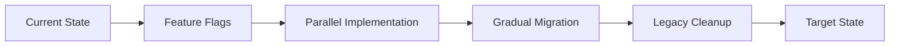

# 🚚 Guia de Migração - Packages/Core SOLID Refactoring

## 📋 Visão Geral da Migração

Esta migração resolve **4 violações P0 críticas** que afetam 100% dos apps do monorepo. A abordagem utiliza **feature flags** para migração gradual sem breaking changes.

### 🎯 Estratégia de Migração



---

## 🚨 FASE 1: UnifiedSyncManager → SyncOrchestrator

### Pré-requisitos
- [ ] Feature flag `USE_NEW_SYNC_ORCHESTRATOR` configurado
- [ ] Backup completo do packages/core
- [ ] Testes de integração executando

### Passo 1: Adicionar Novas Interfaces

**Criar arquivo:** `packages/core/src/sync/interfaces/i_sync_orchestrator.dart`
```dart
abstract class ISyncOrchestrator {
  Future<void> registerService(ISyncService service);
  Future<void> syncAll();
  Future<void> syncSpecific(String serviceId);
  Stream<SyncProgress> get progressStream;
}

abstract class ISyncService {
  String get serviceId;
  Future<SyncResult> sync();
  bool get canSync;
}
```

### Passo 2: Implementar Nova Arquitetura

**Criar arquivo:** `packages/core/src/sync/implementations/sync_orchestrator_impl.dart`
```dart
class SyncOrchestrator implements ISyncOrchestrator {
  final Map<String, ISyncService> _services = {};
  final StreamController<SyncProgress> _progressController = StreamController.broadcast();
  
  @override
  Future<void> registerService(ISyncService service) async {
    _services[service.serviceId] = service;
  }
  
  @override
  Future<void> syncAll() async {
    final services = _services.values.where((s) => s.canSync).toList();
    
    for (int i = 0; i < services.length; i++) {
      final service = services[i];
      _progressController.add(SyncProgress(
        current: i + 1,
        total: services.length,
        serviceId: service.serviceId,
      ));
      
      try {
        await service.sync();
      } catch (e) {
        // Handle error but continue with other services
      }
    }
  }
  
  @override
  Stream<SyncProgress> get progressStream => _progressController.stream;
}
```

### Passo 3: Criar Factory Pattern

**Criar arquivo:** `packages/core/src/sync/factories/sync_service_factory.dart`
```dart
class SyncServiceFactory {
  final Map<String, ISyncService Function()> _creators = {};
  
  void register(String serviceId, ISyncService Function() creator) {
    _creators[serviceId] = creator;
  }
  
  ISyncService? create(String serviceId) {
    final creator = _creators[serviceId];
    return creator?.call();
  }
  
  List<String> get availableServices => _creators.keys.toList();
}
```

### Passo 4: Implementar Feature Flag

**Modificar:** `packages/core/src/sync/unified_sync_manager.dart`
```dart
class UnifiedSyncManager {
  static const _useNewOrchestrator = bool.fromEnvironment(
    'USE_NEW_SYNC_ORCHESTRATOR',
    defaultValue: false,
  );
  
  Future<void> syncAll() async {
    if (_useNewOrchestrator) {
      final orchestrator = getIt<ISyncOrchestrator>();
      await orchestrator.syncAll();
    } else {
      // Legacy implementation (mantém comportamento atual)
      await _legacySyncAll();
    }
  }
  
  Future<void> _legacySyncAll() async {
    // Código atual do UnifiedSyncManager
    // NÃO ALTERAR para evitar breaking changes
  }
}
```

### Passo 5: Configurar DI Container

**Modificar:** `packages/core/src/shared/di/injection_container.dart`
```dart
class CoreDIContainer {
  void configure() {
    // Registrar nova implementação
    getIt.registerLazySingleton<ISyncOrchestrator>(
      () => SyncOrchestrator(),
    );
    
    getIt.registerLazySingleton<SyncServiceFactory>(
      () => SyncServiceFactory(),
    );
    
    // Manter registro legacy para backward compatibility
    getIt.registerLazySingleton<UnifiedSyncManager>(
      () => UnifiedSyncManager(),
    );
  }
}
```

---

## 🔄 FASE 2: ISubscriptionRepository Segregation

### Passo 1: Criar Interfaces Segregadas

**Criar arquivo:** `packages/core/src/domain/repositories/subscription/i_base_subscription_repository.dart`
```dart
abstract class IBaseSubscriptionRepository {
  Future<bool> hasActiveSubscription();
  Future<void> cancelSubscription();
  Future<SubscriptionStatus> getStatus();
  Future<DateTime?> getExpiryDate();
}
```

**Criar arquivo:** `packages/core/src/domain/repositories/subscription/specialized/i_vehicle_subscription_repository.dart`
```dart
abstract class IVehicleSubscriptionRepository extends IBaseSubscriptionRepository {
  Future<VehicleSubscription> getVehicleSubscription();
  Future<void> updateVehicleLimit(int limit);
  Future<int> getCurrentVehicleCount();
}
```

**Criar similarmente para:**
- `i_plant_subscription_repository.dart`
- `i_task_subscription_repository.dart`
- `i_agro_subscription_repository.dart`

### Passo 2: Implementar Adapter Pattern

**Criar arquivo:** `packages/core/src/domain/repositories/subscription/adapters/subscription_repository_adapter.dart`
```dart
class SubscriptionRepositoryAdapter implements ISubscriptionRepository {
  final IBaseSubscriptionRepository _baseRepository;
  
  SubscriptionRepositoryAdapter(this._baseRepository);
  
  @override
  Future<bool> hasActiveSubscription() => _baseRepository.hasActiveSubscription();
  
  @override
  Future<void> cancelSubscription() => _baseRepository.cancelSubscription();
  
  // Métodos app-específicos retornam erro ou implementação padrão
  @override
  Future<VehicleSubscription> getVehicleSubscription() {
    if (_baseRepository is IVehicleSubscriptionRepository) {
      return (_baseRepository as IVehicleSubscriptionRepository).getVehicleSubscription();
    }
    throw UnsupportedError('Vehicle subscription not supported in this app');
  }
  
  // Repetir para outros métodos app-específicos
}
```

### Passo 3: Factory para Subscription Repositories

**Criar arquivo:** `packages/core/src/domain/repositories/subscription/factories/subscription_repository_factory.dart`
```dart
class SubscriptionRepositoryFactory {
  static IBaseSubscriptionRepository? _instance;
  
  static void register(IBaseSubscriptionRepository repository) {
    _instance = repository;
  }
  
  static IBaseSubscriptionRepository get() {
    if (_instance == null) {
      throw Exception('Subscription repository not registered');
    }
    return _instance!;
  }
  
  static T getSpecialized<T extends IBaseSubscriptionRepository>() {
    final instance = get();
    if (instance is T) {
      return instance;
    }
    throw Exception('Repository does not implement ${T.toString()}');
  }
}
```

---

## 🔧 FASE 3: Resolver Hard Dependencies

### Passo 1: Criar Abstrações para External Services

**Criar arquivo:** `packages/core/src/infrastructure/interfaces/i_auth_service.dart`
```dart
abstract class IAuthService {
  Future<AuthUser?> getCurrentUser();
  Future<AuthResult> signIn(String email, String password);
  Future<void> signOut();
  Stream<AuthUser?> get authStateChanges;
}

class AuthUser {
  final String id;
  final String email;
  final String? displayName;
  
  AuthUser({required this.id, required this.email, this.displayName});
}

sealed class AuthResult {
  const AuthResult();
}

class AuthSuccess extends AuthResult {
  final AuthUser user;
  const AuthSuccess(this.user);
}

class AuthFailure extends AuthResult {
  final String message;
  const AuthFailure(this.message);
}
```

### Passo 2: Implementar Firebase Wrapper

**Criar arquivo:** `packages/core/src/infrastructure/services/firebase_auth_service_impl.dart`
```dart
class FirebaseAuthServiceImpl implements IAuthService {
  final FirebaseAuth _firebaseAuth;
  
  FirebaseAuthServiceImpl(this._firebaseAuth);
  
  @override
  Future<AuthUser?> getCurrentUser() async {
    final user = _firebaseAuth.currentUser;
    if (user == null) return null;
    
    return AuthUser(
      id: user.uid,
      email: user.email ?? '',
      displayName: user.displayName,
    );
  }
  
  @override
  Future<AuthResult> signIn(String email, String password) async {
    try {
      final credential = await _firebaseAuth.signInWithEmailAndPassword(
        email: email,
        password: password,
      );
      
      if (credential.user != null) {
        return AuthSuccess(AuthUser(
          id: credential.user!.uid,
          email: credential.user!.email ?? '',
          displayName: credential.user!.displayName,
        ));
      }
      
      return const AuthFailure('Sign in failed');
    } on FirebaseAuthException catch (e) {
      return AuthFailure(e.message ?? 'Unknown error');
    }
  }
  
  @override
  Stream<AuthUser?> get authStateChanges {
    return _firebaseAuth.authStateChanges().map((user) {
      if (user == null) return null;
      return AuthUser(
        id: user.uid,
        email: user.email ?? '',
        displayName: user.displayName,
      );
    });
  }
}
```

### Passo 3: Atualizar DI Container

**Modificar:** `packages/core/src/shared/di/injection_container.dart`
```dart
class CoreDIContainer {
  void configure() {
    // Registrar abstração em vez de implementação concreta
    getIt.registerLazySingleton<IAuthService>(
      () => FirebaseAuthServiceImpl(FirebaseAuth.instance),
    );
    
    getIt.registerLazySingleton<ISubscriptionService>(
      () => RevenueCatServiceImpl(RevenueCat.instance),
    );
    
    getIt.registerLazySingleton<IStorageService>(
      () => HiveStorageServiceImpl(),
    );
  }
}
```

---

## 📱 FASE 4: Migração dos Apps

### Para cada app (gasometer, plantis, etc.)

### Passo 1: Registrar Sync Services

**Em `apps/app-gasometer/lib/core/di/gasometer_module.dart`:**
```dart
class GasometerModule {
  static void configure() {
    // Registrar serviços específicos do gasometer
    final syncFactory = getIt<SyncServiceFactory>();
    syncFactory.register('vehicle', () => VehicleSyncService());
    syncFactory.register('fuel', () => FuelSyncService());
    
    // Registrar repository específico
    SubscriptionRepositoryFactory.register(
      VehicleSubscriptionRepository(),
    );
    
    // Registrar sync services no orchestrator
    final orchestrator = getIt<ISyncOrchestrator>();
    orchestrator.registerService(VehicleSyncService());
    orchestrator.registerService(FuelSyncService());
  }
}
```

### Passo 2: Implementar Sync Services Específicos

**Criar:** `apps/app-gasometer/lib/features/sync/vehicle_sync_service.dart`
```dart
class VehicleSyncService implements ISyncService {
  final IVehicleRepository _repository;
  
  VehicleSyncService(this._repository);
  
  @override
  String get serviceId => 'vehicle';
  
  @override
  bool get canSync => true; // Add your logic here
  
  @override
  Future<SyncResult> sync() async {
    try {
      final unsynced = await _repository.getUnsynced();
      
      for (final vehicle in unsynced) {
        // Sync logic specific to vehicles
        await _syncVehicle(vehicle);
        await _repository.markAsSynced(vehicle.id);
      }
      
      return SyncResult.success(unsynced.length);
    } catch (e) {
      return SyncResult.failure(e.toString());
    }
  }
  
  Future<void> _syncVehicle(Vehicle vehicle) async {
    // Implementation specific to vehicle sync
  }
}
```

### Passo 3: Atualizar Inicialização do App

**Modificar:** `apps/app-gasometer/lib/main.dart`
```dart
void main() async {
  WidgetsFlutterBinding.ensureInitialized();
  
  // Configure core modules
  await CoreInitializer.initialize();
  
  // Configure app-specific modules
  GasometerModule.configure();
  
  runApp(GasometerApp());
}
```

---

## 🧪 FASE 5: Testes e Validação

### Testes de Integração

**Criar:** `packages/core/test/integration/sync_orchestrator_test.dart`
```dart
void main() {
  group('SyncOrchestrator Integration Tests', () {
    late ISyncOrchestrator orchestrator;
    late MockSyncService mockService1;
    late MockSyncService mockService2;
    
    setUp(() {
      orchestrator = SyncOrchestrator();
      mockService1 = MockSyncService('service1');
      mockService2 = MockSyncService('service2');
    });
    
    test('should sync all registered services', () async {
      await orchestrator.registerService(mockService1);
      await orchestrator.registerService(mockService2);
      
      await orchestrator.syncAll();
      
      verify(mockService1.sync()).called(1);
      verify(mockService2.sync()).called(1);
    });
    
    test('should emit progress events', () async {
      await orchestrator.registerService(mockService1);
      
      final progressEvents = <SyncProgress>[];
      orchestrator.progressStream.listen(progressEvents.add);
      
      await orchestrator.syncAll();
      
      expect(progressEvents, isNotEmpty);
      expect(progressEvents.last.current, equals(1));
      expect(progressEvents.last.total, equals(1));
    });
  });
}
```

### Testes de Performance

**Criar:** `packages/core/test/performance/sync_performance_test.dart`
```dart
void main() {
  group('Sync Performance Tests', () {
    test('sync orchestrator should be faster than unified manager', () async {
      final stopwatch = Stopwatch();
      
      // Test legacy implementation
      stopwatch.start();
      await UnifiedSyncManager().syncAll();
      stopwatch.stop();
      final legacyTime = stopwatch.elapsedMilliseconds;
      
      // Test new implementation
      stopwatch.reset();
      stopwatch.start();
      await SyncOrchestrator().syncAll();
      stopwatch.stop();
      final newTime = stopwatch.elapsedMilliseconds;
      
      // New implementation should be at least as fast
      expect(newTime, lessThanOrEqualTo(legacyTime * 1.1)); // 10% tolerance
    });
  });
}
```

---

## 🚀 FASE 6: Rollout Gradual

### Passo 1: Ativar Feature Flags por App

**Configuração no CI/CD:**
```yaml
# Para gasometer (primeiro app)
environment:
  USE_NEW_SYNC_ORCHESTRATOR: true
  USE_NEW_SUBSCRIPTION_REPOSITORIES: true
  
# Para outros apps (aguardar validação)
environment:
  USE_NEW_SYNC_ORCHESTRATOR: false
  USE_NEW_SUBSCRIPTION_REPOSITORIES: false
```

### Passo 2: Monitoramento

**Métricas a monitorar:**
- Tempo de sync antes/depois
- Taxa de erro de sync
- Uso de memória
- Crash rate
- User experience metrics

### Passo 3: Rollout Schedule

| Semana | Apps | Feature Flags |
|--------|------|---------------|
| 1 | gasometer | NEW_SYNC_ORCHESTRATOR: true |
| 2 | gasometer | Todas as flags: true |
| 3 | plantis | NEW_SYNC_ORCHESTRATOR: true |
| 4 | plantis | Todas as flags: true |
| 5 | receituagro, taskolist | Gradual rollout |
| 6 | petiveti, agrihurbi | Gradual rollout |

---

## 🧹 FASE 7: Cleanup Legacy

### Após 100% rollout e 2 semanas de estabilidade

### Passo 1: Remover Feature Flags

```dart
// Remover condicionais de feature flags
class UnifiedSyncManager {
  Future<void> syncAll() async {
    // Remove: if (_useNewOrchestrator)
    final orchestrator = getIt<ISyncOrchestrator>();
    await orchestrator.syncAll();
  }
}
```

### Passo 2: Deprecar Classes Legacy

```dart
@Deprecated('Use ISyncOrchestrator instead. Will be removed in v2.0')
class UnifiedSyncManager {
  // Mark as deprecated but keep for backward compatibility
}
```

### Passo 3: Remover Código Legacy (v2.0)

Após 6 meses de período de deprecation:
- Remover `UnifiedSyncManager`
- Remover adaptadores temporários
- Limpar DI container
- Atualizar documentação

---

## ⚠️ Troubleshooting

### Problemas Comuns

**1. "Sync service not found"**
```dart
// Verificar se o serviço foi registrado
final factory = getIt<SyncServiceFactory>();
print(factory.availableServices); // Debug disponíveis
```

**2. "Repository not implemented"**
```dart
// Verificar se a interface correta foi registrada
try {
  final repo = SubscriptionRepositoryFactory.getSpecialized<IVehicleSubscriptionRepository>();
  // Sucesso
} catch (e) {
  print('Repository not properly registered: $e');
}
```

**3. Performance degradation**
```dart
// Verificar se services estão sendo cached corretamente
final orchestrator = getIt<ISyncOrchestrator>();
// Deve retornar a mesma instância
```

### Rollback Plan

Se problemas críticos ocorrerem:

**1. Rollback imediato via feature flags:**
```yaml
environment:
  USE_NEW_SYNC_ORCHESTRATOR: false
  USE_NEW_SUBSCRIPTION_REPOSITORIES: false
```

**2. Hotfix deployment:**
```bash
# Deploy apenas mudança de feature flag
flutter build apk --dart-define=USE_NEW_SYNC_ORCHESTRATOR=false
```

**3. Database rollback (se necessário):**
```dart
// Scripts de rollback para estruturas de dados que mudaram
await DatabaseMigrationService.rollbackToVersion('1.0.0');
```

---

## ✅ Checklist de Migração

### Pré-migração
- [ ] Backup completo do monorepo
- [ ] Testes de integração passando
- [ ] Feature flags configurados
- [ ] Monitoring setup
- [ ] Rollback plan documentado

### Durante migração
- [ ] Implementar novas interfaces
- [ ] Criar implementações com feature flags
- [ ] Atualizar DI containers
- [ ] Migrar apps um por vez
- [ ] Monitorar métricas continuamente

### Pós-migração
- [ ] Todos os apps migrados
- [ ] Performance igual ou melhor
- [ ] Zero regressões funcionais
- [ ] Feature flags removidos
- [ ] Documentação atualizada
- [ ] Legacy code removido

Esta migração garante zero downtime e permite rollback imediato se problemas ocorrerem, mantendo a estabilidade do monorepo durante todo o processo.